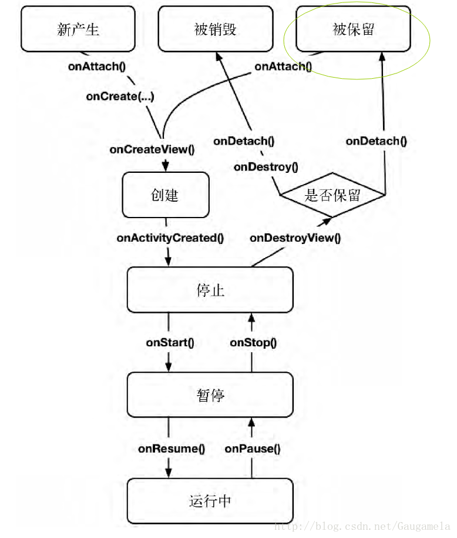

## 【A】Fragment原理

### 输出倒逼输入

-  fragment的生命周期
-  fragment保存数据问题
-  fragment调用setRetainInstance导致的生命周期问题
-  Activity和Fragment的onActivityResult回调
-  ViewPager中Fragment的缓存
-  Fragment A 启动了 Fragment B，Fragment B 中按下返回键只退出 Fragment B 怎么实现。
-  Fragment如果在Adapter中使用应该如何解耦？

#### Fragment生命周期	

##### setRetainInstance 与 生命周期

setRetainInstance(true) 可在屏幕旋转，Activity销毁并重建时，保存Fragment实例不被销毁，只销毁视图。

通常情况Fragment销毁过程：

onPause->onStop->onDestroyView() -> ->onDestroy()->onDetach()

新建：

onAttach -> onCreate->onCreateView -> onActivityCreated->onStart ->onResume

屏幕旋转setRetainInstance(true) 时Fragment：

onPause->onStop->onSaveInstance ->onDestroyView() -> onDetach()

重建：

onAttach -> onCreateView -> onActivityCreated->onStart ->onResume

##### setRetainInstance应用场景

1. 大数据保存避免重新创建
2. 

