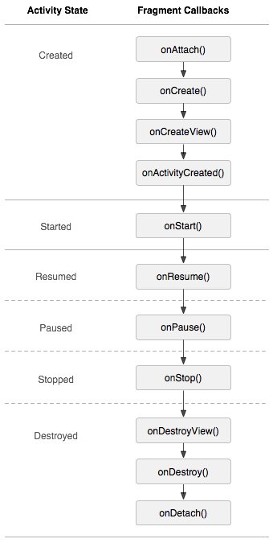

## 【A】四大组件 -- Activity (一) -- 交互


### SelfCheck

- **Activity A 跳转Activity B，**A启动B两个状态分别是什么 ，A的onStop一定会执行吗？**Activity B再按back键回退，两个过程各自的生命周期 ? 若****ActivityB是个窗口Activity的情况下呢？**

- **切换横竖屏时，onCreate会调用吗？几次？**

- **activity和fragment的生命周期**

- restart方法的调用时机，按home键的调用时机，恢复的调用时机，销毁的调用时机 
- on save/restore instate的时机，谁调用，怎么调用，onSaveInstance和onPause、onStop顺序
- onResume和onStart区别，如何判断onResume时已经渲染好
- activity从后台进程切换到前台经历的生命周期
- activity的跨进程调用

- **activity的launch mode ,** singleinstance的启动模式如果不指定栈名，是怎么分配的
- activity显示启动和隐式启动区别
- bundle的数据结构，如何存储，既然有了Intent.putExtra，为啥还要用bundle。


### Activity 生命周期

- Activity 和 Fragment的生命周期对应

  

  onStart() : 组件可见但不可交互

  onResume() ：组件可见，可交互

  onPause() : 当另一个activity切到前台 ， 

  onStop() :  activity不再可见，更高优先级App需要内存，则activity被杀死，不走后面生命周期函数

  onDestroy() : activity finishing或被系统为了腾出空间将其销毁

  onRestart() : 当activity调用onStop()进入不可见状态，再次启动时

  

  

- activity中启动fragment ，按power键熄屏，再点亮

  切换到该Fragment：onAttach->onCreate->onCreateView->onActivityCreated->onStart->onResume 按下Power键：onPause->onSaveInstanceState->onStop 

  点亮屏幕解锁：onStart->onRestoreInstanceState->onResume

  

  

- **Activity A 跳转Activity B，**A启动B两个状态分别是什么 ，A的onStop一定会执行吗？必然会执行的是哪几个方法？**Activity B再按back键回退，两个过程各自的生命周期 ? 若****ActivityB是个窗口Activity的情况下呢？**

```java
ActivityA和ActivityB生命周期执行顺序如下： 
A.onPause －> B.onCreate －> B.onStart－> B.onResume－
> A.onStop
ActivityB 按下back键后：
B.onPause－>A.onRestart－>A.onStart－>A.onResume－>B.onStop－>B.onDestory
```

若ActivityB是个窗口，ActivityA跳转到ActivityB时，ActivityA失去焦点部分可见，故不会调用onStop，此时生命周期顺序：

```java
A.onPause －> B.onCreate －> B.onStart－> B.onResume
 按下Back键后：B.onPause－>A.onResume－>B.onStop－>B.onDestory
```

必然执行的是

ActivityA 的onPause() 和 ActivityB的onResume()


- **切换横竖屏时，onCreate会调用吗？几次？**

  竖屏切到横屏：

  ```
  onPause() -> onSaveInstanceState() -> onStop() -> onDestroy()-> 
  onCreate() -> onStart（）-> onRestoreInstanceState() ->onResume() 
  ```

  横屏切回竖屏：

  ```
  onPause() -> onSaveInstanceState() -> onStop() -> onDestroy()-> 
  onCreate() -> onStart（）-> onRestoreInstanceState() ->onResume() 
  ```

  AndroidManifest.xml 中没配置的话，或只配置android:configChanges="orientation"的话，各走一次

  配置android:configChanges="orientation|keyboardHidden|screenSize“，只走 **onConfigurationChanged**

  

- Activity 启动后按home键，再回到应用

```java
onPause() -> onStop() -> onRestart() -> onStart() ->onResume()
```


#### 状态保存与恢复

Activity被主动回收时，如按下Back键，系统不会保存它的状态，只有被动回收时，虽然这个Activity实例已被销毁，但系统在新建一个Activity实例时，会带上先前被回收Activity的信息。在当前Activity被销毁前调用onSaveInstanceState(onPause和onStop之间保存)，重新创建Activity后会在onCreate后调用onRestoreInstanceState（onStart和onResume之间被调用），它们的参数Bundle用来数据保存和读取的。 保存View状态有两个前提：View的子类必须实现了onSaveInstanceState; 必须要设定Id，这个ID作为Bundle的Key


对于**Fragment**，状态保存onSaveInstanceState在对应的FragmentActivity.onSaveInstanceState方法中会调用FragmentController.saveAllState，其中会对mActive中各个Fragment的实例状态和View状态分别进行保存.当Activity在做状态保存和恢复的时候, 在它其中的fragment自然也需要做状态保存和恢复.


### taskAffinity与任务栈调度

> 查看当前系统 task任务栈：

```shell
adb shell dumpsys activity activities
```


#### Activity 启动模式

1. **standard：**标准启动模式（默认），每启动一次Activity，都会创建一个实例，即使从ActivityA startActivity ActivityA,也会再次创建A的实例放于栈顶，当回退时，回到上一个ActivityA的实例。

2. **singleTop：**栈顶复用模式，每次启动Activity，如果待启动的Activity位于栈顶，则不会重新创建Activity的实例，即不会走onCreate->onStart，会直接进入Activity的onPause->**onNewIntent**->**onResume**方法

3. **singleInstance:** 单一实例模式，整个手机操作系统里只有一个该Activity实例存在，没有其他Actvity,后续请求均不会创建新的Activity。若task中存在实例，执行实例的onNewIntent()。应用场景：闹钟、浏览器、电话

4. **singleTask：**栈内复用，启动的Activity如果在指定的taskAffinity的task栈中存在相应的实例，则会把它上面的Activity都出栈，直到当前Activity实例位于栈顶，执行相应的**onNewIntent()**方法。如果指定的task不存在，创建指定的taskAffinity的task,taskAffinity的作用，进入指定taskAffinity的task,如果指定的task存在，将task移到前台，如果指定的task不存在，创建指定的taskAffinity的task. 应用场景：应用的主页面


#### taskAffinity

##### taskAffinity与launch_mode

每一个Activity都有一个 **Affinity**(亲和关系)，定义了一个Activity将被分配到哪一个TaskRecord（任务栈）中。一个任务栈的affinity由这个任务栈的根Actiivty决定。如果不在AndroidManifest.xml中指定，默认为当前应用包名。


单纯使用 taskAffinity 不能导致 Activity 被创建在新的任务栈中，需要配合 singleTask 或者 singleInstance。

如果singleInstance没指定 Affinity ：

同一个 Stack 下 生成两个TaskRecord 


standard模式下两个Activity ：

同一个Stack、同一个TaskRecord、生成两个ActivityRecord


##### taskAffinity与allowTaskReparenting

allowTaskReparenting 赋予 Activity 在各个 Task 中间转移的特性。一个在后台任务栈中的 Activity A，当有其他任务进入前台，并且 taskAffinity 与 A 相同，则会自动将 A 添加到当前启动的任务栈中。


### Intent

##### Bundle实现原理，Intent传数据为什么用bundle不用HashMap？

```
Bundle内部使用ArrayMap，ArrayMap适合于小数据量操作，如果在数据量比较大的情况下，它的性能将退化。HashMap内部则是数组+链表结构，所以在数据量较少的时候，HashMap的Entry Array比ArrayMap占用更多的内存。而使用Bundle的场景大多数为小数据量。所以使用ArrayMap实现更合适。

Android中如果使用Intent来携带数据的话，需要数据是基本类型或者是可序列化类型，Bundle使用Parcelable进行序列化，而HashMap则是使用Serializable进行序列化。
```


##### Binder传递数据限制与解决办法

Android 系统对使用 Binder 传数据进行了限制。通常情况为 1M。

解决办法：

1. transient关键字修饰Bean类中不必要的字段，不参与序列化。

2. 将对象转换为JSON字符串，减少数据体积。

   因为 JVM 加载类通常会伴随额外的空间来保存类相关信息

   

```

```


##### 既然有了Intent.putExtra 为什么还需要 Bundle？

Bundle 实现了Parcleable接口，内部维护了ArrayMap ，是真正的实现数据传递的类。 Intent.putExtra 内部也是使用了其成员属性private Bundle mExtras; 来实现的。

```csharp
public Intent putExtra(String name, boolean value) {
        if (mExtras == null) {
            mExtras = new Bundle();
        }
        mExtras.putBoolean(name, value);
        return this;
    }
```

从架构设计角度来说，设计成两个类，单一职责，解藕。同时支持给Intent设置Bundle和设置基本数据类型，我认为是为了简化调用以及适应不同应用场景。

只是简单地启动Activity的话，我已经new 了一个Intent了，还要再让我new 一个Bundle对象，是不是很麻烦？


### 项目踩坑记录

1. **Activity onBackPressed回调未被调用 ？**

   检查是不是Fragment已经监听了onKey() 等事件，消耗掉了back键事件。

   > 源码追踪


### 资源参考

-  **Android工程师进阶34讲** -- Android 是如何通过 Activity 进行交互的？


https://kaiwu.lagou.com/course/courseInfo.htm?sid=&courseId=67&lagoufrom=noapp#/detail/pc?id=1867

- Activity与Fragment各场景下生命周期

  https://juejin.cn/post/6844903808808517639

* 我打赌你一定没搞懂Activity启动模式

  https://www.jianshu.com/p/2a9fcf3c11e4