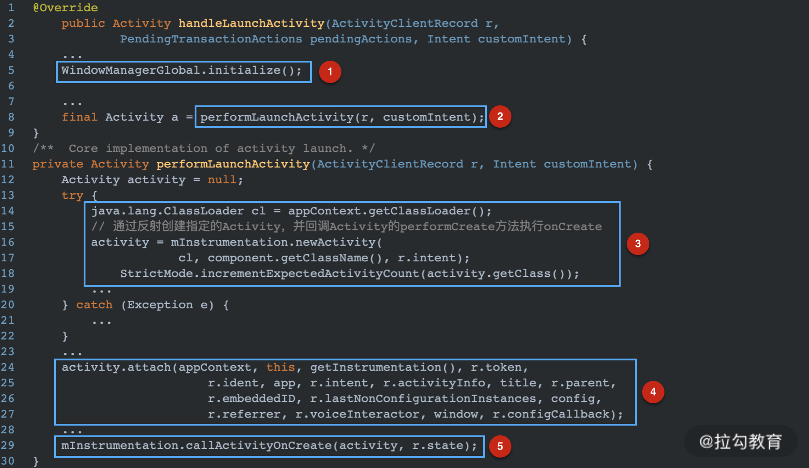

## 【A】四大组件 -- Activity 启动过程分析


### SelfCheck

- activity显示启动和隐式启动区别


### startActivity 过程分析

1. **Activity**

   startActivity() -> startActivityForResult()

2. **Instrumentation**

   execStartActivity()方法

   ​	ActivityManger.getService 获取 AMS 的实例，调用其startActivity方法

   ```
   ActivityManager.getService().startActivity();
   ```

   

3. **ActivityManagerService --> ApplicationThread**

   AMS的startActivity方法

   

   **ActivityStarter**

   startActivityMayWait方法

   解析Intent、创建ActivityRecord、可能还要创建TaskRecord。

   


4. **ApplicationThread **-> Activity

   通过ActivityThread 中Handler mH 对象，向ActivityThread发消息。ActivityThread执行**handleLaunchActivity**方法。

   


## 

```java
public Activity handleLaunchActivity(){
  	// 1. 初始化Activity 的 WindowManager ，每一个Activity对应一个“窗口” 。
  	WindowManagerGlobal.initialize();
  	final Activity = performLaunchActivity();
}

private Activity performLaunchActivity(){
  	//通过反射创建activity对象，并回调Activity的performCreate方法执行onCreate
  	Activity activity = mInstrumentation.newActivity();
  	//关联Activity与Context ， 其内部将会创建Window
  	activity.attach(appContext);
  	//回调Activity生命周期方法
  	mInstrumentation.callActivityOnCreate(activity);
}
```


ActivityThread

​	activity = mInstrumentation.newActivity();

​	Appliation app 初始化

​	Window window = activity.window

​	activity.attach();


### 资源参考

 **Android工程师进阶34讲** -- startActivity 启动过程分析？

https://kaiwu.lagou.com/course/courseInfo.htm?sid=&courseId=67&lagoufrom=noapp#/detail/pc?id=1873