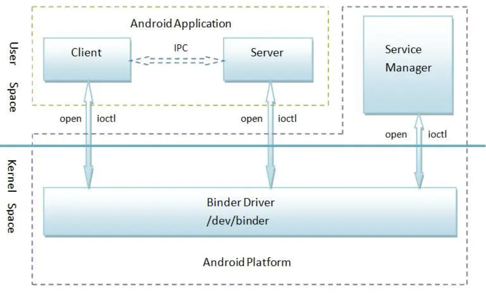
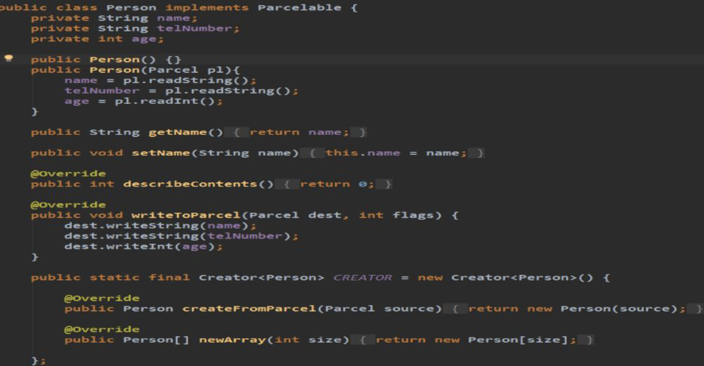
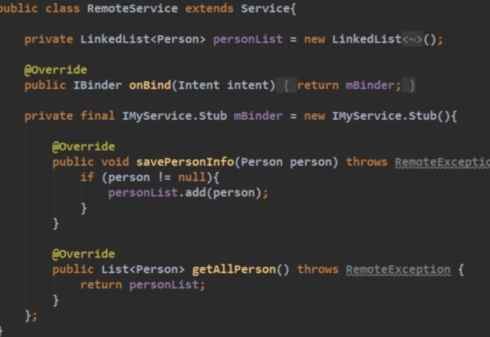
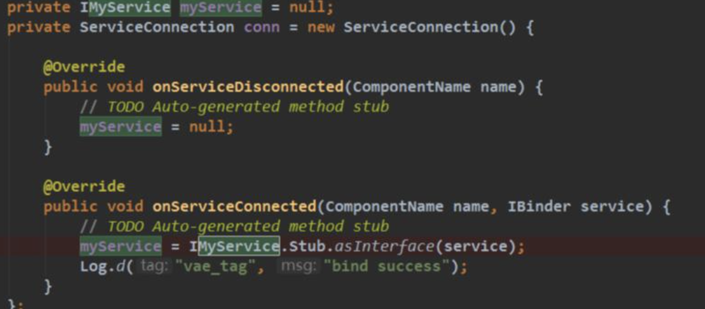

## 【A】Framework原理 -- IPC Binder专题

### SelfCheck

- **android的IPC通信方式，是否使用过 ？ **多进程遇到哪些问题？
- **Binder 机制，与共享内存机制有什么区别？**
- binder与socket区别 binder优势。为什么binder安全 
- 简单讲讲 binder 驱动吧？ 说说他的内存映射过程，说说客户端等待服务端处理返回的流程
- aidl生成的java类细节。aidl binder异步调用具体实现
- 跨进程传递大内存数据如何做？


### Android的 ICP通信方式

#### 多进程存在的问题

为什么Android应用要使用多进程？

*  **更大的内存分配**，**分担主进程的内存压力**
* **进程间独立运行，互不影响。**


本质上讲，多进程间有着各自的内存空间，对应不同的虚拟机实例，相互隔离。带来的问题就比如：

* 静态成员和单例模式完全失效(不是同一块内存，会产生不同的副本)
* 线程同步机制完全失效(不是同一块内存，所以对象也不是同一个，因此类锁、对象锁也不是同一个，不能保证线程同步)
* SharedPreferences 可靠性下降(SharedPreferences不支持多个进程同时写，会有一定的几率丢失数据)
* Application 多次创建(Android为每个进程分配独立的虚拟机，这个过程其实就是启动一个应用，所以Application会被创建多次)，所以我们不能直接将一些数据保存在Application中。


如上所述，进程间不能直接通信，需要特定的进程间通信方式。


#### Android的 ICP通信方式辨析

| 通信方式                 | 描述                                                         | 内存拷贝 | 优缺点                                                    | 应用场景 |
| ------------------------ | ------------------------------------------------------------ | -------- | --------------------------------------------------------- | -------- |
| 管道（Pipe）             | 在创建时分配一个page大小的内存，缓存区大小比较有限；         | 2        |                                                           |          |
| 共享内存（Share Memory） | 无须复制，共享缓冲区直接附加到进程虚拟地址空间，速度快；但进程间的同步问题操作系统无法实现，必须各进程利用同步工具解决。 | 0        |                                                           |          |
| Socket                   |                                                              |          |                                                           |          |
| File                     |                                                              |          |                                                           |          |
| Binder                   |                                                              | 1        | 性能角度，稳定性角度，安全性角度                          |          |
| 消息队列（Message）      |                                                              | 2        | 信息复制两次，额外的CPU消耗；不适合频繁或信息量大的通信； |          |


> Binder与共享内存机制有什么区别？
>

```

```


*统IPC方式中，数据是怎样从发送端到达接收端的呢？*通常的做法是：**发送方**将准备好的数据存放在缓存区中，通过系统API调用进入**内核**中。**内核服务程序**在内核空间分配内存，将数据从**发送方**缓存区复制到内核缓存区中。**接收方**读数据是也要提供一块缓存区，**内核**将数据从内核缓存区拷贝到**接收方**提供的缓存区中并唤醒接收线程，完成一次数据发送。


### BInder机制



##### **Binder驱动**

 尽管名叫“驱动”，实际上和硬件设备没有任何关系，只是实现方式和设备驱动程序是一样的。它工作于内核中，主要任务包括：驱动负责进程之间Binder通信的建立；Binder在进程之间的传递；Binder引用计数管理；数据包在进程之间的传递和交互等一系列底层支持。

https://www.jianshu.com/p/50b1f3af4f9d


##### Binder内存映射原理

Binder驱动通过实现mmap()来创建数据接收的缓存空间。mmap()的返回值是内存映射在用户空间的地址，不过这段空间是由驱动管理，用户不必直接访问（映射类型为PROT_READ，只读映射）。


##### 探究Binder传递大数据问题


### AIDL

AIDL（Android 接口定义语言），用它按照一定语法规则编写.aidl 文件，Android Studio自动编译生成Java代码，封装基于binder的进程间通信过程，简单的方法调用就可以满足多进程通信场景需求，降低了应用开发者的开发难度。


#### AIDL支持的数据类型

1. **Java基本数据类型**

   byte (1字节，8位)、

   short (2字节，16位)、char (2字节，16位)

   int (4字节，32位) 、float (4字节，32位)

   long (8字节，64位) 、double (8字节，64位) 、

   boolean（boolean类型数据在经过编译后在JVM中会通过int类型来表示，此时boolean数据4字节32位，而boolean数组将会被编码成Java虚拟机的byte数组，此时每个boolean数据1字节占8bit.）

2. **List 和 Map**

   * 元素必须是AIDL支持的数据类型
   * Server端具体的类里必须是ArrayList或者HashMap

3. 其他AIDL生成的接口

4. 实现Parcelable的实体


#### AIDL基本使用

1. 编写AIDL文件，生成 Java 类

   1. 新建 aidl 文件夹，在其中创建接口 aidl 文件

   2. 创建要操作的实体类，实现 Parcelable 接口

      

   3. Make project ，生成 Binder 的 Java 文件

2. 服务端

   1. 创建 Service ，在其中创建上面生成的 Binder 对象实例，实现接口定义的方法

   2. 在 onBind ( ）中返回

      

3. 客户端

   1. 实现 ServiceConnection 接口，在其中拿到 AIDL 类
   2. bindSerivce()
   3. 调用 AIDL 类中定义好的操作请求




#### 理解AIDL语法关键字

##### oneway -- 异步调用

https://cloud.tencent.com/developer/article/1639733


##### in、out、inout参数


#### AIDL生成文件分析


### 参考资源

* 图文详解Binder机制模型与源码原理

  https://www.jianshu.com/p/3e5f378f12a1

* AIDL oneway 以及 in 、out、inout参数的理解

  https://blog.csdn.net/anlian523/article/details/98476033

* 你真的懂AIDL的oneway嘛？

  https://cloud.tencent.com/developer/article/1639733

* [[007\]一次Binder通信最大可以传输多大的数据？](https://www.jianshu.com/p/ea4fc6aefaa8)


### 学习资源

* 听说你Binder机制学的不错，来面试下这几个问题

  https://www.jianshu.com/p/adaa1a39a274