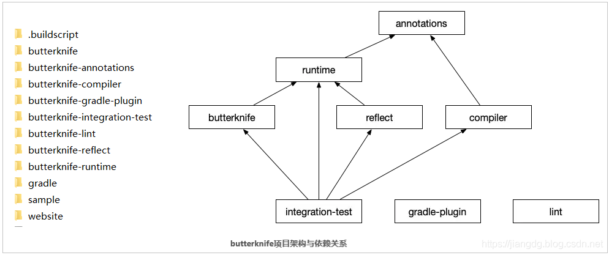
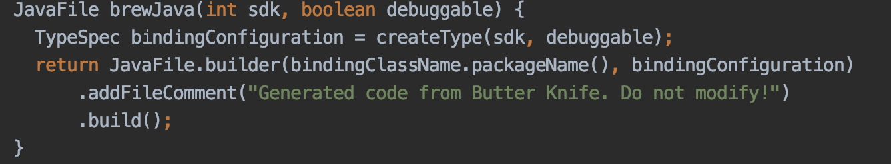

## 【A】框架源码与设计 -- ButterKnife


### Topics


ButterKnife是一个专注于基于注解处理器及javaPoet库自动生成代码替代findViewById及事件绑定的框架。


### 原理分析

1. 编译时扫描注解，并保存到Map集合当中。使用JavaPoet生成Java代码
2. 调用ButterKnife.bind(this) ；方法的时候，将ID与对应的上下文绑定在一起。


ButterKnife项目结构




> Butterknife-compiler

#### ButterKnifeProcessor

##### BindingSet类

保存目标类信息；

封装JavaPoet生成目标类代码的过程 --BindingSet::**brewJava()**方法；



生成 className + "_ViewBinding" 类文件

- ##### init()


* getSupportedAnnotationTypes()

  

* **process()方法**

  * findAndParseTargets()

    根据注解类型，解析要生成的目标类（Target）信息。

    返回 **Map<TypeElement, BindingSet> bindingMap**

    其中BindingSet即封装了目标类信息及生成Java目标类代码的方法。

    

  * 生成Java类代码

    ```
    for (Map.Entry<TypeElement, BindingSet> entry : bindingMap.entrySet()) {
      TypeElement typeElement = entry.getKey();
      BindingSet binding = entry.getValue();
    
      JavaFile javaFile = binding.brewJava(sdk, debuggable);
      try {
        javaFile.writeTo(filer);
      } catch (IOException e) {
        error(typeElement, "Unable to write binding for type %s: %s", typeElement, e.getMessage());
      }
    }
    ```


#### 2. ButterKnife.bind()方法

> ButterKnife类

根据对象的不同，ButterKnife提供了多个视图绑定方法重载。最终方法：

```
public static Unbinder bind(@NonNull Object target, @NonNull View source) {
   // 1. 获取被绑定视图对应的Class对象，假设MainActivity
  Class<?> targetClass = target.getClass();
  
  //2. 通过反射获取MainActivity_ViewBinding的构造器
  Constructor<? extends Unbinder> constructor = findBindingConstructorForClass(targetClass);

  if (constructor == null) {
    return Unbinder.EMPTY;
  }

  try {
  	//3. 实例化一个MainActivity_ViewBinding对象
    return constructor.newInstance(target, source);
  } catch () {
   	省略...
  }
}
```


ButterKnife类中 BINDINGS是LinkedHashMap，用来缓存已加载过的clsName + "_ViewBinding"类构造函数。

findBindingConstructorForClass方法，核心就是classLoader加载类

```
private static Constructor<? extends Unbinder> findBindingConstructorForClass(Class<?> cls) {
  Constructor<? extends Unbinder> bindingCtor = BINDINGS.get(cls);
  if (bindingCtor != null || BINDINGS.containsKey(cls)) {
    return bindingCtor;
  }
  String clsName = cls.getName();
  try {
    Class<?> bindingClass = cls.getClassLoader().loadClass(clsName + "_ViewBinding");
  
    bindingCtor = (Constructor<? extends Unbinder>) bindingClass.getConstructor(cls, View.class);
    
  } catch (ClassNotFoundException e) {
    bindingCtor = findBindingConstructorForClass(cls.getSuperclass());
  }
  BINDINGS.put(cls, bindingCtor);
  return bindingCtor;
}
```

最后看MainActivity_ViewBinding类构造函数中如何完成的视图绑定

```
public class MainActivity extends AppCompatActivity {
    @BindView(R.id.id_tv)
    TextView mTvTip;
    @BindView(R.id.id_btn)
    Button mBtn;

    @Override
    protected void onCreate(@Nullable Bundle savedInstanceState) {
        super.onCreate(savedInstanceState);
        setContentView(R.layout.activity_main);
    }

    @OnClick({R.id.id_btn})
    public void onViewClick(View view) {

    }
}

```

```
public class MainActivity_ViewBinding implements Unbinder {
  private MainActivity target;

  private View view7f08004d;

  @UiThread
  public MainActivity_ViewBinding(final MainActivity target, View source) {
    this.target = target;

    View view;
    // 找到id为R.id.id_tv，类型为TextView.class的对象
    // 将其赋值(注入)给MainActivity的mTvTip属性
    target.mTvTip = Utils.findRequiredViewAsType(source, R.id.id_tv, 
                                                 "field 'mTvTip'", TextView.class);
    view = Utils.findRequiredView(source, R.id.id_btn, 
                                  "field 'mBtn' and method 'onViewClick'");
    // 找到id为R.id.id_btn，Button.class的对象
    // 将其赋值(注入)给MainActivity的mBtn属性
    target.mBtn = Utils.castView(view, R.id.id_btn, 
                                 "field 'mBtn'", Button.class);
    view7f08004d = view;
    // 注册点击事件监听器
    // 调用MainActivity的onViewClick方法完成事件传递
    view.setOnClickListener(new DebouncingOnClickListener() {
      @Override
      public void doClick(View p0) {
        // onViewClick方法即为被@OnClick注解的方法
        target.onViewClick(p0);
      }
    });
  }
}
```


### Butterknife问题与优化

1. 简述butterknife 原理；

2. apt 大致开发流程；

3. 在library中使用buttterknife的时候，会使用R2.id.xxx ,怎么做到的。

   

#### library中Butterknife R问题


### 资源参考

https://jiangdg.blog.csdn.net/article/details/103726082