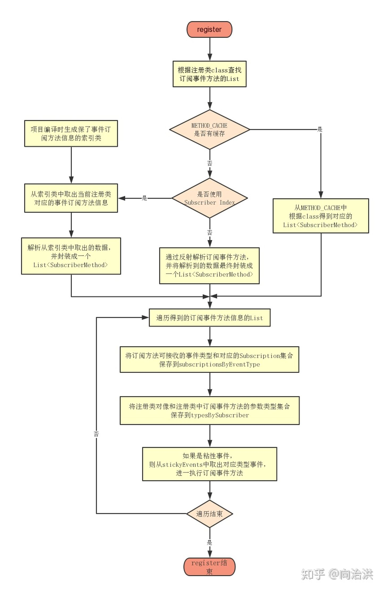
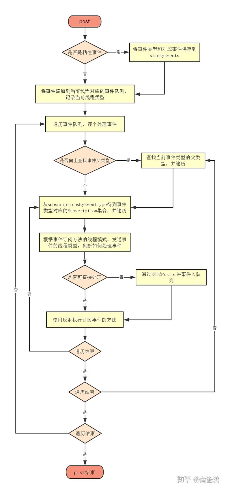

## 【A】框架源码与设计 -- EventBus


### EventBus原理


#### 对象创建

```
EventBus(EventBusBuilder builder) {
    logger = builder.getLogger();
    subscriptionsByEventType = new HashMap<>();
    typesBySubscriber = new HashMap<>();
    stickyEvents = new ConcurrentHashMap<>();
    mainThreadSupport = builder.getMainThreadSupport();
    mainThreadPoster = mainThreadSupport != null ? mainThreadSupport.createPoster(this) : null;
    backgroundPoster = new BackgroundPoster(this);
    asyncPoster = new AsyncPoster(this);
    indexCount = builder.subscriberInfoIndexes != null ? builder.subscriberInfoIndexes.size() : 0;
    subscriberMethodFinder = new SubscriberMethodFinder(builder.subscriberInfoIndexes,
            builder.strictMethodVerification, builder.ignoreGeneratedIndex);
    logSubscriberExceptions = builder.logSubscriberExceptions;
    logNoSubscriberMessages = builder.logNoSubscriberMessages;
    sendSubscriberExceptionEvent = builder.sendSubscriberExceptionEvent;
    sendNoSubscriberEvent = builder.sendNoSubscriberEvent;
    throwSubscriberException = builder.throwSubscriberException;
    eventInheritance = builder.eventInheritance;
    executorService = builder.executorService;
}
```


#### 注册



```
public void register(Object subscriber) {
    Class<?> subscriberClass = subscriber.getClass();
     // SubscriberMethod类封装了订阅方法的相关信息：Method对象、线程模式、事件类型、优先级、是否是粘性事等
    List<SubscriberMethod> subscriberMethods = subscriberMethodFinder.findSubscriberMethods(subscriberClass);
    synchronized (this) {
        for (SubscriberMethod subscriberMethod : subscriberMethods) {
            subscribe(subscriber, subscriberMethod);
        }
    }
}
```


两个Map区分一下：

**typesBySubscriber**以订阅者为key，value为当前订阅者订阅的所有事件类型列表。

```
List<Class<?>> subscribedEvents = typesBySubscriber.get(subscriber);
```

**subscriptionsByEventType**以eventtype为key，value为所有订阅了该实践的方法列表

```
CopyOnWriteArrayList<Subscription> subscriptions = subscriptionsByEventType.get(eventType);
```

```
private void subscribe(Object subscriber, SubscriberMethod subscriberMethod) {
    Class<?> eventType = subscriberMethod.eventType;
    // Subscription类保存了要注册的类对象以及当前的subscriberMethod
    Subscription newSubscription = new Subscription(subscriber, subscriberMethod);
    
     // subscriptionsByEventType是一个HashMap，保存了以eventType为key,Subscription对象集合为value的键值对,如果不存在，则创建一个subscriptions，并保存到subscriptionsByEventType
    CopyOnWriteArrayList<Subscription> subscriptions = subscriptionsByEventType.get(eventType);
    if (subscriptions == null) {
        subscriptions = new CopyOnWriteArrayList<>();
        subscriptionsByEventType.put(eventType, subscriptions);
    } else {
        if (subscriptions.contains(newSubscription)) {
            throw new EventBusException("Subscriber " + subscriber.getClass() + " already registered to event "
                    + eventType);
        }
    }

    int size = subscriptions.size();
    for (int i = 0; i <= size; i++) {
        if (i == size || subscriberMethod.priority > subscriptions.get(i).subscriberMethod.priority) {
            subscriptions.add(i, newSubscription);
            break;
        }
    }

    List<Class<?>> subscribedEvents = typesBySubscriber.get(subscriber);
    if (subscribedEvents == null) {
        subscribedEvents = new ArrayList<>();
        typesBySubscriber.put(subscriber, subscribedEvents);
    }
    subscribedEvents.add(eventType);

    if (subscriberMethod.sticky) {
        if (eventInheritance) {
            // Existing sticky events of all subclasses of eventType have to be considered.
            // Note: Iterating over all events may be inefficient with lots of sticky events,
            // thus data structure should be changed to allow a more efficient lookup
            // (e.g. an additional map storing sub classes of super classes: Class -> List<Class>).
            Set<Map.Entry<Class<?>, Object>> entries = stickyEvents.entrySet();
            for (Map.Entry<Class<?>, Object> entry : entries) {
                Class<?> candidateEventType = entry.getKey();
                if (eventType.isAssignableFrom(candidateEventType)) {
                    Object stickyEvent = entry.getValue();
                    checkPostStickyEventToSubscription(newSubscription, stickyEvent);
                }
            }
        } else {
            Object stickyEvent = stickyEvents.get(eventType);
            checkPostStickyEventToSubscription(newSubscription, stickyEvent);
        }
    }
}
```


unRegister取消注册

遍历eventType所有订阅者列表，将当前订阅者从列表中移除

```text
private void unsubscribeByEventType(Object subscriber, Class<?> eventType) {
        // 得到当前参数类型对应的Subscription集合
        List<Subscription> subscriptions = subscriptionsByEventType.get(eventType);
        if (subscriptions != null) {
            int size = subscriptions.size();
            // 遍历Subscription集合
            for (int i = 0; i < size; i++) {
                Subscription subscription = subscriptions.get(i);
                // 如果当前subscription对象对应的注册类对象 和 要取消注册的注册类对象相同，则删除当前subscription对象
                if (subscription.subscriber == subscriber) {
                    subscription.active = false;
                    subscriptions.remove(i);
                    i--;
                    size--;
                }
            }
        }
    }
```


#### 发送事件 -- post与postSticky




#### 线程调度

EventBus提供了4种ThreadMode：

```
public enum ThreadMode {
    //与发送者同线程
    POSTING,

	 //Ui线程
    MAIN,

   //Ui线程，确保排队有序分发
    MAIN_ORDERED,

   //后台/非主线程
    BACKGROUND,
    
		//新异步线程
    ASYNC
}
```


EventBus中生产者消费者的实现主要是PendingPostQueue里边。


### 面试问题

EventBus 2.x 到 Eventbus3.x 对反射性能问题进行了怎样的优化？

```
EventBus 2.x 会在 register 方法运行时，遍历所有方法找到回调方法；而EventBus 3.x 则在编译期间，将所有回调方法的信息保存的自己定义的 SubscriberMethodInfo 中，这样可以减少对运行时的性能影响。

```


### 资源参考

https://zhuanlan.zhihu.com/p/77809630