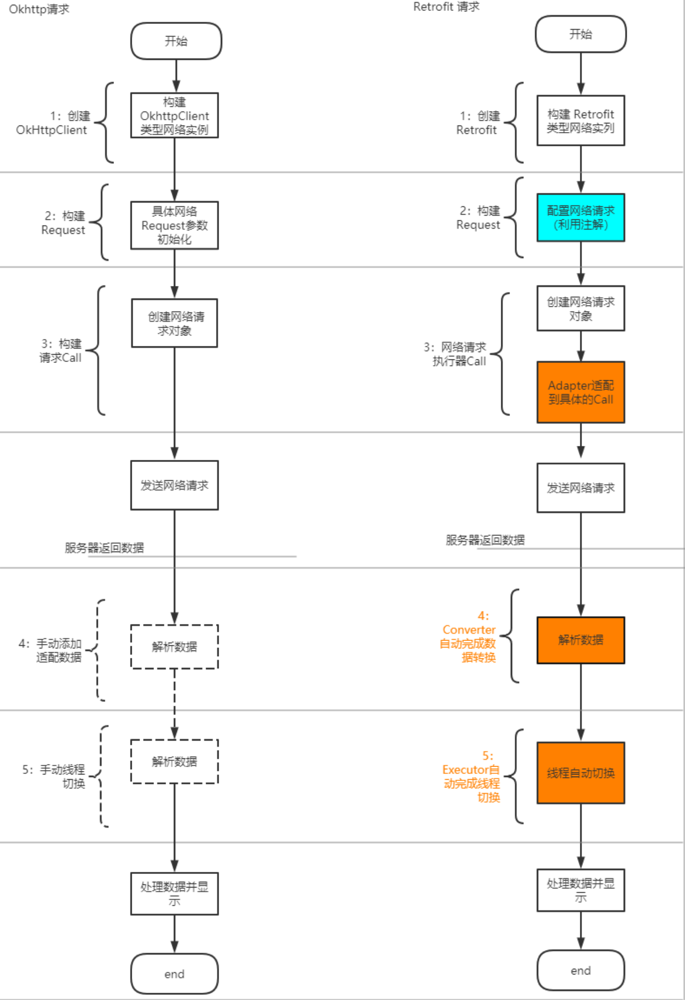

## 【A】框架源码与设计 -- Retrofit


### SelfCheck

* okhttp与Retrofit关系
* 


### 基本使用

okhttp基本使用

```java
 //Step1
final OkHttpClient client = new OkHttpClient();
//Step2
final Request request = new Request.Builder()
.url("https://www.google.com.hk").build();
//Step3
Call call = client.newCall(request); 
//step4 发送网络请求，获取数据，进行后续处理 
call.enqueue(new Callback() {}
```


Retrofit基本使用

```java
//step1
Retrofit retrofit = new Retrofit.Builder() .baseUrl("https://www.wanandroid.com/")
.addConverterFactory(GsonConverterFactory.create(new Gson())) .build();
//step2
ISharedListService sharedListService = retrofit.create(ISharedListService.class); //step3
Call<SharedListBean> sharedListCall = sharedListService.getSharedList(2,1); 
//step4
sharedListCall.enqueue(new Callback<SharedListBean>() {}
```


Retrofit 仅负责网络请求接口的封装。使用注解、反射、动态代理以及各种设计模式，简化调用以及自动化了一些流程。

​			 	


retrofit与okhttp区别：

1. Request 的构建
2. 配置Call ， retrofit 是利用Adapter适配的Okhttp的Call。
3. 相对okhttp，retrofit会对responseBody进行自动Json解析。
4. 相对Okhttp ， retrofit会自动完成线程切换


### 实现原理

#### Retrofit.build()


#### Retrofit.create 

```java
//step2
ISharedListService sharedListService = retrofit.create(ISharedListService.class); //step3
Call<SharedListBean> sharedListCall = sharedListService.getSharedList(2,1); 
```


Retrofit.create 方法中使用动态代理，运行时生成我们写的各种 ApiService 的动态代理。

```java
public <T> create(final Class<T> service){
  	return (T) Proxy.newProxyInstance(service.getClassLoader(), new Class<?>[]{service},new InvocationHandler(){
      	private final Platform platform = platform.get();
      	
      	@override
      	public Object invoke(Object proxy,Method method , Object[] args){
          	//生成ServiceMethod 对象
          	ServiceMethod<Object,Object> serviceMethod = loadServiceMethod(method);
           // 根据ServiceMethod对象和请求参数生成一个OkHttpCall对象
          	OkHttpCall<Object> okhttpCall = new OkhttpCall<>(serviceMethod,args);
          return serviceMethod.callAdapter.adapt(okhttpCall);
        }
    })
}
```


ServiceMethod 职责是解析方法注解，生成请求对象、发起请求、获得返回结果。

实现类是HttpServiceMethod。内部通过CallAdapter#adapt(Call) 发起请求 。

Retrofit.Call 接口 与okHttp中 Call 接口声明方法完全一致。


