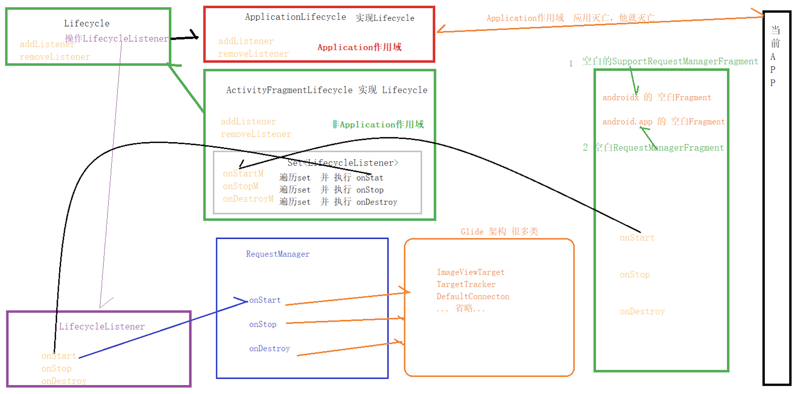
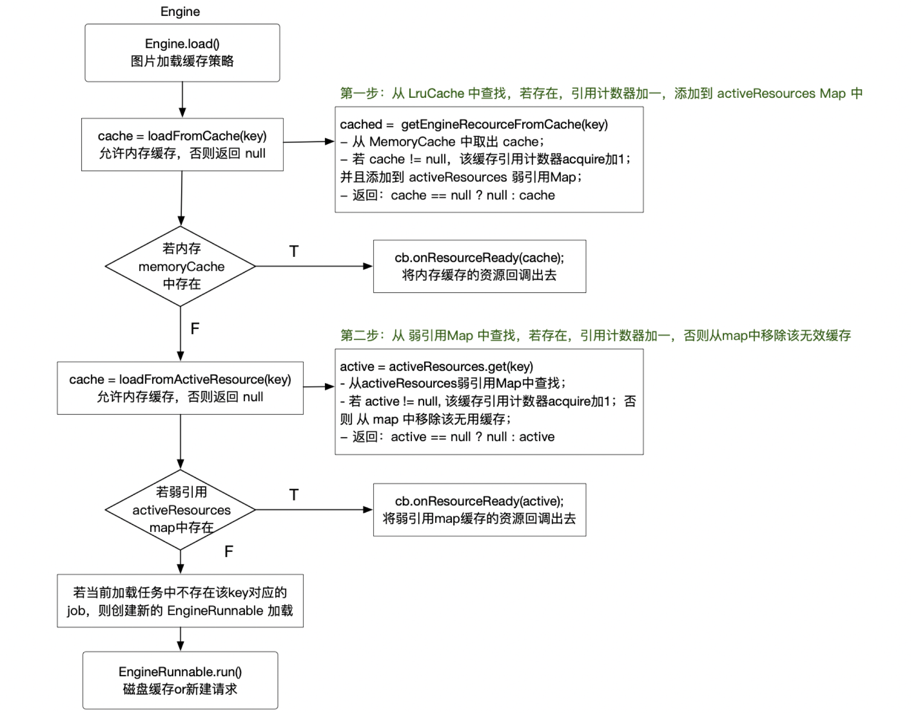

## 【A】框架源码与设计 -- 图片加载框架 Glide


### SelfCheck

- glide如何实现圆角剪裁的
- Glide的三级缓存原理
- Glide加载一个1M的图片（100 * 100），是否会压缩后再加载，放到一个300 * 300的view上会怎样，800*800呢，图片会很模糊，怎么处理？
- 简单说一下内存泄漏的场景，如果在一个页面中使用Glide加载了一张图片，图片正在获取中，如果突然关闭页面，这个页面会造成内存泄漏吗？
- 如何设计一个大图加载框架


### 图片框架选型

**Fresco：**

- 最大的优势在于5.0以下(最低2.3)的bitmap加载。在5.0以下系统，Fresco使用使用NativeMemoryChunk在直接内存上操作Bitmap 。Android L以上，ArtBitmapFactory 生成 BitmapPool，BitmapPool里边只能老老实实用Bitmap提供的createBitmap、recycle方法。

- 大大减少OOM（在更底层的Native层对OOM进行处理，图片将不再占用App的内存）

- 适用于需要高性能加载大量图片的场景

  

**Glide：**

- 多种图片格式的缓存，适用于更多的内容表现形式（如Gif、WebP、缩略图、Video）
- 生命周期集成（根据Activity或者Fragment的生命周期管理图片加载请求）
- 高效处理Bitmap（bitmap的复用和主动回收，减少系统回收压力）
- 高效的缓存策略，灵活（Picasso只会缓存原始尺寸的图片，Glide缓存的是多种规格），加载速度快且内存开销小（默认Bitmap格式的不同，使得内存开销是Picasso的一半）


**Picasso：**

​	体积更小，使用方式与Glide相似

​	Picasso会不管imageview大小是什么，总是直接缓存整张图片


#### Glide 4.x与3.x区别


### 基本使用 -- API


### with -- 生命周期绑定原理




**getRequestManagerFragment**

Double Check

防止创建多个Fragment


### load 加载


#### Glide 缓存机制

Glide的缓存机制，主要分为2种，一种是内存缓存，一种是磁盘缓存。

防止重复下载，也防止重复加载到内存。

具体来说，加载图片时，先去LruCache中寻找，如果有则直接取出来用，引用计数加1，并将该图片放入弱引用Map

如果没有则去弱引用Map中查找，若存在，引用计数加1，否则从Map中移除无效缓存




Glide 缓存Key 生成机制

```
public <R> LoadStatus load() {
    // 根据请求参数得到缓存的键
    EngineKey key = keyFactory.buildKey(model, signature, width, height, transformations,
        resourceClass, transcodeClass, options);
}
```

ImageView长和宽是有影响的。


### Into

#### 图片转换

RequestOptions. transform()


### 参考资源

* Glide面试那些事

https://liuyangbajin.blog.csdn.net/article/details/103193470?utm_medium=distribute.pc_relevant.none-task-blog-BlogCommendFromMachineLearnPai2-4.control&depth_1-utm_source=distribute.pc_relevant.none-task-blog-BlogCommendFromMachineLearnPai2-4.control


