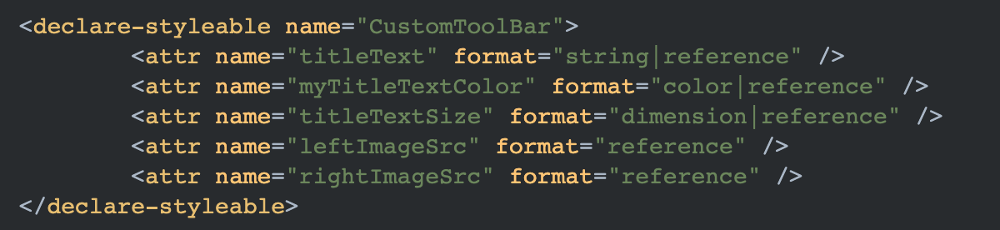
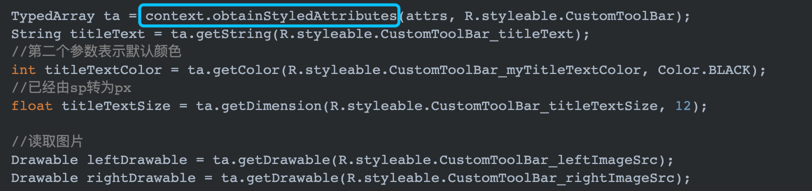
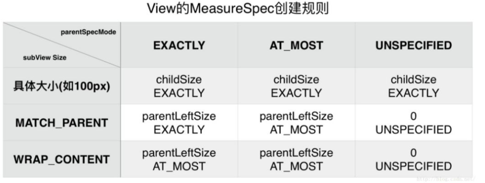
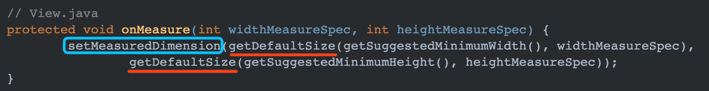
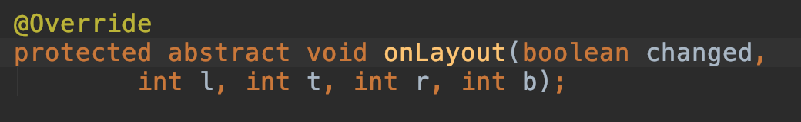
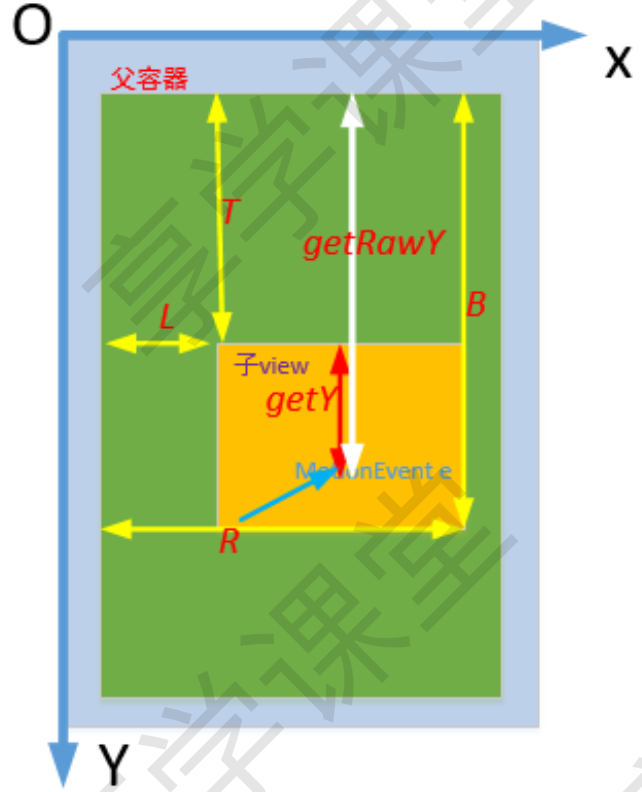

## 【A】高级UI  系列一：自定义View基本流程 

> 自我管理应该着重于精力的管理，而非时间的安排 。


### SelfCheck

- ~~**自定义控件有哪几种实现方式？在实现自定义控件时需要重写哪几个构造方法？**~~ 

- ~~自定义view的步骤，Android的wrap_content是如何计算的~~

- ~~如果我要显示一张图片，要求一定要4:3显示(onMeasure的setMeasureDimension)~~

- ~~怎么计算一个View在屏幕可见部分的百分比？~~

- 如何绘制大于父view的子view

  

  

### 自定义View方式

1.  继承系统提供的成熟控件（比如 LinearLayout、RelativeLayout、ImageView 等）；

2. 直接继承自系统 View 或者 ViewGroup，并自绘显示内容。

   该方式需要解决以下几个问题：

   - ​	如何根据相应的属性将 UI 元素绘制到界面；
   - ​	自定义控件的大小，也就是宽和高分别设置多少；
   - ​	如果是 ViewGroup，如何合理安排其内部子 View 的摆放位置。


### 自定义View基本步骤

1.构造方法 

2.重写核心方法onMeasure、onLayout、onDraw

​	View要实现 onMeasure、onDraw()

​	ViewGroup 要实现 onMeasure() 、onLayout() 其中onLayout是必须的。


#### 构造方法

> 几种构造方法的区别？

构造函数共有4个。

```
		// 如果View是在Java代码里面new的，则调用第一个构造函数 
		public CarsonView(Context context) {
        super(context);
    }
    
    // 如果View是在.xml里声明的，则调用第二个构造函数 ，自定义属性是从AttributeSet参数传进来的
    public  CarsonView(Context context, AttributeSet attrs) {
        super(context, attrs);
		}
		
		// 不会自动调用。一般是在第二个构造函数里主动调用 ，如View有style属性时
    public  CarsonView(Context context, AttributeSet attrs, int defStyleAttr) {
        super(context, attrs, defStyleAttr);
		}
		
		//API 21之后。不会自动调用。一般是在第二个构造函数里主动调用，如View有style属性时
		public CarsonView(Context context, AttributeSet attrs, int defStyleAttr, int
defStyleRes) {
        super(context, attrs, defStyleAttr, defStyleRes);
	  }
```


##### 自定义属性AtrributeSet

在 res 的 values 目录下的 attrs.xml 文件中（没有就自己新建一个），使用 标签自定义属性，如下所示：




通过context.obtainStyledAttributes(); 传入构造函数中的AttributeSet attrs对象 ， 得到出TypeArray 进而解析出自定义属性具体值。



> TypeArray 用完后为什么要调用recycle() ？

```java
	类似Handler机制中的Message，通过享元模式，重复利用可能高频率"创建-使用-回收"的对象。避免内存抖动。
	具体来说，Resource对象内部持有一个SynchronizedPool<TypedArray> 对象缓存池，通过aquaire和release方法从池中存取重复利用对象。
```


#### onMeasure

> 为什么要measure ？ 为什么measure是不可或缺的？

为了更好地兼容不同尺寸的屏幕，Android 系统提供了 wrap_contetn 和 match_parent 属性来规范控件的显示规则。它们分别代表自适应大小和填充父视图的大小，但是这两个属性并没有指定具体的大小，因此我们需要在 onMeasure 方法中过滤出这两种情况，真正的测量出自定义 View 应该显示的宽高大小。

```java
		@Override
    protected void onMeasure(int widthMeasureSpec, int heightMeasureSpec) {
        super.onMeasure(widthMeasureSpec, heightMeasureSpec);
    }
```

onMeasure方法传入两个名为MeasureSpec 的int值： widthMeasureSpec, heightMeasureSpec ，其32位二进制数的高 2 位表示**测量模式**，低 30 位表示测量规格即**宽高具体大小**。

可以通过MeasureSpec.getMode(measureSpec)、MeasureSpec.getSize(measureSpec) 方法进行提取。

```java
int widthMode = MeasureSpec.getMode(widthMeasureSpec);
int widthSize = MeasureSpec.getSize(widthMeasureSpec);
int heightMode = MeasureSpec.getMode(heightMeasureSpec);
int heightSize = MeasureSpec.getSize(heightMeasureSpec);
```


##### MeasureSpec的意味

> measureSpec是什么 ？ measureSpec与 LayoutParams关系？

MeasureSpec 是View类的静态内部类，用来说明如何测量这个View。

表示一个32位的整数值，高2位表示测量模式SpecMode,低30位表示某种测量模式下的规格大小SpecSize。

测量模式意义说明：

| Mode        | 说明                                                         |
| ----------- | ------------------------------------------------------------ |
| UNSPECIFIED | 不指定测量模式，父视图没有限制子视图的大小，子视图可以是想要的任何尺寸，一般用于系统内部，比如：ListView、ScrollView |
| EXACTLY     | 精准测量模式。视图宽高指定为match_parent或**具体数值**时生效，表示父视图已经决定了子视图的精确大小。 |
| AT_MOST     | 对应wrap_content。View的大小不能大于父容器的大小。           |


对于*DecorView*而言，它的MeasureSpec由**窗口尺寸和其自身的LayoutParams**共同决定；

对于***普通的View***，它的MeasureSpec由其**父视图的测量模式SpecMode**和其自身的**LayoutParams**共同决定。



但是要注意的是，即使确定了子View的MeasureSpec，并不代表决定了子View的大小，自定义View 可以根据需要修改这个值，最终通过**setMeasuredDimension(width, height)**设置最终大小。


##### 自定义View对于wrap_content的处理

对于直接继承View的自定义控件，如果View在布局中使用wrap_content，那么它的sepcMode是AT_MOST模式，这种模式下，它的宽高等于父容器当前剩余空间大小：



View.java 的onMeasure()方法中，getDefaultSize()默认为父视图的剩余可用空间，相当于match_parent。


解决方案是，需要重写onMeasure()方法并设置wrap_content时自身的大小并通过 setMeasuredDimension(width, height);进行设置：

```
int widthSpecMode = MeasureSpec.getMode(widthMeasureSpec);
int widthSpecSize = MeasureSpec.getSize(widthMeasureSpec);
int heightSpecMode = MeasureSpec.getMode(heightMeasureSpec);
int heightSpecSize = MeasureSpec.getSize(heightMeasureSpec);

if (widthSpecMode == MeasureSpec.AT_MOST && heightSpecMode == MeasureSpec.AT_MOST){
    setMeasuredDimension(mWidth,mHeight);
}else if (widthSpecMode == MeasureSpec.AT_MOST ){
    setMeasuredDimension(mWidth,heightSpecSize);
}else if (heightSpecMode == MeasureSpec.AT_MOST){
    setMeasuredDimension(widthSpecSize,mHeight);
}else{
		setMeasuredDimension(widthSpecSize,heightSpecSize);
}
```


> 如果我要显示一张图片，要求一定要4:3显示

```
   int widthMode = MeasureSpec.getMode(widthMeasureSpec);
        int heightMode = MeasureSpec.getMode(heightMeasureSpec);

        if (MeasureSpec.AT_MOST == widthMode || MeasureSpec.AT_MOST == heightMode) {
            int widthSize = MeasureSpec.getSize(widthMeasureSpec);
            int heightSize = MeasureSpec.getSize(heightMeasureSpec);
            int size = Math.min(widthSize, heightSize);
            //固定宽高比例4:3显示图片
            setMeasuredDimension(size, (int) (size * 0.75));
        }
```


##### 自定义ViewGroup中的onMeasure

如果我们自定义的控件是一个容器，onMeasure 方法会更加复杂一些。因为 ViewGroup 在测量自己的宽高之前，需要先确定其内部子 View 的所占大小，然后才能确定自己的大小。例如FlowLayout 的每一行上的 item 个数不一定，当每行的 item 累计宽度超过可用总宽度，则需要重启一行摆放 item 项。因此我们需要在 onMeasure 方法中主动的分行计算出 FlowLayout 的最终高度，如下所示：

```java
   //测量控件的宽和高
    @Override
    protected void onMeasure(int widthMeasureSpec, int heightMeasureSpec) {
        super.onMeasure(widthMeasureSpec, heightMeasureSpec);
        //获得宽高的测量模式和测量值
        int widthMode = MeasureSpec.getMode(widthMeasureSpec);
        int widthSize = MeasureSpec.getSize(widthMeasureSpec);
        int heightSize = MeasureSpec.getSize(heightMeasureSpec);
        int heightMode = MeasureSpec.getMode(heightMeasureSpec);
        //获得容器中子View的个数
        int childCount = getChildCount();
        //记录每一行View的总宽度
        int totalLineWidth = 0;
        //记录每一行最高View的高度
        int perLineMaxHeight = 0;
        //记录当前ViewGroup的总高度
        int totalHeight = 0;
        for (int i = 0; i < childCount; i++) {
            View childView = getChildAt(i);
            //对子View进行测量
            measureChild(childView, widthMeasureSpec, heightMeasureSpec);
            MarginLayoutParams lp = (MarginLayoutParams) childView.getLayoutParams();
            //获得子View的测量宽度
            int childWidth = childView.getMeasuredWidth() + lp.leftMargin + lp.rightMargin;
            //获得子View的测量高度
            int childHeight = childView.getMeasuredHeight() + lp.topMargin + lp.bottomMargin;
            if (totalLineWidth + childWidth > widthSize) {
                //统计总高度
                totalHeight += perLineMaxHeight;
                //开启新的一行
                totalLineWidth = childWidth;
                perLineMaxHeight = childHeight;
            } else {
                //记录每一行的总宽度
                totalLineWidth += childWidth;
                //比较每一行最高的View
                perLineMaxHeight = Math.max(perLineMaxHeight, childHeight);
            }
            //当该View已是最后一个View时，将该行最大高度添加到totalHeight中
            if (i == childCount - 1) {
                totalHeight += perLineMaxHeight;
            }
        }
        //如果高度的测量模式是EXACTLY，则高度用测量值，否则用计算出来的总高度（这时高度的设置为wrap_content）
        heightSize = heightMode == MeasureSpec.EXACTLY ? heightSize : totalHeight;
        setMeasuredDimension(widthSize, heightSize);
    }
```


#### onLayout

 onMeasure 方法只是计算出 ViewGroup 的最终显示宽高，但是并没有规定某一个子 View 应该显示在何处位置。要定义 ViewGroup 内部子 View 的显示规则，则需要复写并实现 onLayout 方法。



> **getWidth()和getMeasuredWidth()的区别**

getMeasuredWidth()、getMeasuredHeight()必须在onMeasure之后使用才有效）getMeasuredWidth() 的取值最终来源于 setMeasuredDimension() 方法调用时传递的参数, getWidth()返回的是，mRight - mLeft，mRight、mLeft 变量分别表示 View 相对父容器的左右边缘位置，getWidth()与getHeight()方法必须在layout(int l, int t, int r, int b)执行之后才有效


#### onDraw


> **onDraw() 和dispatchDraw()的区别**

- 绘制View本身的内容，通过调用View.onDraw(canvas)函数实现
- 绘制自己的孩子通过dispatchDraw（canvas）实现

draw过程会调用onDraw(Canvas canvas)方法，然后就是dispatchDraw(Canvas canvas)方法, dispatchDraw()主要是分发给子组件进行绘制，我们通常定制组件的时候重写的是onDraw()方法。值得注意的是ViewGroup容器组件的绘制，当它没有背景时直接调用的是dispatchDraw()方法, 而绕过了draw()方法，当它有背景的时候就调用draw()方法，而draw()方法里包含了dispatchDraw()方法的调用。因此要在ViewGroup上绘制东西的时候往往重写的是dispatchDraw()方法而不是onDraw()方法，或者自定制一个Drawable，重写它的draw(Canvas c)和 getIntrinsicWidth()方法，然后设为背景。


#### View的位置描述（坐标）

view的位置由4个顶点决定的：Top、Left、Right、Bottom。**且都是相对父控价而言的（以父容器作为坐标系）**



View的位置是通过view.getXXX()函数进行获取，例如 view.getTop()


> MotionEvent中get()和getRaw()区分

event.getX() 是触摸点相对于其所在组件坐标系的坐标

event.getRawX 是触摸点相对于屏幕默认坐标系的坐标


> 怎么计算一个View在屏幕可见部分的百分比？

**View.getLocalVisibleRect(Rect rect)** 

这个方法返回View的可视区域的Rect对象

- 当View可见时，无论是否完全可见，Rect内的坐标所在坐标系的原点为View自己的坐标原点

- 当View不可见时，Rect内的坐标所在坐标系的原点为View的父控件的坐标原点

  

判断View是否在可视区域

- 在顶部，Rect.top <0

- 在底部，Rect.bottom>View.getHeight

  ```
  public boolean isVisible(Rect rect){
          return !(rect.top<0||rect.bottom>getHeight());
  }
  ```

判断View可视区域占自身百分比

```java
public int getVisibilePercent(Rect rect){
        return rect.height() * 100 / getHeight();
}
```


#### 自定义ViewGroup原理 -- LinearLayout

**LinearLayout测量分两种情况：**

- ​			带权重的childview；

  ​	第一遍遍历忽略掉，

- ​			不带权重的childview；	


##### LinearLayout#onMeasure源码分析

```java
@Override
protected void onMeasure(int widthMeasureSpec, int heightMeasureSpec) {
    if (mOrientation == VERTICAL) {
        measureVertical(widthMeasureSpec, heightMeasureSpec);
    } else {
        measureHorizontal(widthMeasureSpec, heightMeasureSpec);
    }
}
```

```java
void measureVertical(int widthMeasureSpec, int heightMeasureSpec) {
    mTotalLength = 0;
    int maxWidth = 0; //记录最大宽度
    int childState = 0;
    int alternativeMaxWidth = 0;
    int weightedMaxWidth = 0;
    boolean allFillParent = true;
    float totalWeight = 0; //总权重

    final int count = getVirtualChildCount();

    final int widthMode = MeasureSpec.getMode(widthMeasureSpec);
    final int heightMode = MeasureSpec.getMode(heightMeasureSpec);

    boolean matchWidth = false;
    boolean skippedMeasure = false;

    final int baselineChildIndex = mBaselineAlignedChildIndex;
    final boolean useLargestChild = mUseLargestChild;

    int largestChildHeight = Integer.MIN_VALUE;
    int consumedExcessSpace = 0;

    int nonSkippedChildCount = 0;

    //  每个子View高度，并记录maxWidth
    for (int i = 0; i < count; ++i) {
        final View child = getVirtualChildAt(i);
        if (child == null) {
            mTotalLength += measureNullChild(i);
            continue;
        }

        if (child.getVisibility() == View.GONE) {
           i += getChildrenSkipCount(child, i);
           continue;
        }

        nonSkippedChildCount++;
        if (hasDividerBeforeChildAt(i)) {
            mTotalLength += mDividerHeight;
        }

        final LayoutParams lp = (LayoutParams) child.getLayoutParams();

        totalWeight += lp.weight;

        final boolean useExcessSpace = lp.height == 0 && lp.weight > 0;
        if (heightMode == MeasureSpec.EXACTLY && useExcessSpace) {
            // Optimization: don't bother measuring children who are only
            // laid out using excess space. These views will get measured
            // later if we have space to distribute.
            final int totalLength = mTotalLength;
            mTotalLength = Math.max(totalLength, totalLength + lp.topMargin + lp.bottomMargin);
            skippedMeasure = true;
        } else {
            if (useExcessSpace) {
                // The heightMode is either UNSPECIFIED or AT_MOST, and
                // this child is only laid out using excess space. Measure
                // using WRAP_CONTENT so that we can find out the view's
                // optimal height. We'll restore the original height of 0
                // after measurement.
                lp.height = LayoutParams.WRAP_CONTENT;
            }

            // Determine how big this child would like to be. If this or
            // previous children have given a weight, then we allow it to
            // use all available space (and we will shrink things later
            // if needed).
            final int usedHeight = totalWeight == 0 ? mTotalLength : 0;
            measureChildBeforeLayout(child, i, widthMeasureSpec, 0,
                    heightMeasureSpec, usedHeight);

            final int childHeight = child.getMeasuredHeight();
            if (useExcessSpace) {
                // Restore the original height and record how much space
                // we've allocated to excess-only children so that we can
                // match the behavior of EXACTLY measurement.
                lp.height = 0;
                consumedExcessSpace += childHeight;
            }

            final int totalLength = mTotalLength;
            mTotalLength = Math.max(totalLength, totalLength + childHeight + lp.topMargin +
                   lp.bottomMargin + getNextLocationOffset(child));

            if (useLargestChild) {
                largestChildHeight = Math.max(childHeight, largestChildHeight);
            }
        }

        /**
         * If applicable, compute the additional offset to the child's baseline
         * we'll need later when asked {@link #getBaseline}.
         */
        if ((baselineChildIndex >= 0) && (baselineChildIndex == i + 1)) {
           mBaselineChildTop = mTotalLength;
        }

        // if we are trying to use a child index for our baseline, the above
        // book keeping only works if there are no children above it with
        // weight.  fail fast to aid the developer.
        if (i < baselineChildIndex && lp.weight > 0) {
            throw new RuntimeException("A child of LinearLayout with index "
                    + "less than mBaselineAlignedChildIndex has weight > 0, which "
                    + "won't work.  Either remove the weight, or don't set "
                    + "mBaselineAlignedChildIndex.");
        }

        boolean matchWidthLocally = false;
        if (widthMode != MeasureSpec.EXACTLY && lp.width == LayoutParams.MATCH_PARENT) {
            // The width of the linear layout will scale, and at least one
            // child said it wanted to match our width. Set a flag
            // indicating that we need to remeasure at least that view when
            // we know our width.
            matchWidth = true;
            matchWidthLocally = true;
        }

        final int margin = lp.leftMargin + lp.rightMargin;
        final int measuredWidth = child.getMeasuredWidth() + margin;
        maxWidth = Math.max(maxWidth, measuredWidth);
        childState = combineMeasuredStates(childState, child.getMeasuredState());

        allFillParent = allFillParent && lp.width == LayoutParams.MATCH_PARENT;
        if (lp.weight > 0) {
            /*
             * Widths of weighted Views are bogus if we end up
             * remeasuring, so keep them separate.
             */
            weightedMaxWidth = Math.max(weightedMaxWidth,
                    matchWidthLocally ? margin : measuredWidth);
        } else {
            alternativeMaxWidth = Math.max(alternativeMaxWidth,
                    matchWidthLocally ? margin : measuredWidth);
        }

        i += getChildrenSkipCount(child, i);
    }

    if (nonSkippedChildCount > 0 && hasDividerBeforeChildAt(count)) {
        mTotalLength += mDividerHeight;
    }

    if (useLargestChild &&
            (heightMode == MeasureSpec.AT_MOST || heightMode == MeasureSpec.UNSPECIFIED)) {
        mTotalLength = 0;

        for (int i = 0; i < count; ++i) {
            final View child = getVirtualChildAt(i);
            if (child == null) {
                mTotalLength += measureNullChild(i);
                continue;
            }

            if (child.getVisibility() == GONE) {
                i += getChildrenSkipCount(child, i);
                continue;
            }

            final LinearLayout.LayoutParams lp = (LinearLayout.LayoutParams)
                    child.getLayoutParams();
            // Account for negative margins
            final int totalLength = mTotalLength;
            mTotalLength = Math.max(totalLength, totalLength + largestChildHeight +
                    lp.topMargin + lp.bottomMargin + getNextLocationOffset(child));
        }
    }

    // Add in our padding
    mTotalLength += mPaddingTop + mPaddingBottom;

    int heightSize = mTotalLength;

    // Check against our minimum height
    heightSize = Math.max(heightSize, getSuggestedMinimumHeight());

    // Reconcile our calculated size with the heightMeasureSpec
    int heightSizeAndState = resolveSizeAndState(heightSize, heightMeasureSpec, 0);
    heightSize = heightSizeAndState & MEASURED_SIZE_MASK;
    // Either expand children with weight to take up available space or
    // shrink them if they extend beyond our current bounds. If we skipped
    // measurement on any children, we need to measure them now.
    int remainingExcess = heightSize - mTotalLength
            + (mAllowInconsistentMeasurement ? 0 : consumedExcessSpace);
    if (skippedMeasure || remainingExcess != 0 && totalWeight > 0.0f) {
        float remainingWeightSum = mWeightSum > 0.0f ? mWeightSum : totalWeight;

        mTotalLength = 0;

        for (int i = 0; i < count; ++i) {
            final View child = getVirtualChildAt(i);
            if (child == null || child.getVisibility() == View.GONE) {
                continue;
            }

            final LayoutParams lp = (LayoutParams) child.getLayoutParams();
            final float childWeight = lp.weight;
            if (childWeight > 0) {
                final int share = (int) (childWeight * remainingExcess / remainingWeightSum);
                remainingExcess -= share;
                remainingWeightSum -= childWeight;

                final int childHeight;
                if (mUseLargestChild && heightMode != MeasureSpec.EXACTLY) {
                    childHeight = largestChildHeight;
                } else if (lp.height == 0 && (!mAllowInconsistentMeasurement
                        || heightMode == MeasureSpec.EXACTLY)) {
                    // This child needs to be laid out from scratch using
                    // only its share of excess space.
                    childHeight = share;
                } else {
                    // This child had some intrinsic height to which we
                    // need to add its share of excess space.
                    childHeight = child.getMeasuredHeight() + share;
                }

                final int childHeightMeasureSpec = MeasureSpec.makeMeasureSpec(
                        Math.max(0, childHeight), MeasureSpec.EXACTLY);
                final int childWidthMeasureSpec = getChildMeasureSpec(widthMeasureSpec,
                        mPaddingLeft + mPaddingRight + lp.leftMargin + lp.rightMargin,
                        lp.width);
                child.measure(childWidthMeasureSpec, childHeightMeasureSpec);

                // Child may now not fit in vertical dimension.
                childState = combineMeasuredStates(childState, child.getMeasuredState()
                        & (MEASURED_STATE_MASK>>MEASURED_HEIGHT_STATE_SHIFT));
            }

            final int margin =  lp.leftMargin + lp.rightMargin;
            final int measuredWidth = child.getMeasuredWidth() + margin;
            maxWidth = Math.max(maxWidth, measuredWidth);

            boolean matchWidthLocally = widthMode != MeasureSpec.EXACTLY &&
                    lp.width == LayoutParams.MATCH_PARENT;

            alternativeMaxWidth = Math.max(alternativeMaxWidth,
                    matchWidthLocally ? margin : measuredWidth);

            allFillParent = allFillParent && lp.width == LayoutParams.MATCH_PARENT;

            final int totalLength = mTotalLength;
            mTotalLength = Math.max(totalLength, totalLength + child.getMeasuredHeight() +
                    lp.topMargin + lp.bottomMargin + getNextLocationOffset(child));
        }

        // Add in our padding
        mTotalLength += mPaddingTop + mPaddingBottom;
        // TODO: Should we recompute the heightSpec based on the new total length?
    } else {
        alternativeMaxWidth = Math.max(alternativeMaxWidth,
                                       weightedMaxWidth);


        // We have no limit, so make all weighted views as tall as the largest child.
        // Children will have already been measured once.
        if (useLargestChild && heightMode != MeasureSpec.EXACTLY) {
            for (int i = 0; i < count; i++) {
                final View child = getVirtualChildAt(i);
                if (child == null || child.getVisibility() == View.GONE) {
                    continue;
                }

                final LinearLayout.LayoutParams lp =
                        (LinearLayout.LayoutParams) child.getLayoutParams();

                float childExtra = lp.weight;
                if (childExtra > 0) {
                    child.measure(
                            MeasureSpec.makeMeasureSpec(child.getMeasuredWidth(),
                                    MeasureSpec.EXACTLY),
                            MeasureSpec.makeMeasureSpec(largestChildHeight,
                                    MeasureSpec.EXACTLY));
                }
            }
        }
    }

    if (!allFillParent && widthMode != MeasureSpec.EXACTLY) {
        maxWidth = alternativeMaxWidth;
    }

    maxWidth += mPaddingLeft + mPaddingRight;

    // Check against our minimum width
    maxWidth = Math.max(maxWidth, getSuggestedMinimumWidth());

    setMeasuredDimension(resolveSizeAndState(maxWidth, widthMeasureSpec, childState),
            heightSizeAndState);

    if (matchWidth) {
        forceUniformWidth(count, heightMeasureSpec);
    }
}
```


