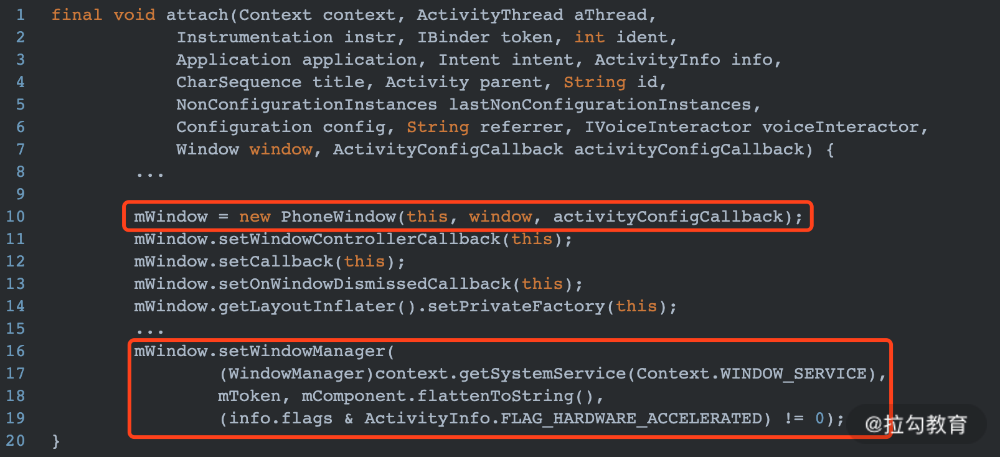
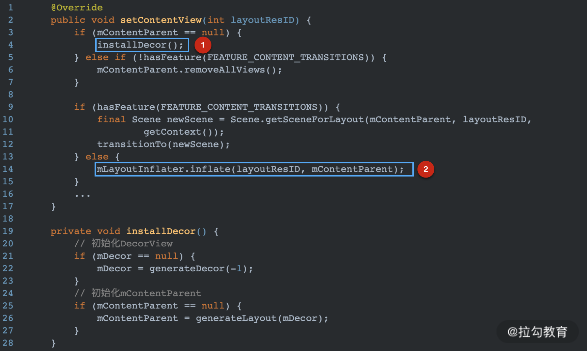
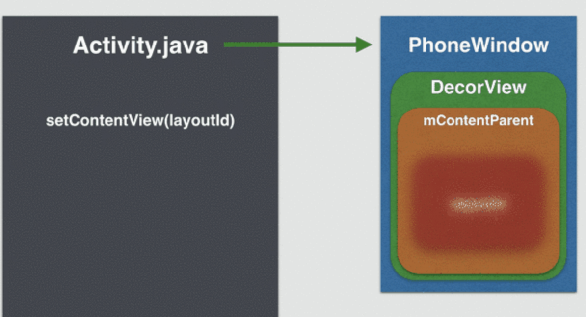
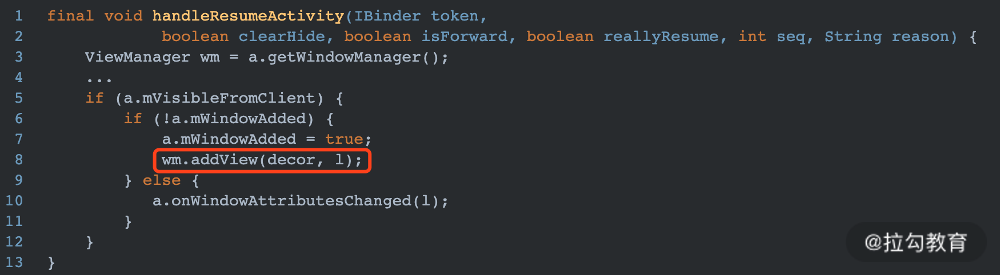
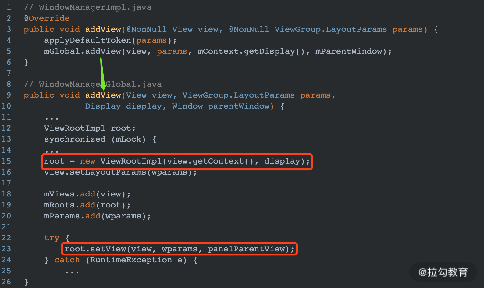
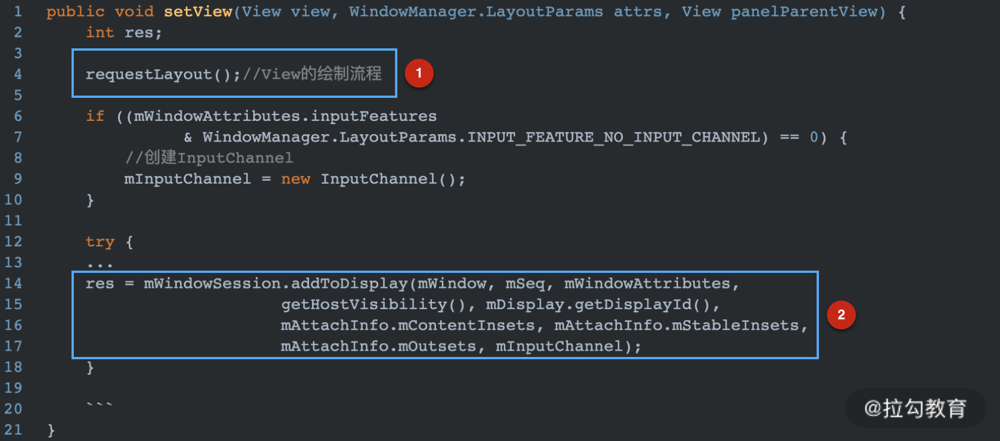

## 【A】高级UI系列2：布局解析与视图加载-- Activiy、Window、View的关系


### 输出倒逼输入

- activity、window跟view的关系。

- **android.view由谁加载**

- 怎么获取view的宽高 -- view.post()和viewTreeObserverOnGlobalLayoutListener，如何确定值是准确的？

  


### 前言

平时开发，只要在Activity 的onCreate方法中通过setContentView()指定xml布局文件，然后就可以dataBinding、ButterKnife等各种骚操作了。那么我们指定的xml布局是怎么样加载、被解析成View的，如何添加到Window上成为Activity 的onResume 后“视图可见”状态的，又是谁发起的View内容加载和绘制的呢？


#### 布局加载与解析

 startActivity 的过程，最终代码会调用到 **ActivityThread** 中的 **performLaunchActivity** 方法，通过反射创建 Activity 对象，并调用Activity的 attach 方法。创建PhoneWindow对象。

> Activity



```java
final void attach(){
  	mWindow = new PhoneWindow(this);
  	mWindow.setCallback(this);
  	mWindow.setWindowManager(context.getSystemService,mToken);
  	mWindowManager = mWindow.getWindowManager();
}
```


> PhoneWIndow

Activity#onCreate中调用的setContentView最终调用的是Window的setConentView():

```
getWindow().setContentView(layoutResID);
```

PhoneWIndow的setContentView()方法里，真正进行了布局解析：



DecorView是一个FrameLayout，其自带一个mContentParent（实际上是一个ViewGroup ），我们自己实现的布局被添加到上面。




我们早就知道在Activity的onResume之后，视图才变为可见。现在从源码角度就可以解释了：

在 ActivityThread 的 handleResumeActivity 中，会调用 WindowManager 的 addView 方法将 DecorView 添加到 WMS(WindowManagerService) 上。



```java
final void handleResumeActivity(){
  	ViewManager wm = a.getWindowManager();
  	if(!a.mWindowAdded){
      	a.mWindowAdded = true;
      	wm.addView(decor , l);
    }
}
```

WindowManagerImpl的addView逻辑最终交由**WindowManagerGlobal**类实现

> WindowManagerGlobal类



创建了关键对象ViewRootImpl。


```
Window与ViewRoot的关系：
调用Window的addView就会创建一个ViewRoot，给window添加第二个View时如果没移除第一个View，抛出 android.view.WindowManager.BadTokenException
```


ViewRootImpl类对象的setView方法中 requestLayout()方法发起布局首次绘制流程。




##### Inflater xml解析过程


### 参考资源

- 


