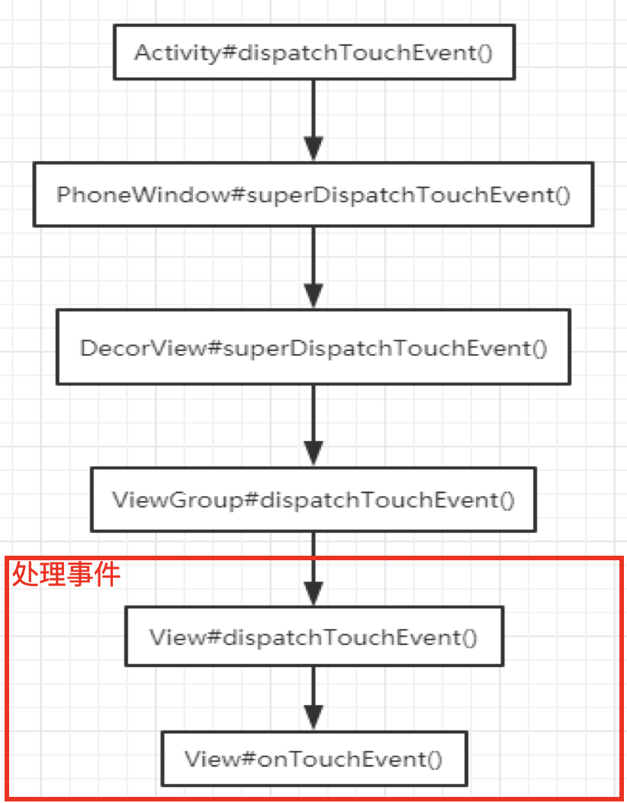
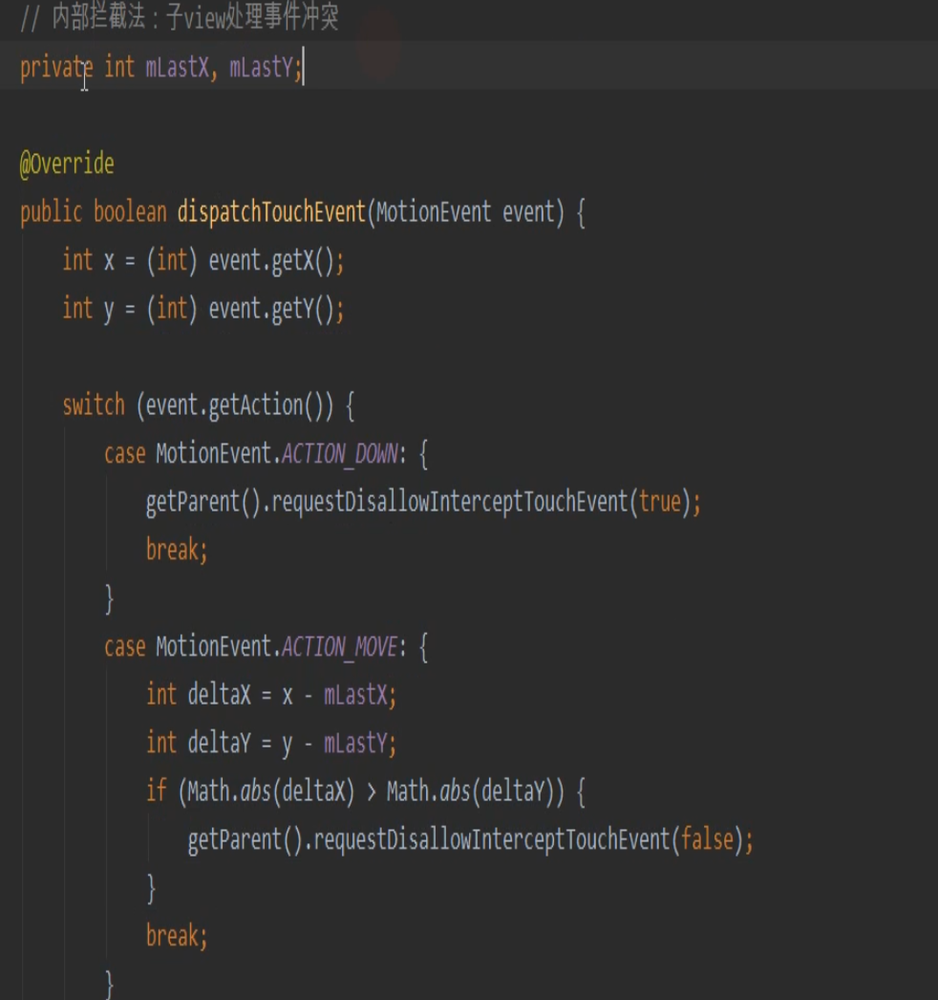
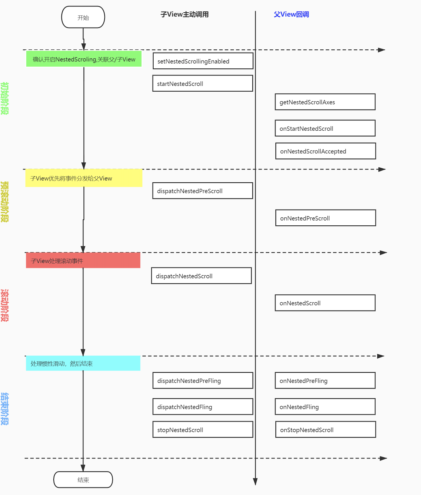

## 【A】高级UI系列3 ：View事件分发机制与滑动冲突处理


### SelfCheck

- **事件分发机制点击事件流程，**touch事件的传递机制和函数调用栈 
-  view分发反向制约的方法 
- 如果添加onClick事件怎么处理事件 ，对ACTION_CANCEL事件的理解，什么时候触发 
- **多点触控如何传递，**多手势的具体实现


### View 事件分发机制

Android touch事件从底层驱动到WMS，再传到View中，大致分三个层面：

1. touch 事件是如何从驱动层传递给 Framework 层的 InputManagerService；
2. WMS 是如何通过 ViewRootImpl 将事件传递到目标窗口；
3. **touch 事件到达 DecorView 后，是如何一步步传递到内部的子 View 中的。**


如果要说整个事件的传递机制，是Android底层收到触摸屏的事件后，使用socket跨进程通信，用InputDispatcher将事件发送给APP进程，由主线程的Looper去取出消息进行处理。在Android APP层面，屏幕事件被封装成 MotionEvent对象进行分发。

> MotionEvent 共4种

| **事件**      | **简介**                            |
| ------------- | ----------------------------------- |
| ACTION_DOWN   | 手指 初次接触到屏幕 时触发          |
| ACTION_MOVE   | 手指 在屏幕上滑动时触发，会多次触发 |
| ACTION_UP     | 手指 离开屏幕 时触发                |
| ACTION_CANCEL | 事件 被上层拦截 时触发              |


> 基于API 28源码
>

事件 -> Activity.dispatchTouchEvent -> PhoneWindow.superDispatchTouchEvent() -> DecorView.superDispatchTouchEvent()  -> ViewGroup.dispatchTouchEvent()(我们自己的布局ViewGroup)




ViewGroup不消费事件，则调回Activity的

```
onTouchEvent(ev);
```


对于 View , 它没有事件分发的逻辑，只关心如何**处理事件**。

ViewGroup 继承自View，作为容器，重写了onDispatchTouchEvent方法，处理**事件分发**的逻辑。


#### View事件处理

​	*从View#dispatchTouchEvent方法看onTouch、onClick、onLongClick...之间的关系。*

1. **View如果设置了onTouchListener ，优先触发。**

   > View#dispatchTouchEvent(MotionEvent event) 精简代码

```java
    public boolean dispatchTouchEvent(MotionEvent event) {
        boolean result = false;
        ListenerInfo li = mListenerInfo;
        if (li != null && li.mOnTouchListener != null
                && (mViewFlags & ENABLE_MASK) == ENABLE
                && li.mOnTouchListener.onTouch(this, event)) {
            result = true; // View是ENABLE状态 ，True 表示listener消费了事件
        }
        //OnTouchListener如果不消费事件，交给 onTouchEvent(event)方法消费
        if (!result && onTouchEvent(event)) {
            result = true;  //onTouchEvent() 返回true，则告知父ViewGroup它要消费事件
        }
        return result;
    }

```

onTouch(this, event) 如果return true 表示消费事件，就不会进入到 onTouchEvent(event) 事件处理逻辑，反之，result 如果为false ， 则可以进入  onTouchEvent(event) 方法，进行onClick等事件的监测。


> View#onTouchEvent(event) 精简代码

```java
    public boolean onTouchEvent(MotionEvent event) {
        final float x = event.getX();
        final float y = event.getY();
        final int viewFlags = mViewFlags;
        final int action = event.getAction();

        final boolean clickable = ((viewFlags & CLICKABLE) == CLICKABLE
                || (viewFlags & LONG_CLICKABLE) == LONG_CLICKABLE)
                || (viewFlags & CONTEXT_CLICKABLE) == CONTEXT_CLICKABLE;
        if (clickable) {
            switch (action) {
                case MotionEvent.ACTION_UP:
                    //click事件在 MotionEvent.ACTION_UP 处理逻辑中检测
                    if (!mHasPerformedLongPress) {
                        if (mPerformClick == null) {
                            mPerformClick = new PerformClick();
                        }
                        if (!post(mPerformClick)) {
                            performClickInternal();
                        }
                    }
                    break;
                case MotionEvent.ACTION_DOWN:
                    mHasPerformedLongPress = false;
                    setPressed(true);
                    checkForLongClick(0, x, y);
                    break;
                case MotionEvent.ACTION_CANCEL:
                    if (clickable) {
                        setPressed(false);
                    }
                    mHasPerformedLongPress = false;

                    break;
                case MotionEvent.ACTION_MOVE:
//                    if (!pointInView(x, y, mTouchSlop)) {
//                        // Outside button
//                        // Remove any future long press/tap checks
//                        removeTapCallback();
//                        removeLongPressCallback();
//                        if ((mPrivateFlags & PFLAG_PRESSED) != 0) {
//                            setPressed(false);
//                        }
//                        mPrivateFlags3 &= ~PFLAG3_FINGER_DOWN;
//                    }
                    break;
            }
            return true;
        }
        return false;
    }
```


#### ViewGroup事件分发

​		ViewGroup重写了View的dispatchTouchEvent方法，写了作为容器，对于事件拦截、分发的逻辑。


> ##### 初始DOWN事件传递过程

```java
  public boolean dispatchTouchEvent(MotionEvent ev) {
        final int action = ev.getAction();
        final int actionMasked = action & MotionEvent.ACTION_MASK;

        boolean handled = false;

        //check for interception
        final boolean intercepted;

        //1.判断容器自身是否要拦截事件
        if (ev.getAction() == MotionEvent.ACTION_DOWN
                || mFirstTouchTarget != null) {
            //接收到初始DOWN事件或者已有mFirstTouchTarget
            final boolean disallowIntercept = (mViewGroupFlags & FLAG_DISALLOW_INTERCEPT) != 0;
            //子View没有不允许拦截
            if (!disallowIntercept) {
                intercepted = onInterceptTouchEvent(ev);//容器自身是否拦截
            } else {
                intercepted = false;
            }
        } else {
            //不是DOWN事件的时候主动进行拦截
            intercepted = true;
        }

        boolean canceled = false;

        TouchTarget newTouchTarget = null;
        //2.如果没cancel而且容器也不拦截，分发
        boolean alreadyDispatchedToNewTouchTarget = false; //重置
        if (!canceled && !intercepted) {
            // DOWN事件才分发，到MOVE事件时不再进行分发
            if (actionMasked == MotionEvent.ACTION_DOWN) {
                final int actionIndex = ev.getActionIndex();//always 0 for down
                int childrenCount = mChildrenCount;

                if (newTouchTarget == null && childrenCount != 0) {
                    //从前到后遍历children，找到接收事件的view
                    final View[] children = mChildren;

                    for (int i = childrenCount - 1; i >= 0; i--) {
                        final View child = getAndVerifyPreorderedView(
                                preorderedList, children, childIndex);

                        //1.是否可见，是否有动画；2.点击区域是否在View范围内
                        if (!canViewReceivePointerEvents(child)
                                || !isTransformedTouchPointInView(x, y, child, null)) {
                            continue;
                        }

                        if (dispatchTransformedTouchEvent(ev, false, child, idBitsToAssign)) {
                            // newTouchTarget == mFirstTouchTarget
                            newTouchTarget = addTouchTarget(child, idBitsToAssign);
                            alreadyDispatchedToNewTouchTarget = true;
                            break; //跳出循环
                        }
                    }
                }
            }
        }

        //3.如果拦截，则分发给容器自己处理；否则分发给mFirstTouchTarget链表头部的子View
        if (mFirstTouchTarget == null) {
            //没有target，则把当前容器视为普通的View
            handled = dispatchTransformedTouchEvent(ev, canceled, null, TouchTarget.ALL_POINTER_IDS);
        } else {
            TouchTarget predecessor = null;
            TouchTarget target = mFirstTouchTarget;
            //单点触控，while只一次
            while (target != null) {
                final TouchTarget next = target.next; //next == null;
                if (alreadyDispatchedToNewTouchTarget && target == newTouchTarget) {
                    handled = true;
                } else {
                    //分发前alreadyDispatchedToNewTouchTarget被重置为false，所以MOVE事件会走到这里

                    //判断cancel
                    final boolean cancelChild = resetCancelNextUpFlag(target.child)
                            || intercepted;

                    //MOVE事件，优先分发给初始DOWN事件保存的mFirstTouchTarget
                    if (dispatchTransformedTouchEvent(ev,canceled,target.child,target.pointerIdBits)){
                        handled = true;
                    }
                    //正常情况下 cancelChild = false
                    if (cancelChild){
                        if (predecessor == null){
                            mFirstTouchTarget = next;
                        }else{
                            predecessor.next = next;
                        }
                        target = next;
                        continue;
                    }
                }
                target = next;//next null，所以 while循环结束
            }
        }
        return handled;
    }
```


> MOVE事件

***根据mFirstTouchEvent，再次分发事件***

​	MOVE事件不会再次遍历child[] 进行分发，而是由父容器找到初始DOWN事件记录的mFirstTouchTarget保存的View进行处理。

​	事件冲突也是针对MOVE事件处理的。


> CANCEL事件

当父容器的onInterceptTouchEvent()先返回false，事件分发给子View，在接下来MOVE事件过程中，父容器的onInterceptTouchEvent又返回true，intercepted标识又重新置为true。子View就会收到ACTION_CANCEL 事件。

典型场景：

ScrollView中添加自定义View，ScrollView默认在DOWN事件中不会进行拦截，当手指进行滑动到达一定距离，onInterceptTouchEvent返回true，触发ScrollView滑动效果，滚动的瞬间，内部子View接收到一个CANCEL事件，并丢失焦点。


dispatchTransformedTouchEvent()方法中 根据canceled对MotionEvent进行封装

```java
private boolean dispatchTransformedTouchEvent(MotionEvent event, boolean canceled, com.zhx.baselibrary.view.event.View child, int allPointerIds) {
        final boolean handled;
        final int oldAction = event.getAction();
        //对于CANCEL事件的处理
        if(canceled || oldAction == MotionEvent.ACTION_CANCEL){
            event.setAction(MotionEvent.ACTION_CANCEL);
            if (child == null){
                handled = super.dispatchTouchEvent(event);
            }else{
                handled = child.dispatchTouchEvent(event);
            }
            event.setAction(oldAction);
            return handled;
        }

        if (child == null) {
            handled = super.dispatchTouchEvent(event);
        } else {
            handled = child.dispatchTouchEvent(event);
        }
        return handled;
    }
```


### 滑动冲突处理

处理事件冲突只能在MOVE的时候处理。


#### 内部拦截法 -- 子View处理冲突

子View的尚方宝剑，在收到ACTION_DOWN事件时调用**getParent().requestDisallowInterceptTouchEvent(true)**方法，使得父容器判断是否拦截的逻辑为false。

子View在ACTION_MOVE事件中，根据自己实际情况，调用getParent().requestDisallowInterceptTouchEvent(false) ， 将控制权再交还给父容器。


> 子View




> 容器ViewGroup

```java
  			 //1.判断容器自身是否要拦截事件
        if (ev.getAction() == MotionEvent.ACTION_DOWN
                || mFirstTouchTarget != null) {
            //接收到初始DOWN事件或者已有mFirstTouchTarget
            final boolean disallowIntercept = (mGroupFlags & FLAG_DISALLOW_INTERCEPT) != 0;
            //子View没有不允许拦截
            if (!disallowIntercept) {
                intercepted = onInterceptTouchEvent(ev);//容器自身是否拦截
            } else {
                intercepted = false;
            }
        } else {
            //不是DOWN事件的时候主动进行拦截
            intercepted = true;
        }
```


子View收到 DOWN事件后，调用getParent().requestDisallowInterceptTouchEvent(true) mGroupFlags置为FLAG_DISALLOW_INTERCEPT ，使得后续MOVE事件， 父容器不执行onInterceptTouchEvent(ev)方法，事件就会跳过分发，直接交给子View。


而mGroupFlags在父容器dispatchTouchEvent()收到初始DOWN事件时会被重置为false，导致子View设置无效。所以父容器这里要特殊处理，指定DOWN事件不拦截。

```java
  /**
  *	对于DOWN事件，
  */
		@Override
    protected boolean onInterceptTouchEvent(MotionEvent ev) {
        if (MotionEvent.ACTION_DOWN == ev.getAction()){
            super.onInterceptTouchEvent(ev);
            return false;
        }
        return true;
    }
```

控制权交给内部子View，只有当子View允许拦截，父容器才拦截。


当子View在ACTION_MOVE事件中，根据自己实际情况，调用getParent().requestDisallowInterceptTouchEvent(false)  则使得 intercepted 置为true。

这样以来产生两个效果：


1. 第三步事件处理逻辑，else语句中 cancelChild 变成true。

   则在dispatchTransformedTouchEvent()方法中, 封装成一个CANCEL事件，发给子View 。

   即当子View调用**getParent().requestDisallowInterceptTouchEvent(false)**  ，表示放弃控制权后，间接地给自己发了一条CANCEL事件。

```java

        if (mFirstTouchTarget == null) {
            //没有target，则把当前容器视为普通的View
            handled = dispatchTransformedTouchEvent(ev, canceled, null, TouchTarget.ALL_POINTER_IDS);
        } else {
            TouchTarget predecessor = null;
            TouchTarget target = mFirstTouchTarget;
            //单点触控，while只一次
            while (target != null) {
                final TouchTarget next = target.next; //next == null;
                if (alreadyDispatchedToNewTouchTarget && target == newTouchTarget) {
                    handled = true;
                } else {
                    //分发前alreadyDispatchedToNewTouchTarget被重置为false，所以MOVE事件会走到这里

                    //判断cancel
                    final boolean cancelChild = resetCancelNextUpFlag(target.child)
                            || intercepted;
                 
                    //cancelChild = true
                    if (dispatchTransformedTouchEvent(ev,canceled,target.child,target.pointerIdBits)){
                        handled = true;
                    }
                    // cancelChild = true ， mFirstTouchTarget置为 null
                    if (cancelChild){
                        if (predecessor == null){
                            mFirstTouchTarget = next;
                        }else{
                            predecessor.next = next;
                        }
                        target = next;
                        continue;
                    }
                }
                target = next;//next null，所以 while循环结束
            }
        }
```

2. cancelChild = true 后， mFirstTouchTarget 置为null ， 意味着后续的MOVE事件会分发给父容器自己。从而实现，内部拦截法处理滑动冲突。


> dispatchTransformedTouchEvent()方法：

```java
   private boolean dispatchTransformedTouchEvent(MotionEvent event, boolean canceled, View child, int allPointerIds) {
        final boolean handled;
        final int oldAction = event.getAction();
        //对于CANCEL事件的处理
        if(canceled || oldAction == MotionEvent.ACTION_CANCEL){
            event.setAction(MotionEvent.ACTION_CANCEL);
            if (child == null){
                handled = super.dispatchTouchEvent(event);
            }else{
                handled = child.dispatchTouchEvent(event);
            }
            event.setAction(oldAction);
            return handled;
        }

        if (child == null) {
            handled = super.dispatchTouchEvent(event);
        } else {
            handled = child.dispatchTouchEvent(event);
        }
        return handled;
    }
```


#### 外部拦截法 -- 父容器处理冲突

```java
    // 外部拦截法：父容器处理冲突
    // 我想要把事件分发给谁就分发给谁
    @Override
    public boolean onInterceptTouchEvent(MotionEvent event) {
        int x = (int) event.getX();
        int y = (int) event.getY();

        switch (event.getAction()) {
            case MotionEvent.ACTION_DOWN: {
                mLastX = (int) event.getX();
                mLastY = (int) event.getY();
                break;
            }
            case MotionEvent.ACTION_MOVE: {
                int deltaX = x - mLastX;
                int deltaY = y - mLastY;
                if (Math.abs(deltaX) > Math.abs(deltaY)) {
                    return true;
                }
                break;
            }
            case MotionEvent.ACTION_UP: {
                break;
            }
            default:
                break;
        }
        return super.onInterceptTouchEvent(event);
    }
```


### 嵌套滑动机制与NestedScrollView原理

两个View同一方向滑动。

scrollY ： 上移

外部拦截法，父容器停止后，子View无法继续滑动。


事件类型

touch

fling


#### 嵌套滑动机制

可滑动的ViewGroup充当父容器 实现 **NestedScrollingParent** 

```

```

可滑动的ViewGroup充当子View 实现**NestedScrollingChild**

```java
void setNestedScrollEnabled(boolean enable);
boolean startNestedScroll()
void dispatchNestedPreSroll(); 
```


##### 案例：

```

```


##### 原理：




1. 孩子问父亲吃 dispatchNestedPreScroll
   1. 父亲全吃完
   2. 父亲象征性咬了一口；
2. 孩子吃
   1. 全部吃完
   2. 咬两口，还有剩余
3. 孩子再问父亲吃 dispatchNestedPreScroll
   1. 全部吃完
   2. 又咬一口 还有剩余
4. 孩子再吃
   1. 全部吃完


scrollBy(dy)消费  dy值可能大于真实可滑动距离，滑动过头问题

### 

事件消费是从View开始，当MOVE事件到来：

```
子View
startNestedScroll() 主动开启嵌套滑动


子View

dispatchNestedPreScroll

dispatchNestedScroll


父容器

onNestedPreScroll() 

onNestedScroll() 

进行嵌套滑动
```


#### NestedScrollView源码

作为子View

作为父容器 onInterceptTouchEvent()


