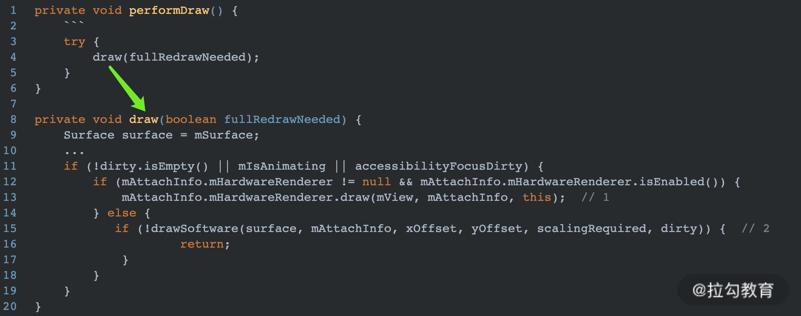
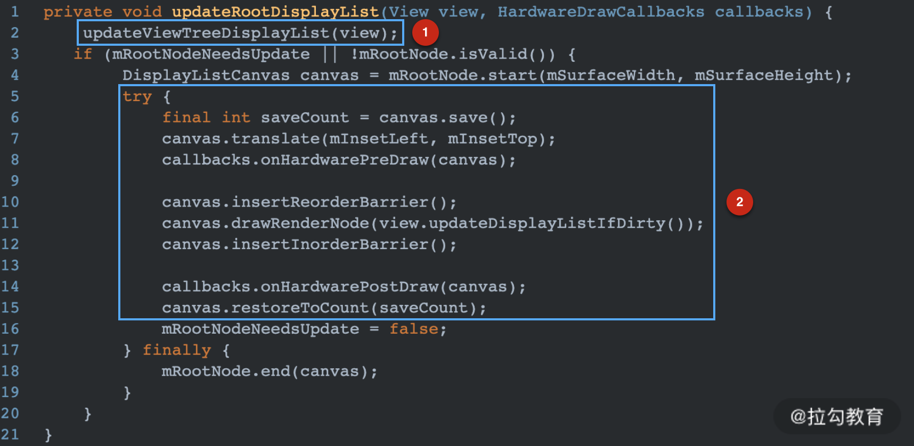
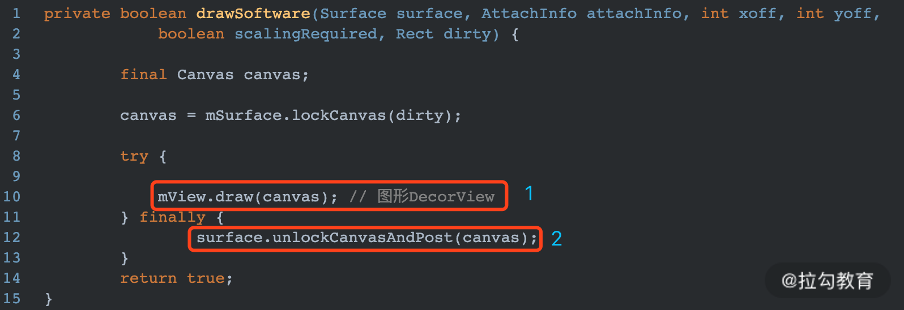
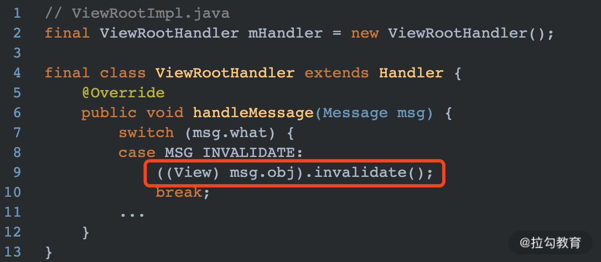

## 【A】高级UI系列4：View绘制原理

### SelfCheck

- canvas怎么来的。
- View绘制机制，onMeasure onLayout ,onDraw方法的调用机制谈一下,invalidate()方法,为什么有时候不会回调onDraw()
- surfaceView 和普通view的区别
- 


上篇说到Activity启动、布局文件解析、视图加载。ViewRootImpl.setView()方法中调用**requestLayout()** 发起了视图首次绘制。


### 屏幕绘制

> ViewRootImpl#requestLayout()


1. **调用checkThread()** ：判断当前线程是否为创建ViewRootImpl的线程，一般情况下就是主线程。

```java
   void checkThread() {
        if (mThread != Thread.currentThread()) {
            throw new CalledFromWrongThreadException(
                    "Only the original thread that created a view hierarchy can touch its views.");
        }
    }
```

2. 调用**scheduleTraversals()** 

   1. 向MessageQueue发送同步屏障消息，优先视图绘制相关异步消息通过

   2. 调用Choreographer.postCallback(mTraversalRunnable)方法 ，mTraversalRunnable作为回调 传入

```java
/**
*	安排遍历视图
*/
   void scheduleTraversals() {
        if (!mTraversalScheduled) {
            mTraversalScheduled = true;
            mTraversalBarrier = mHandler.getLooper().getQueue().postSyncBarrier(); //添加同步屏障
            //申请VSYNC信号，Choreographer类职责是控制动画、输入、绘制的时机。接收垂直同步的时间脉冲，准备下一帧的内容。
            mChoreographer.postCallback(
                    Choreographer.CALLBACK_TRAVERSAL, mTraversalRunnable, null);
            if (!mUnbufferedInputDispatch) {
                scheduleConsumeBatchedInput();
            }
            notifyRendererOfFramePending();
            pokeDrawLockIfNeeded();
        }
    }
```


> Choreographer#postCallback方法

Choreographer向申请VSync信号，

```
scheduleFrameLocked(long now)  -> 
mDisplayEventReceiver.scheduleVsync() ->
nativeScheduleVsync(long receiverPtr);  //通知底层准备视图绘制数据
```


收到VSync信号，后mTraversalRunnable将会执行

```java
void doTraversal() {
    if (mTraversalScheduled) {
        mTraversalScheduled = false;
      //移除消息屏障  
     mHandler.getLooper().getQueue().removeSyncBarrier(mTraversalBarrier);
        if (mProfile) {
            Debug.startMethodTracing("ViewAncestor");
        }
        performTraversals(); //至此就到了熟悉的performLayout、performMessure、performDraw方法
        if (mProfile) {
            Debug.stopMethodTracing();
            mProfile = false;
        }
    }
}
```

但看ViewRootImpl的performDraw方法



ViewRootImpl 中 Surface好比画板上的一张画纸，Surface中的内容最终会被传递给底层的SurfaceFlinger最终合成并显示到屏幕上。


##### 硬件加速绘制

View视图被抽象成RenderNode节点，View中绘制操作都会被抽象成一个个DrawOp。Canvas将所有的DrawOp进行缓存操作。所有的DrawOp对应的openGL命令构建完后，使用RenderProxy向**RenderThread**发送消息，请求OpenGL进行渲染。整个渲染过程是通过 GPU 并在不同线程绘制渲染图形，因此整个流程会更加顺畅。




##### 软件绘制 drawSoftware()



默认情况下软件绘制没有采用 GPU 渲染的方式，drawSoftware 工作完全由 CPU 来完成


##### invalidate 轻量级刷新

这个方法根requestLayout的区别在于，它不一定会触发View的measure和layout操作。

 invalidate 是在 UI 线程调用，postInvalidate 可以在非 UI 线程调用。


最终都会通过ViewRootImpl内部的Handler 切回original线程




### 参考资源

- Android图形显示系统（一）

  https://blog.csdn.net/a740169405/article/details/70548443


