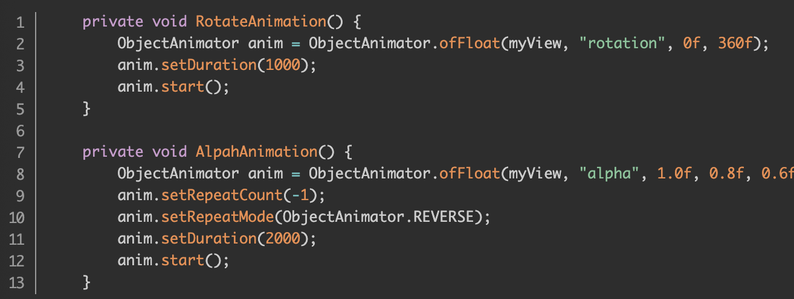

## 【A】高级UI系列十：动画应用与原理


### 动画基础

#### 帧动画


#### 补间动画

View动画

view控件属性未改变（点击事件还在原位问题）


#### 属性动画

不仅是View，可以针对任何对象做动画。


##### 属性动画使用方式

1. ObjectAnimator / ValueAnimator
2. 定义AnimationSet


用属性动画实现上面补间动画的效果



指定属性名称（要求提供该属性的set和get方法）、起始值和结束值，


也可以使用AnimationSet播放属性动画集合

```cpp
                ObjectAnimator alphaAnim = ObjectAnimator.ofFloat(myView, "alpha", 1.0f, 0.5f, 0.8f, 1.0f);
                ObjectAnimator scaleXAnim = ObjectAnimator.ofFloat(myView, "scaleX", 0.0f, 1.0f);
                ObjectAnimator scaleYAnim = ObjectAnimator.ofFloat(myView, "scaleY", 0.0f, 2.0f);
                ObjectAnimator rotateAnim = ObjectAnimator.ofFloat(myView, "rotation", 0, 360);
                ObjectAnimator transXAnim = ObjectAnimator.ofFloat(myView, "translationX", 100, 400);
                ObjectAnimator transYAnim = ObjectAnimator.ofFloat(myView, "tranlsationY", 100, 750);
                AnimatorSet set = new AnimatorSet();
                set.playTogether(alphaAnim, scaleXAnim, scaleYAnim, rotateAnim, transXAnim, transYAnim);
//                set.playSequentially(alphaAnim, scaleXAnim, scaleYAnim, rotateAnim, transXAnim, transYAnim);
                set.setDuration(3000);
                set.start();
```


##### 插值器与估值器

**TimeInterpolator 时间插值器**，作用是控制动画“节奏” ，根据时间流逝来属性值改变的百分比，系统预置了线性插值器（LinearInterpolator）、加速插值器AccelerateInterpolator等。

**TypeEvaluator 类型估值器**作用是根据属性改变的百分比，计算出具体改变后的属性值，系统预置了整型属性IntEvaluator、浮点型属性FloatEvaluator和针对Color属性ArgbEvaluator。

> 示例：实现背景色3时内从0xFFFF8080到0xFF8080FF的匀速渐变

```
    ValueAnimator colorAnim = ObjectAnimator.ofInt(tv,"backgroundColor",0xFFFF8080,0xFF8080FF);
        colorAnim.setDuration(3000);
        colorAnim.setEvaluator(new ArgbEvaluator());
        colorAnim.setRepeatCount(ValueAnimator.INFINITE);
        colorAnim.setRepeatMode(ValueAnimator.REVERSE);
        colorAnim.start();
```


#### 属性动画原理


多次调用想要改变的对象属性的set方法，且由于插值器和估值器的作用，每次传递set方法的值都不一样。


#### 动画存在哪些问题

1. 帧动画图片较多且较大时，容易出现OOM问题

2. 属性动画，repeatCount设为无限循环时内存泄漏问题（View动画无此问题）。

3. View动画状态问题

   View动画移动后，只是对View的影像做动画，并不是真正改变View的状态，有时候会出现setVisibility失效，动画完成后View无法隐藏现象。view.clearAnimation清除动画先。

4. 动画元素交互问题

   View动画移动后，只是影像移动了，点击事件还是在老位置。


### 实践

1.闪屏logo动画效果

https://mp.weixin.qq.com/s/T2FYhz1KbzXVvmh65nz94g


