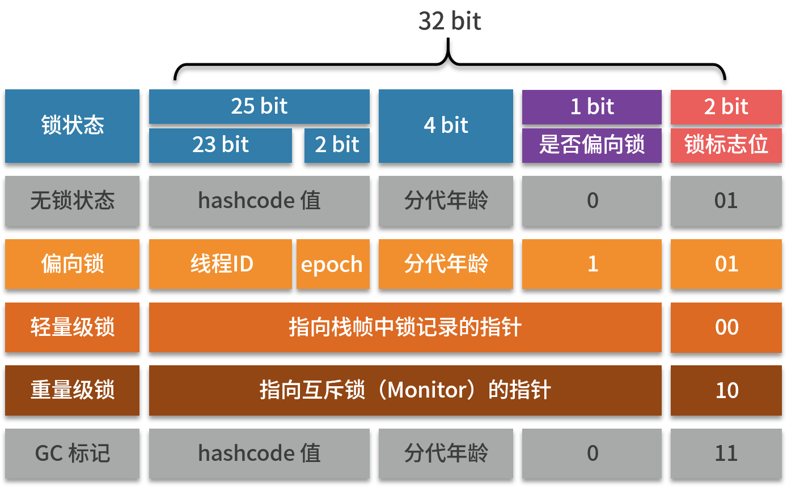

## 【B】Java -- 多线程并发

### SelfCheck

- 有三个线程在做计算，把结果发送给第四个线程

- **线程同步的问题，常用的线程同步**

- 主线程等待所有线程执行完毕，再执行某个特定任务怎么实现？原理和源码看过没？

- 俩线程分别持续打印奇数和偶数，实现俩线程的交替打印（从小到大）

- 7个线程按次序打印1-70（自旋+cas）

- sleep 、wait、yield 的区别？

- wait 的线程如何唤醒，三个线程wait，唤醒情况是什么样的

- **Java的生产者-消费者模型** （非阻塞式）

- **volatile 的作用和原理 ？ 一个 int 变量用 volatile 修饰，多线程去操作 i++，是否线程安全？如何保证 i++ 线程安全？（什么叫指令重排）**。为什么我们不在每个变量的前面加上volatile。

- 

- **Integer类是不是线程安全的，为什么？AtomicInteger 的底层实现原理？**

- **不使用同步锁如何实现线程安全**CAS

- 写一个死锁的程序。面试官就一直让我解释这段代码。考察得很细致。

- java锁的模型 ？乐观锁使用。ReentrantLock 公平锁与非公平锁。

- **synchroinzed的原理是什么 ？ synchronized 修饰 static 方法、普通方法、类、方法块区别**

- synchroinzed关键字和lock的区别? 他们对线程的控制原理简单说下

- **针对concurrent包下面的一些类的问题**

- 不通过concurrent包下面的现成类库来实现一个CountDownLatch，怎么实现？使用你这个CountDownLatch的这3+1个线程，一共需要几个锁呢？

- **线程池的理解，Java线程池有哪些，以及创建线程池的几个关键参数 ？自己实现的话怎样去做**

- threadlocal了解吗

- 

  


### 知识体系

java中主要以多线程方式实现并发

- 线程与线程同步

  - sleep 、 wait/notify
  - Join、yield 
  - ThreadLocal
  - 

- Java内存模型JMM：

  - 重排序问题
  - 顺序一致性问题
  - happens-before原则
  - as if serial

- volatile：

  - `volatile`实现机制
  - 内存语义
  - 内存模型

- - 

- Java锁模型

  - `synchronized`原理
  - 锁优化：
    1. 自旋锁
    2. 轻量级锁
    3. 重量级锁
    4. 偏向锁

- 并发同步原理：

  - CAS: Compare and Swap 缺陷
  - AQS:
    1. AbstractqueuedSynchronizer同步器
    2. AQS基本思想 -- CLH队列锁
    3. 同步状态的获取和释放
    4. 线程阻塞和唤醒

- 并发同步框架 -- concurrent工具包

  - 锁：`ReentrantLock`、`Condition`、`ReentrantReadWriteLock`、`LockSupport`

  - 并发工具类：`Semaphore`、`CyclicBarrier`、`CountDownLatch`

  - 原子操作：
    
    - 基本类型：`AtomicBoolean`、`AtomicInteger`、`AtomicLong`
    - 数组：`AtomicIntegerArray`、`AtomicLongArray`、`AtomicReferenceArray`
    - 引用类型：`AtomicReference`、`AtomicReferenceArrayFieldUpdater`
    
  - 并发集合

    - ConcurrentHashMap

    - BlockingQueue

      ​	LinkedBlockingQueue

    - CopyOnWriteArrayList

    - ConcurrentLinkedQueue

    - ConcurrentSkipListMap

- 线程池：
  
  - `ThreadPoolExecutor`（拒绝策略、参数优化）、`ScheduledExecutorService`
  - `Callable`和`Future`
  
  


### 进程与线程

进程是CPU分配资源、执行程序的完整动态过程，执行过程中有着就绪-执行-阻塞状态转换，它是系统进行资源分配和调度的独立单位。线程是CPU进行调度的最小单位，线程可以理解为进程的多条执行线索，是比进程更小的能独立运行的基本单位，同一个进程可以有多个线程并发执行，且属于同一进程的多线程之间共享为进程分配的资源。


##### 线程创建

以前普遍来说有三种方式，现在根据Thread类注释说明，应该有两种方法可以创建新的执行线程。

1. 继承Thread类，扩展run方法

2. 实现Runnable接口 ，传给Thread构造函数

   从源码上看 Callable方式实质也是Runnable

   

##### 线程的停止

```
stop() 强制性野蛮停掉，不关心是否释放资源、线程任务是否完成。可能造成数据异常
suspend() 占据资源不释放，进入挂起状态
destroy()
```

正确实践是组合使用interrupt系列方法：

```
    public void interrupt() 
    public native boolean isInterrupted(); //返回中断状态标识位
    public static native boolean interrupted(); //返回中断状态标识位，并重置为false。
```


JDK中线程是协作式不是抢占式。其他线程使用interrupt()方法尝试中断线程A，只是打个招呼，使线程A的中断状态标识位isInterrupted变为true。但是线程A中可以通过isInterrupted()方法或者static native boolean interrupted()判断中断状态，并自行决定是否要结束任务，当然也可以选择不理会。

sleep()本身也支持中断检查，所以比较推荐用 interrupt() 来尝试停止线程。


> 守护线程

Thread#setDeamon(boolean )

设置两个线程的主-从关系，主线程退出，守护线程也随之停止。

我们平时创建的都是非守护线程，即用户线程。

我们都知道对于用户线程中try{} finally{ } 的finally{}中语句是一定会执行的，但是对于守护线程则不一定会执行到，完全看CPU调度。


##### 线程状态切换


​	有且仅有在资源不满足（获取不到锁）的时候，进入阻塞态。


* yield()方法 ：

  当前线程让出CPU，变成就绪状态，**不会释放锁资源。**


* join()方法：

  插队；效果是将两个交替执行的线程合并为顺序执行。

  当前线程A线程中，调用线程B的join()方法，则线程A将等待线程B执行完后才继续执行。

  

* isAlive() 方法: 检测线程是否存活

  

* wait() / notify() /notifyAll()方法：

  **wait()会释放当前线程持有的锁。**必须放到synchronized同步块中使用。

  被唤醒时，重新竞争锁，获取到锁以后才会执行wait()后面的代码。

  notify() / notifyAll() 对锁无影响，所以一般放在synchronized同步代码块最后一行，synchronized同步代码块执行完，锁自然释放。其他线程被唤醒后即可竞争资源。

* Thread.sleep()：

  Thread.sleep()和wait()方法都会使线程进入阻塞态。**sleep不释放锁。**


### 多线程并发与线程安全问题

##### 并行与并发

并发是宏观上同时执行，实际上是同一个CPU交替执行任务，并发是有时间概念的即单位时间内，并发量多少。多线程并发编程的意义在于充分利用CPU资源，提高任务执行速度。缺点在于并发编程下，带来了线程安全问题，创建线程、线程切换带来的资源消耗问题。

并行是真正意义上的，不同的CPU，同时执行不同的任务。


> 多进程和多线程并发问题有什么区别？


同一进程中的多个线程间是共享系统为进程分配的内存的。当多线程在CPU中并发运行的时候，会产生一些线程安全问题，Java 虚拟机规范提出了一套机制，对多线程并发工作原理、CPU缓存等场景进行了抽象描述，并制定了一套共享内存系统中多线程读写操作行为规范。这就是**Java内存模型（JMM）**。


### Java内存模型JMM 

CPU计算的速度远快于内存读取的速度，现代CPU引入了高速缓存，甚至是多级缓存。


在执行任务时，CPU 会先将运算所需要使用到的数据复制到高速缓存中，让运算能够快速进行，当运算完成之后，再将缓存中的结果刷回（flush back）主内存，这样 CPU 就不用等待主内存的读写操作了。


人们在着力于从硬件层面压榨CPU性能的同时，随之产生了一些问题多线程并发场景下特有的问题：

1. **可见性 -- 缓存一致性问题**

   高速缓存中各自保存了变量副本，缓存的有效性、更新时机，影响到Java多线程访问同一个变量的安全性。

   

2. **原子性 -- 指令重排序问题**

   CPU可能根据性能优化需要，对指令重排序。

   不是原子性操作，意味着线程执行中途可以被打断，由其他线程进行修改。

   比如DCL单例模式new Singleton() 指令重排序后，

   1.分配内存 

   2.对象引用指向内存空间（对象不为null）

   3.初始化内存空间

   若线程执行步骤2时，有其他线程被CPU调度，对象虽然不为null，但是其成员属性还未初始化，产生意想不到的错误。


> 什么是Java内存模型（JMM）

**内存模型是一套共享内存系统中多线程读写操作行为的规范**，这套规范屏蔽了底层各种硬件和操作系统的内存访问差异，解决了 CPU 多级缓存、CPU 优化、指令重排等导致的内存访问问题，从而保证 Java 程序（尤其是多线程程序）在各种平台下对内存的访问效果一致。*就好比用栈实现一个队列和用数组实现一个队列，虽然实现方式不同，但对于使用者都只需按照队列这种数据结构的性质来理解和操作即可。*

在 Java 内存模型中，我们统一用**工作内存（working memory）**来当作 CPU 中寄存器或高速缓存的抽象。线程之间的共享变量存储在**主内存（main memory）**中。所以我们作为开发者通常只需要理解为每个线程都有一个私有工作内存，工作内存中存储了该线程读/写共享变量的副本，以及按照Java内存模型提出的**规范要求**，进行多线程操作即可保证我们的程序按照期望安全的运行。


#### happens-before 先行发生原则

JMM规范提出了**happens-before**原则 ，它用于描述两个操作的内存可见性。

```
如果一个操作A happens-before另一个操作B，那么操作A的执行结果将对操作B可见。
```

反过来理解就是：如果操作A的结果想要对另一个操作B可见，那么操作A必须happens - before操作B。

比如：

如果 A happens-before B 不满足

也就是说当线程调用操作 B（getValue）时，即使操作 A（setValue）已经在其他线程中被调用过，并且 value 也被成功设置为 1，但这个修改对于操作 B（getValue）仍然是不可见的。根据之前我们介绍的 CPU 缓存，value 值有可能返回 0，也有可能返回 1。


如果 A happens-before B 成立

根据 happens-before 的定义，先行发生动作的结果，对后续发生动作是可见的。也就是说如果我们先在一个线程中调用了操作 A（setValue）方法，那么这个修改后的结果对后续的操作 B（getValue）始终可见。因此如果先调用 setValue 将 value 赋值为 1 后，后续在其他线程中调用 getValue 的值一定是 1。


##### 遵循如下规则就算符合 happens-before 原则

* 程序次序规则

* 锁定规则

* 变量规则

  volatile 保证了线程可见性。通俗讲就是如果一个线程先写了一个 volatile 变量，然后另外一个线程去读这个变量，那么这个写操作一定是 happens-before 读操作的。

* 线程启动规则

* 线程中断规则

* 线程终结规则

* 对象终结规则


##### Java 内存模型应用

如何才能使我们的多线程程序满足 happens-before 先行发生原则 ，根据这个原则解决多线程并发情况下存在的数据竞争干扰问题。为了满足这个原则，有时候需要我们的程序不惜以降低CPU性能为代价。

使用 volatile 或 synchronized关键字都可以使 setValue 和 getValue 符合 happens-before 原则——当在某一线程中调用 setValue 后，再在其他线程中调用 getValue 获取的值一定是 1。

使用volatile

```java
private volatile int value = 0;
```

使用synchronized关键字

```java
private int value = 0;
public void setValue(int value){
		synchronized{
				value = 1;
		}
}

public int getValue(){
		synchronized{
			return value;
		}
}
```


### JDK 内置的线程并发同步机制

#### volatile关键字

volatile是最轻量级的线程同步机制，只能保证可见性。当然，如果是变量简单读写操作，也可以视为保证了原子性。


##### volatile实现原理

volatile修饰的共享变量进行读写操作的时候会使用CPU提供的**Lock前缀**指令。这个Lock前缀指令被称为**“内存屏障”**，其作用是：

1. 禁止CPU指令重排序优化
2. 将当前处理器缓存行的数据写回到系统内存，这个写回操作会使得在其他CPU里缓存了该内存地址的数据无效。


**可见性：**

可以保证。Load/Store 指令后面接着一条内存屏障。强制更新CPU的缓存。


**原子性**：

不保证。只对单个变量读写get()/set()是可以认为有原子性的；但是对于复合操作"getAndOperate"类型的操作，则不保证原子性；


示例：不加volatile关键字，PrintThread中未感知到main线程已经将isReady = true; while(!isReady); 形成死循环，未执行number打印语句。

```java
 static boolean isReady = false;

    static int number = 50;

    private static class PrintThread extends Thread{
        @Override
        public void run() {
            System.out.println("PrintThread is running..");
            while (!isReady);
            System.out.println("number = "+number);
        }
    }
    public static void main(String[] args) {
        new PrintThread().start();
        try {
            Thread.sleep(100l);
        } catch (InterruptedException e) {
            e.printStackTrace();
        }
        isReady = true;
        System.out.println("main Thread is stop");
    }
```

加上volatile之后，

```
> Task :Javalib:TestVolatile.main()
PrintThread is running..
main Thread is stop
number = 50
```


适用场景：

一个线程写，多个线程读。


无锁化编程

volatile + CAS 替换 sync


#### JDK内置锁模型

使用锁机制保证线程同一时刻只有一个线程访问某一段代码或者变量。

锁的是某个具体对象。让多线程抢同一把锁，形成资源竞争，从而实现线程同步执行。

两线程若使用不同的对象锁，即便是同一个类的类锁和类的对象锁，也不构成同步互斥关系。


##### 对象头和 Monitor

Java对象在内存中布局分为3部分：对象头、实例数据、对齐填充。

32位虚拟机中，用对象头中 标记字段（Mark Word）存储了对象的hashCode、GC分代年龄，锁标识位、是否偏向锁等信息。




**Monitor** 可以视作一个同步机制，monitor()函数会创建ObjectMonitor对象，通过monitor_value来计数，判断锁是否正被别的线程持有。重量级锁会在对象头中，保存指向这个Monitor的指针，


##### synchronized关键字 

 

我们知道synchronized关键字，JDK提供的内置锁（重量级锁）。

类锁

对象锁


字节码表现是 monitor_enter 、monitor_exit 。

当线程执行遇到monitor_enter指令时会尝试获取内置锁，如果获取锁则锁计数器+1，如果没有获取锁则阻塞；当遇到monitor_exit指令时锁计数器-1，如果计数器为0则释放锁。


##### 错误加锁分析

###### Integer线程安全问题

Integer对象加锁试验

```java
    static class Worker implements Runnable {
        private Integer i;

        public Worker(Integer i) {
            this.i = i;
        }

        @Override
        public void run() {
            synchronized (i){
                i++;
                System.out.println(Thread.currentThread() + " i = "+i+" id@" + System.identityHashCode(i));
                try {
                    Thread.sleep(1000);
                } catch (InterruptedException e) {
                    e.printStackTrace();
                }
            }
        }
    }

    public static void main(String[] args) {
        Worker worker = new Worker(1);
        for (int j = 0; j < 5; j++) {
            new Thread(worker).start();
        }
    }
```

对i++操作之前，我们已经对 Integer对象 i 加了synchronized同步锁，但是打印结果发现，i 仍然没有按照预想 顺序打印出 i++ 结果。System.identityHashCode(i) 显示出 Integer i;  已经不是同一个对象 ：

```
Thread[Thread-0,5,main] i = 3 id@853776425
Thread[Thread-4,5,main] i = 6 id@1989415655
Thread[Thread-2,5,main] i = 4 id@176433561
Thread[Thread-1,5,main] i = 3 id@853776425
Thread[Thread-3,5,main] i = 5 id@2008215480
```

反编译可见：

Integer 的 i++操作 实质上是Integer.valueof() 


Integer.valueOf()的实现


生成了新的Integer对象。synchronized锁的是不同对象，自然同步失效了。


###### 死锁

两个或多个进程在执行过程中，由于竞争资源或者由于彼此通信

1. 争夺资源顺序不对
2. 拿到资源不放手


产生死锁的4个必要条件

1. 互斥条件：一个资源每次只能被一个进程使用。　（资源本身的特点，不可避免）

2. 请求与保持条件：一个进程因请求资源而等待时，不会释放已分配的资源。

3. 不剥夺条件：进程已获得的资源，在未使用之前，不能被强行剥夺。

4. 循环等待条件：若干个进程之间形成头尾相连的循环等待资源的关系。

   只要产生死锁，这四个条件必定成立，若破坏其中一个条件，死锁就不会发生了。


> 写一个死锁程序

```java
public static void main(String[] args) {
    final Object a = new Object();
    final Object b = new Object();
    Thread threadA = new Thread(new Runnable() {
        public void run() {
            synchronized (a) {
                try {
                    System.out.println("now i in threadA-locka");
                    Thread.sleep(500);
                    synchronized (b) {
                        System.out.println("now i in threadA-lockb");
                    }
                } catch (Exception e) {
                    // ignore
                }
            }
        }
    });

    Thread threadB = new Thread(new Runnable() {
        public void run() {
            synchronized (b) {
                try {
                    System.out.println("now i in threadB-lockb");
                    Thread.sleep(500);
                    synchronized (a) {
                        System.out.println("now i in threadB-locka");
                    }
                } catch (Exception e) {
                    // ignore
                }
            }
        }
    });

    threadA.start();
    threadB.start();
}
```


##### Java 虚拟机对 synchronized 的优化

线程的阻塞和唤醒需要 CPU 从用户态转为核心态，频繁的线程切换对 CPU 来说是一件负担很重的工作。


###### 自旋锁

所谓自旋，就是让该线程等待一段时间，不会被立即挂起，看当前持有锁的线程是否会很快释放锁。而所谓的等待就是执行一段无意义的循环即可（自旋）。


###### 偏向锁

有些时候锁不仅存在多线程的竞争，而且总是由同一个线程获得。因此为了让线程获得锁的代价更低引入了偏向锁的概念。偏向锁的意思是如果一个线程获得了一个偏向锁，如果在接下来的一段时间中没有其他线程来竞争锁，那么持有偏向锁的线程再次进入或者退出同一个同步代码块，不需要再次进行抢占锁和释放锁的操作。


###### 轻量级锁

有时候 Java 虚拟机中会存在这种情形：对于一块同步代码，虽然有多个不同线程会去执行，但是这些线程是在不同的时间段交替请求这把锁对象，也就是不存在锁竞争的情况。在这种情况下，锁会保持在轻量级锁的状态，从而避免重量级锁的阻塞和唤醒操作。


#### ThreadLocal

与synchronized一样都是用来多线程下并发访问。ThreadLocal 采用的是线程隔离策略，每个线程都有一个自己的变量副本。资源不进行共享，自然也就没有冲突和线程安全问题。


##### ThreadLocal使用

```java
private static ThreadLocal<Integer> threadLocal = new ThreadLocal<>(){
			protectd Integer initialValue(){
        	return 1; //可以直接初始化
      }
};
threadLocal.set(i);  //内部与会将Integer 对象 i 与 当前线程绑定
threadLocal.get()
```


##### ThreadLocal实现原理

每个Thread有一个 成员属性

```
ThreadLocal.ThreadLocalMap threadLocals = null;
```

这个ThreadLocal.ThreadLocalMap 以key-value形式，保存线程用到的各种ThreadLocal 变量的。其中key是ThreadLocal<?> 对象自己，通过指定范型表示ThreadLocal 是哪一种线程本地变量比如ThreadLocal<Looper>，如此可以实现ThreadLocalMap 为线程创建多个线程本地变量。value则保存着各个线程各自使用的对象。


ThreadLocalMap 的 Entry[] 数组 初识大小 16 

> Entry

```
static class Entry extends WeakReference<ThreadLocal<?>> {
    /** The value associated with this ThreadLocal. */
    Object value;

    Entry(ThreadLocal<?> k, Object v) {
        super(k);
        value = v;
    }
}
```


ThreadLocal封装了set、get方法，内部通过Thread.currentThread获取到对应的Thread及其ThreadLocal.ThreadLocalMap。

```java
public void set(T value) { 
    Thread t = Thread.currentThread();
    ThreadLocalMap map = getMap(t);//先走createMap(t，value)创建
    if (map != null)
        map.set(this, value);//ThreadLocalMap 不为空则以当前ThreadLocal对象为key，looper对象为value保存
    else
        createMap(t,  value);//创建了ThreadLocalMap后，赋值给了当前线程对象的threadLocals成员属性，以后通过getMap获取
}

void createMap(Thread t, T firstValue) {
        t.threadLocals = new ThreadLocalMap(this, firstValue);
}

ThreadLocalMap getMap(Thread t) {
        return t.threadLocals;
}

public T get() {
   Thread t = Thread.currentThread();
   ThreadLocalMap map = getMap(t);
   if (map != null) {
      ThreadLocalMap.Entry e = map.getEntry(this); //set的时候是以ThreadLocal对象为key
       	if (e != null) {
             T result = (T)e.value;
             return result;
        }
      }
   return setInitialValue();
}
```


##### ThreadLocal 内存泄漏问题


当用ThreadLocal 保存一下 new LocalVariable() 对象之后，内存持续暴增 -- 出现了内存泄漏。

ThreadLocalMap 内部用以保存数据的是Entry[] ，而Entry 类是继承自虚引用WeakReference，包装了一下key -- ThreadLocal对象和  相应的value 对象。

```java
static class Entry extends WeakReference<ThreadLocal<?>> {
    /** The value associated with this ThreadLocal. */
    Object value;

    Entry(ThreadLocal<?> k, Object v) {
        super(k);
        value = v;
    }
}
```

弱引用我们知道，一旦发生GC 就被回收掉，


ThreadLocal被回收了， value就访问不到了，只能等到Thread结束


记得调用remove()方法

内部 expunge方法

删除key为null 的value


> 为什么JDK要用弱引用 ，作为Entry


##### ThreadLocal安全问题

ThreadLocal 策略是线程隔离，每个线程有自己的变量副本，但是对于static型共享变量的访问，仍然是不安全的。


##### 应用场景 -- 数据库事务

ThreadLocal 保存每个线程绑定自己的conn 对象。


### 线程间协作 -- 生产者消费者模型


#### 等待-通知标准范式

wait()/notify() /notifyAll() 是 Object类的成员方法。

notify() : 唤醒在此对象监视器上等待的单个线程。如果所有线程都在此对象上等待，则会选择唤醒其中一个线程。

notifyAll() 唤醒所有。条件有多个的话尽量使用notifyAll()


等待范式：

```
Sync(对象){
	while(条件不满足){
		对象.wait(); //wait()方法进入休眠前会释放锁。且一定要在synchronized同步块中调用。被唤醒后重新尝试获取锁
	}
}
```


通知范式：

wait()释放对象锁，通知方这边才能拿到，并且在条件改变之后，发出通知、唤醒

```
sync(对象){
	//业务逻辑，改变条件
	//do sth;
	对象.notify/notifyAll(); //不释放锁，直到sync语句块结束	
}
```


##### 生产者消费者模型

```java
    public static void main(String[] args) {
        Queue<Integer> list = new ArrayDeque<>();
        for (int i = 0; i < 1; i++) {
            new Thread(new Producer(list, 10)).start();
        }

        for (int i = 0; i < 5; i++) {
            new Thread(new Consumer(list)).start();
        }
    }

    static class Producer implements Runnable {

        private Queue<Integer> list;

        private int max;

        public Producer(Queue<Integer> list, int maxLength) {
            this.list = list;
            this.max = maxLength;
        }

        @Override
        public void run() {
            while (true) {
                try {
                    Thread.sleep(200);
                } catch (InterruptedException e) {
                    e.printStackTrace();
                }

                synchronized (list) {
                    while (list.size() == max) {
                        try {
                            System.out.println("生产者" + Thread.currentThread().getName() + "  list达到最大容量，进行wait");
                            list.wait();
                            System.out.println("生产者" + Thread.currentThread().getName() + "  唤醒，继续生产");
                        } catch (InterruptedException e) {
                            e.printStackTrace();
                        }
                    }
                    list.offer(1);
                    list.notifyAll();
                    System.out.println("生产者" + Thread.currentThread().getName() + "  生产数据 " + 1);
                }
            }
        }
    }

    static class Consumer implements Runnable {

        private Queue<Integer> list;

        public Consumer(Queue<Integer> list) {
            this.list = list;
        }

        @Override
        public void run() {
            while (true) {
                try {
                    Thread.sleep(500);
                } catch (InterruptedException e) {
                    e.printStackTrace();
                }

                synchronized (list) {
                    while (list.isEmpty()) {
                        try {
                            System.out.println("消费者" + Thread.currentThread().getName() + "  list为空，进行wait");
                            list.wait();
                            System.out.println("消费者" + Thread.currentThread().getName() + "  退出wait");
                        } catch (InterruptedException e) {
                            e.printStackTrace();
                        }
                    }
                    Integer element = (Integer) list.poll();
                    System.out.println("消费者" + Thread.currentThread().getName() + "  消费数据：" + element);
                    list.notifyAll();
                }
            }
        }
    }
```


> 这里有个问题，为什么只能用 while 而不是 if？

```
其实在这一小段，生产者线程经历了几个过程：

如果队列已满，它就没法生产，那也不能占着位置不做事，所以要把锁让出来，去 Q3 - 等待队列 等着；
在等待队列里被唤醒之后，不能直接夺过锁来，而是要先加入 Q1 - 同步队列 等待资源；
一旦抢到资源，关门上锁，才能来到 Q2 继续执行 wait() 之后的活，但是，此时这个队列有可能又满了，所以退出 wait() 之后，还需要再次检查 queue.size() == maxCapacity 这个条件，所以要用 while。
那么为什么可能又满了呢？

因为线程没有一直拿着锁，在被唤醒之后，到拿到锁之间的这段时间里，有可能其他的生产者线程先拿到了锁进行了生产，所以队列又经历了一个从不满到满的过程。

总结：在使用线程的等待通知机制时，一般都要在 while 循环中调用 wait() 方法。
```

参见：

https://segmentfault.com/a/1190000024444906


##### 连接池等待-超时模型


```

```


### concurrent包 -- 线程并发工具类

#### 并发同步原理 -- CAS

##### 原子操作

假定有两个操作A和B，如果从执行A操作的线程来看，当另一个线程执行B操作时，要么将B全部执行完，要么完全不执行B操作，那么A和B对彼此来说是原子的。

多线程并发场景下，为保证操作的原子性，通常可以用synchronized关键字，来使某一段代码块的同步执行。但是synchronized关键字是基于阻塞的锁机制。

现代CPU提供了CAS指令，即Compare And Swap。


#### CAS原理


用CAS的好处在于不需要使用传统的锁机制来保证线程安全,CAS是一种基于忙等待的算法,依赖底层硬件的实现,相对于锁它没有线程切换和阻塞的额外消耗,可以支持较大的并行度。

CAS的一个重要缺点在于如果忙等待一直执行不成功(一直在死循环中),会对CPU造成较大的执行开销。


> **不使用同步锁如何实现线程安全** -- CAS

例如，不使用锁来实现线程安全的单例模式：

```java
    public class Singleton {
        private static final AtomicReference<Singleton> INSTANCE = new AtomicReference<Singleton>();

        private Singleton() {
        }

        public static Singleton getInstance() {
            for (; ; ) {
                Singleton singleton = INSTANCE.get();
                if (null != singleton) {
                    return singleton;
                }
                singleton = new Singleton();
                if (INSTANCE.compareAndSet(null, singleton)) {
                    return singleton;
                }
            }
        }
    }
```


#### AQS


#### Fork / Join

分而治之思想

大问题分割为小问题，小问题之间无关联。

> 大问题分割为小问题，小问题之间有关联 -- 动态规划


将一个大任务，进行拆分（fork）成若干个小任务（拆到不可再拆时），再将一个个小任务运算结果进行join汇总。


工作密取

已完成工作的线程，去别的线程的任务队列中偷任务，完成后再给放回去。


##### Fork/Join框架使用

没有返回值的任务，继承 **RecursiveAction**

```
public abstract class RecursiveAction extends ForkJoinTask<Void> {
    private static final long serialVersionUID = 5232453952276485070L;

    /**
     * The main computation performed by this task.
     */
    protected abstract void compute();

    /**
     * Always returns {@code null}.
     *
     * @return {@code null} always
     */
    public final Void getRawResult() { return null; }

    /**
     * Requires null completion value.
     */
    protected final void setRawResult(Void mustBeNull) { }

    /**
     * Implements execution conventions for RecursiveActions.
     */
    protected final boolean exec() {
        compute();
        return true;
    }

}
```


有返回值的任务

```
public abstract class RecursiveTask<V> extends ForkJoinTask<V> {
    private static final long serialVersionUID = 5232453952276485270L;

    /**
     * The result of the computation.
     */
    V result;

    /**
     * The main computation performed by this task.
     * @return the result of the computation
     */
    protected abstract V compute();

    public final V getRawResult() {
        return result;
    }

    protected final void setRawResult(V value) {
        result = value;
    }

    /**
     * Implements execution conventions for RecursiveTask.
     */
    protected final boolean exec() {
        result = compute();
        return true;
    }

}
```


重写compute方法实现具体计算逻辑，拆分或合并


###### 同步用法：invoke


###### 异步用法：submit / execute 


由于递归以及线程切换

##### Fork/Join 实现归并排序


```

```


#### CountDownLatch

闭锁。CountDownLatch能够使一个线程在等待另外一些线程完成各自工作之后，再继续执行。它相当于是一个计数器，这个计数器的初始值就是线程的数量，每当一个任务完成后，计数器的值就会减一，当计数器的值为 0 时，表示所有的线程都已经任务了，然后在 CountDownLatch 上等待的线程就可以恢复执行接下来的任务。


##### 应用场景与基本使用

常用于协调多个线程之间的同步。典型应用场景是，服务启动，主线程等待各个组件、子服务初始化完成。

1. CountDownLatch 值可以大于子线程数，一个线程内可以扣减多次count值
2. 子线程可以一直运行。


```

```


##### CountDownLatch源码实现

```

```


#### CurrentHashMap


> CurrentHashMap 读写锁是如何实现的？

```markdown
如果没有hash冲突的情况下，使用CAS进行插入，如果有hash冲突，使用synchronized加锁进行插入。
当链表长度大于8且数据长度>=64时，会使用红黑树替代链表。 
ReentrantReadWriteLock类中有readLock()和writeLock()方法可以分别获取WriteLock和ReadLock对象，调用他们的lock方法，就可以实现读写锁。实现原理就是AQS的acquire和acquireShared方法。
```

> concurrentHashMap会出现modifyCountException么?
>


#### 阻塞队列原理

##### 阻塞队列方式实现生产者消费者

```
public class ProducerCustomerModelUsingBlockedQueue {

    static BlockingQueue<Integer> queue;
    static int MAX_SIZE = 10;

    public static void main(String[] args) {
        queue = new ArrayBlockingQueue<>(MAX_SIZE);
        new Thread(new Producer()).start();
        new Thread(new Customer()).start();
    }

    private static class Producer implements Runnable{
        @Override
        public void run() {
            while(true){
                try {
                    Thread.sleep(300);
                } catch (InterruptedException e) {
                    e.printStackTrace();
                }
                try {
                    queue.put(1);
                    System.out.println("生产了一个产品，现在有"+queue.size()+"个产品。");
                } catch (InterruptedException e) {
                    e.printStackTrace();
                }
            }
        }
    }

    private static class Customer implements Runnable{

        @Override
        public void run() {
            while(true){
                try {
                    Thread.sleep(400);
                } catch (InterruptedException e) {
                    e.printStackTrace();
                }
                try {
                    queue.take();
                    System.out.println("消费了一个产品，现在有"+queue.size()+"个产品。");
                } catch (InterruptedException e) {
                    e.printStackTrace();
                }
            }
        }
    }
}
```


#### Lock锁模型

常用的锁有两种Synchronized和Lock。

隐性锁：每个JAVA对象可以用作实现同步的内置锁，线程在访问同步代码块时必须先获取该内置锁，在退出和中断的时候需要释放内置锁。Java内置锁通过synchronized关键字使用，使用其修饰方法或者代码块，就能保证方法或者代码块以同步方式执行。有对象锁和类锁（static方法和class上枷锁）区分，两者不冲突可以并行存在。

显性锁：显式锁(ReentrantLock)正式为了解决这些灵活需求而生，ReentrantLock的字面意思是可重入锁，可重入的意思是线程可以同时多次请求同一把锁，而不会自己导致自己死锁。


##### Lock的底层实现

底层是CAS乐观锁，依赖AbstractQueuedSynchronizer类，把所有的请求线程构成一个CLH队列。而对该队列的操作均通过Lock-Free（CAS）操作。


##### ReentrantLock

ReentrantLock + Condition使用实现生产者消费者

https://www.jianshu.com/p/ebceb18be27c

```

public class ProducerCustomerModelReentrantLock {
    static ReentrantLock lock = new ReentrantLock(true);
    static int MAX_SIZE = 10;
    static List<Integer> list;
    static Condition ableToProduce,ableToCustom;

    public static void main(String[] args) {
        list = new ArrayList<>();
        ableToCustom = lock.newCondition();
        ableToProduce = lock.newCondition();
        new Thread(new Producer()).start();
        new Thread(new Customer()).start();
    }

    private static class Producer implements Runnable{

        @Override
        public void run() {
            while(true) {
                try {
                    Thread.sleep(250);
                } catch (InterruptedException e) {
                    e.printStackTrace();
                }
                lock.lock();
                while(list.size()>=MAX_SIZE) {
                    try {
                        ableToProduce.await();
                    } catch (InterruptedException e) {
                        e.printStackTrace();
                    }
                }
                list.add(1);
                System.out.println("生产了一个产品，现在有"+list.size()+"个产品。");
                ableToCustom.signal();
                lock.unlock();
            }

        }
    }

    private static class Customer implements Runnable{

        @Override
        public void run() {
            while(true) {
                try {
                    Thread.sleep(500);
                } catch (InterruptedException e) {
                    e.printStackTrace();
                }
                lock.lock();
                while(list.size()==0) {
                    try {
                        ableToCustom.await();
                    } catch (InterruptedException e) {
                        e.printStackTrace();
                    }
                }
                list.remove(0);
                System.out.println("消费了一个产品，现在有"+list.size()+"个产品。");
                ableToProduce.signal();
                lock.unlock();
            }
        }
    }
}
```


##### Synchronized和Lock比较

- Synchronized是关键字，内置语言实现，Lock是接口。
- Synchronized在线程发生异常时会自动释放锁，因此不会发生异常死锁。Lock异常时不会自动释放锁，所以需要在finally中实现释放锁。
- Lock是可以中断锁，Synchronized是非中断锁，必须等待线程执行完成释放锁。
- Lock可以使用读锁提高多线程读效率。


### 线程池原理

#### 线程池创建


##### 各个参数的意义：

**corePoolSize**：表示核心线程数量。

**maximumPoolSize**：表示线程池最大能够容纳同时执行的线程数，必须大于或等于 1。如果和 corePoolSize 相等即是固定大小线程池。

**keepAliveTime**：表示线程池中的线程空闲时间，当空闲时间达到此值时，线程会被销毁直到剩下 corePoolSize 个线程。

unit：用来指定 keepAliveTime 的时间单位，有 MILLISECONDS、SECONDS、MINUTES、HOURS 等。

**workQueue**：等待队列，BlockingQueue 类型。当请求任务数大于 corePoolSize 时，任务将被缓存在此 BlockingQueue 中。

**threadFactory**：线程工厂，线程池中使用它来创建线程，如果传入的是 null，则使用默认工厂类 DefaultThreadFactory。

**handler**：执行拒绝策略的对象。当 workQueue 满了之后并且活动线程数大于 maximumPoolSize 的时候，线程池通过该策略处理请求。

注意：当 ThreadPoolExecutor 的 allowCoreThreadTimeOut 设置为 true 时，核心线程超时后也会被销毁。


##### Executors 提供内置4种线程池

* newSingleThreadExecutor // 创建一个单线程化的线程池，它只会用唯一的工作线程来执行任务，保证所有任务按先进先出的顺序执行。
* newCachedThreadPool // 创建一个可缓存线程池，如果线程池长度超过处理需要，可灵活回收空闲线程，若无可回收，则新建线程。
* newFixedThreadPool  // 创建一个固定数目的、可重用的线程池。
* newScheduledThreadPool //创建一个定时线程池，支持定时及周期性任务执行。


> ##### 如何合理配置线程池 ？ 


#### 工作原理

核心线程工作 

任务量增加，放入任务队列（BlockingQueue类型），队列将满

创建非核心线程，加入 works （HashSet类型）

任务量急剧增加，线程满负荷，队列依然将满；

拒绝策略；


#### 任务提交流程

当我们调用 execute 或者 submit，将一个任务提交给线程池，线程池收到这个任务请求后，有以下几种处理情况：

1.当前线程池中运行的线程数量还没有达到 corePoolSize 大小时，线程池会创建一个新线程执行提交的任务，无论之前创建的线程是否处于空闲状态。

2.当前线程池中运行的线程数量已经达到 corePoolSize 大小时，线程池会把任务加入到等待队列中，直到某一个线程空闲了，线程池会根据我们设置的等待队列规则，从队列中取出一个新的任务执行。

3.如果线程数大于 corePoolSize 数量但是还没有达到最大线程数 maximumPoolSize，并且等待队列已满，则线程池会创建新的线程来执行任务。


#### 线程池关闭


### 资源参考

- Android 工程师进阶34讲 

  https://kaiwu.lagou.com/course/courseInfo.htm?courseId=67

- [Java 锁机制](http://blog.csdn.net/guuinbelieve/article/details/79587799)

- 阮一峰 -- 理解进程与线程

  http://www.ruanyifeng.com/blog/2013/04/processes_and_threads.html

  