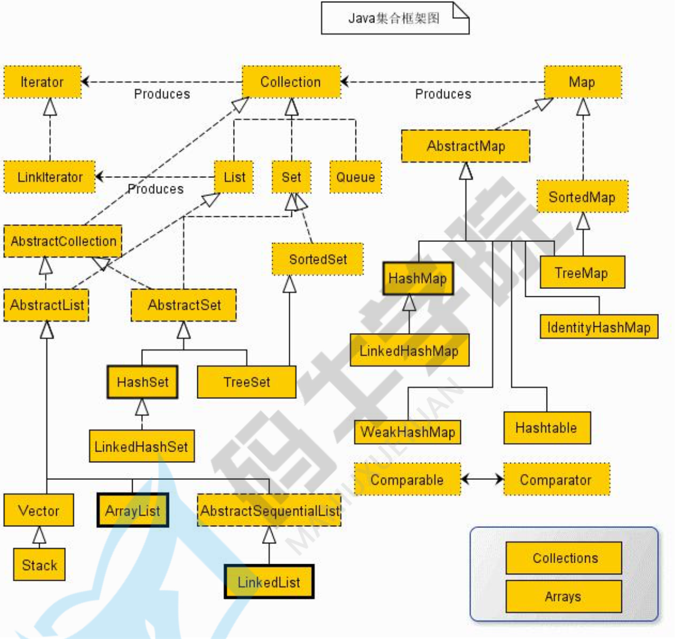
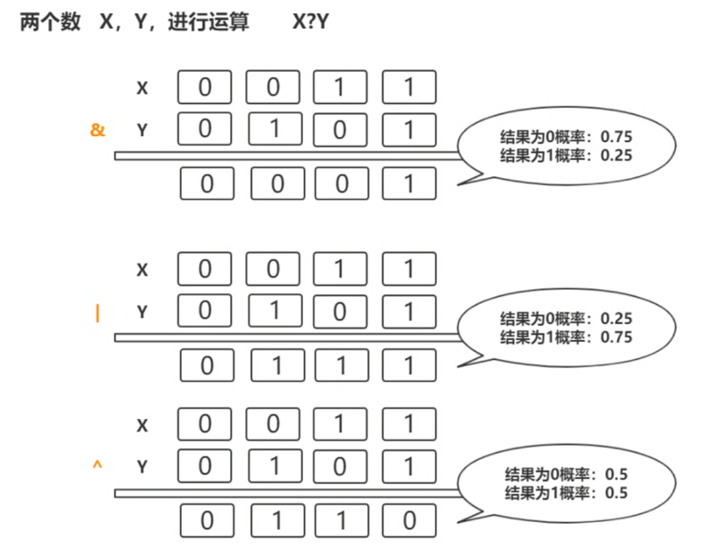
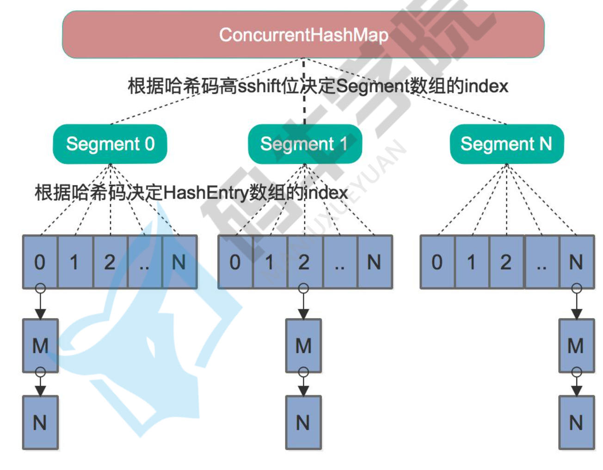

## 【B】Java -- 容器篇


### SlefCheck

- ArrayList 与 LinkedList 的底层原理与区别 ？
- **HashMap原理，初始大小，**put 方法的实现， hash冲突
- 描述一下扩容的过程，为什么要2的指数幂容量，如果输入17会是多少容量？hash冲突，红黑树时间复杂度，10000个桶的情况
- arraylist和hashmap的区别，为什么取数快

- HashTable理解，初始带大小，扩容机制，hashmap和hashtable的区别 ？ 还有哪些安全的map
- CurrentHashMap原理， 读写锁是如何实现的？初始化大小是多少？





### 辨析ArrayList 与 LinkedList

|        | 优点                                        | 缺点                                         |
| ------ | ------------------------------------------- | -------------------------------------------- |
| 顺序表 | 存储空间连续 ；允许随机访问；尾插、尾删方便 | 插入、删除效率低；长度固定（需要扩容）       |
| 单链表 | 随意增删改；插删效率高；长度随意不需扩容    | 内存不连续，不能随机查找（需要遍历，性能差） |
| 双链表 | 同上；查找效率效率比单链表快一倍            | 应用：LinkedList                             |


#### ArrayList 

ArrayList本质是一个动态数组，DEFAULT_CAPACITY 为 10。

优点：支持随机访问，尾插效率高

缺点：插入、删除效率低

适用场景：当数据列表多用于展示和随机查找，而涉及到改变数据顺序的操作比较少的时候。


重点关注ArrayList的几个成员属性 -- 

- 存放元素的数组 Object[] elementData ，它是ArrayList作为顺序表的本质， int size属性则表示elementData中真实元素个数 , 声明如下：

  > ```java
  > transient Object[] elementData; 
  > ```
  >
  > 

  

- serialVersionUID ： 表明ArrayList实现了Serializeable接口 -- 它是可以序列化的。由于elementData数组是可以扩容、自定义初始化大小的，为防止不必要空间浪费（比如故意把capacity设置得很大）所以elementData的声明是 transient 的，ArrayList实现了writeObject、readObject方法在写流和读流的时候，通过for循环读取真实元素个数，这样手动进行数组的序列化/反序列化。

```java
 		// Write out all elements in the proper order.
        for (int i=0; i<size; i++) {
            s.writeObject(elementData[i]);
        }
```


##### 增 -- add方法

直接在尾部增加元素：

```java
public boolean add(E e) {
    ensureCapacityInternal(size + 1);  //指定目标 minCapacity。确保至少有size+1的空间大小，好往里放1个元素，如果是addAll()方法 那此处应是size加上另一个容器的size。
    elementData[size++] = e;			// 扩容完后，直接把要添加的元素把元素放到尾部
    return true;
}
```

确保数组容量的逻辑在ensureCapacityInternal方法中：

```java
/**
* 参数 minCapacity 为本次添加元素之后，至少保证的数组(容量)大小
*/
private void ensureCapacityInternal(int minCapacity) {
    if (elementData == DEFAULTCAPACITY_EMPTY_ELEMENTDATA) {
        minCapacity = Math.max(DEFAULT_CAPACITY, minCapacity); // 最小容量DEFAULT_CAPACITY = 10
    }

    ensureExplicitCapacity(minCapacity);
}

private void ensureExplicitCapacity(int minCapacity) {
    modCount++;

    // overflow-conscious code
    if (minCapacity - elementData.length > 0)
        grow(minCapacity);
}
```


扩容的核心方法：

```java
/**
 * 扩容：至少要比要求的minCapacity大一点
 */
private void grow(int minCapacity) {
    // overflow-conscious code
    int oldCapacity = elementData.length;
    int newCapacity = oldCapacity + (oldCapacity >> 1);   // 按照规则，应扩容至oldCapacity的1.5倍大小
    if (newCapacity - minCapacity < 0)
        newCapacity = minCapacity;			// 按照规则计算出的扩容后的容量仍不满足要求，则使用指定的minCapacity的值
    if (newCapacity - MAX_ARRAY_SIZE > 0)  //超出了ArrayList所定义的最大容量 MAX_ARRAY_SIZE = Integer.MAX_VALUE - 8;
        newCapacity = hugeCapacity(minCapacity);//调用hugeCapacity()
   
    elementData = Arrays.copyOf(elementData, newCapacity);  //创建具有新容量大小的数据，并将原数组数据拷贝给新数组 。 数组拷贝是耗时的操作，尽量提前预估容量，避免频繁扩容
}

/**
*	比较minCapacity和 MAX_ARRAY_SIZE，如果minCapacity大于MAX_ARRAY_SIZE，则新容量则为Integer.MAX_VALUE，否则，使用MAX_ARRAY_SIZE 即 Integer.MAX_VALUE - 8
*/
private static int hugeCapacity(int minCapacity) {
    if (minCapacity < 0) // overflow
        throw new OutOfMemoryError();
    return (minCapacity > MAX_ARRAY_SIZE) ?
        Integer.MAX_VALUE :
        MAX_ARRAY_SIZE;
}
```

Arrays.copy()方法

```java
public static <T,U> T[] copyOf(U[] original, int newLength, Class<? extends T[]> newType) {
   
    T[] copy = ((Object)newType == (Object)Object[].class)
        ? (T[]) new Object[newLength]
        : (T[]) Array.newInstance(newType.getComponentType(), newLength);
    System.arraycopy(original, 0, copy, 0,
                     Math.min(original.length, newLength));
    return copy;
}
```


以上是尾部插入, 如果需要扩容，扩容完之后，直接把要添加的元素把元素放到尾部位置即可

```java
public boolean add(E e) {
    ensureCapacityInternal(size + 1);  //确保至少有size+1的空间大小，好往里放1个元素，如果是addAll()方法 那此处应是size加上另一个容器的size。
    elementData[size++] = e;			// 扩容完后，直接把要添加的元素把元素放到尾部
    return true;
}
```


再看中间插入的add方法：

```java
public void add(int index, E element) {
    if (index > size || index < 0)
        throw new IndexOutOfBoundsException(outOfBoundsMsg(index));

    ensureCapacityInternal(size + 1);  // 扩容逻辑同上
    System.arraycopy(elementData, index, elementData, index + 1,
                     size - index);		// index位置开始元素后移
    elementData[index] = element;		// 将目标元素放到目标位置index
    size++;
}
```


System.arrayCopy()方法：

```java
public static native void arraycopy(Object src,  int  srcPos,
                                    Object dest, int destPos,
                                    int length);
```

可见，非尾插的话，要多出一次数组拷贝的过程。


##### 删 -- remove方法

删除指定位置元素的remove方法：

```java
public E remove(int index) {
    if (index >= size)
        throw new IndexOutOfBoundsException(outOfBoundsMsg(index));

    modCount++;
    E oldValue = (E) elementData[index];

    int numMoved = size - index - 1;  // numMoved 表示需要移动的元素数量
    if (numMoved > 0)
        System.arraycopy(elementData, index+1, elementData, index,
                         numMoved); //index+1位置的元素至最后一个元素整体前移，覆盖掉index位置
    elementData[--size] = null; //将末尾元素位置置空，由 GC 回收内存

    return oldValue;
}
```


删除指定对象的remove方法：

```java
public boolean remove(Object o) {
    if (o == null) {
        for (int index = 0; index < size; index++)
            if (elementData[index] == null) {  //如果指定要删除的是null，查找第一个null的index并删除。其实也起到了判空效果
                fastRemove(index);
                return true;
            }
    } else {
        for (int index = 0; index < size; index++)
            if (o.equals(elementData[index])) {
                fastRemove(index);
                return true;
            }
    }
    return false;
}

/*
 * Private remove method that skips bounds checking and does not
 * return the value removed.
 */
private void fastRemove(int index) {
    modCount++;
    int numMoved = size - index - 1;
    if (numMoved > 0)
        System.arraycopy(elementData, index+1, elementData, index,
                         numMoved);
    elementData[--size] = null; // clear to let GC do its work
}
```


顺便提一下ArrayList的缩容方法：

```java
public void trimToSize() {
    modCount++;
    if (size < elementData.length) {    //size代表实际存储的元素数量，
        elementData = (size == 0)
          ? EMPTY_ELEMENTDATA
          : Arrays.copyOf(elementData, size); //创建新的大小为size的数组并拷贝当前数组中所有元素，节约内存空间
    }
}
```


Arrays.copyOf方法是这样建新数组并拷贝数据的：

```java
public static <T,U> T[] copyOf(U[] original, int newLength, Class<? extends T[]> newType) {
    T[] copy = ((Object)newType == (Object)Object[].class)
        ? (T[]) new Object[newLength]
        : (T[]) Array.newInstance(newType.getComponentType(), newLength);
    System.arraycopy(original, 0, copy, 0,
                     Math.min(original.length, newLength));
    return copy;
}
```


##### 改 -- set方法、查 -- get方法

ArrayList作为顺序表数据结构，其“改”和“查（随机访问）”的便捷性从方法实现中就可见一斑：

```java
/**
 * @throws IndexOutOfBoundsException {@inheritDoc}
 */
public E get(int index) {
    if (index >= size)
        throw new IndexOutOfBoundsException(outOfBoundsMsg(index));

    return (E) elementData[index];
}

public E set(int index, E element) {
    if (index >= size)
        throw new IndexOutOfBoundsException(outOfBoundsMsg(index));

    E oldValue = (E) elementData[index];  //取出index位置的元素并返回，index位置放入新元素
    elementData[index] = element;
    return oldValue;
}
```


##### 遍历方法

​	按性能降序排：

- 普通for循环

```java
List<Integer> list = new ArrayList<Integer>();
int size = list.size();
for(int j = 0; j < size; j++) {
	list.get(j);
}
```


- 显式调用迭代器：

```java
Iterator<Integer> iterator = list.iterator();
while(iterator.hasNext()) {
	Integer j = iterator.next();
}
```


- for each循环

```java
List<Integer> list = new ArrayList<Integer>();
for(Integer j : list) {

}
```

**foreach不必关心下标初始值和终止值及越界等，所以不易出错**。[Effective-Java](http://www.amazon.cn/Effective-Java中文版-Joshua-Bloch/dp/B001PTGR52/ref=as_li_wdgt_ex?&linkCode=wey&tag=trinea-23)中推荐使用此种写法遍历。

使用foreach结构的类对象必须实现了Iterable接口，Java的Collection继承自此接口，List实现了Collection，这个接口仅包含一个函数 -- iterator。


#### LinkedList

节点结构 -- Link类：

```java
private static final class Link<ET> {
    ET data;

    Link<ET> previous, next;

    Link(ET o, Link<ET> p, Link<ET> n) {
        data = o;
        previous = p;
        next = n;
    }
}
```


add节点：

```java
public void add(int location, E object) {
    if (location >= 0 && location <= size) {
        Link<E> link = voidLink;
        if (location < (size / 2)) {		//对目标location二分判断，离头节点近还是尾近
            for (int i = 0; i <= location; i++) {  //拿到当前location处的节点元素
                link = link.next;
            }
        } else {
            for (int i = size; i > location; i--) {
                link = link.previous;
            }
        }
          //BEGIN -- 头插操作 
        Link<E> previous = link.previous; //1. 取前置节点
        Link<E> newLink = new Link<E>(object, previous, link);//2.构造新节点
        previous.next = newLink;
        link.previous = newLink;
         //END -- 头插操作 
        size++;
        modCount++;
    } else {
        throw new IndexOutOfBoundsException();
    }
}
```


remove节点：

```java
public E remove(int location) {
    if (location >= 0 && location < size) {
        Link<E> link = voidLink;
        if (location < (size / 2)) { 
            for (int i = 0; i <= location; i++) {
                link = link.next;
            }
        } else {
            for (int i = size; i > location; i--) {
                link = link.previous;
            }
        }
         //BEGIN --remove操作 
        Link<E> previous = link.previous; 
        Link<E> next = link.next;
        previous.next = next;
        next.previous = previous;
          //END --remove操作 
        size--;
        modCount++;
        return link.data;
    }
    throw new IndexOutOfBoundsException();
}
```


### HashMap 

#### 初始化

HashMap 数据结构是 数组+链表 ，数组初始化大小是 1>>4 = 16。

Entry[] 数组，其元素是链表头结点

```java
static class Node<K,V> implements Map.Entry<K,V>{
	final int hash;//Node要维护一个 hash成员，作为key的唯一标识
	final K key;
	V value;
	Node<K,V> next;
}
```


#### put方法

大体上三大部分，细分六个步骤。简述HashMap中put方法过程：

1. 对key**求hash值，然后计算下标**

2. 如果没有碰撞，直接放入桶中

3. 如果碰撞了，以链表形式链接到后面

4. 如果链表长度超过阈值（TREEIFY_THRESHOLD == 8），就把链表转成红黑树

5. 如果节点已经存在就替换旧值

6. 如果桶满了（容量*加载因子），就**需要resize**

   ```java
   public V put(K key, V value) {
     	return putVal(hash(key), key, value, false, true);
   }
   ```

   

```java
final V putVal(int hash, K key, V value, boolean onlyIfAbsent,
               boolean evict) {
    Node<K,V>[] tab; Node<K,V> p; int n, i;
    if ((tab = table) == null || (n = tab.length) == 0)
        n = (tab = resize()).length;
     
    if ((p = tab[i = (n - 1) & hash]) == null)
        tab[i] = newNode(hash, key, value, null); //Node中保存的hash是hash()函数得到的hash
    else {
        Node<K,V> e; K k;
        if (p.hash == hash &&
            ((k = p.key) == key || (key != null && key.equals(k))))
            e = p;
        else if (p instanceof TreeNode)
            e = ((TreeNode<K,V>)p).putTreeVal(this, tab, hash, key, value);
        else {
            for (int binCount = 0; ; ++binCount) {
                if ((e = p.next) == null) {
                    p.next = newNode(hash, key, value, null);
                    if (binCount >= TREEIFY_THRESHOLD - 1) // -1 for 1st
                        treeifyBin(tab, hash);
                    break;
                }
                if (e.hash == hash &&
                    ((k = e.key) == key || (key != null && key.equals(k))))
                    break;
                p = e;
            }
        }
        if (e != null) { // existing mapping for key
            V oldValue = e.value;
            if (!onlyIfAbsent || oldValue == null)
                e.value = value;
            afterNodeAccess(e);
            return oldValue;
        }
    }

    ++modCount;
    if (++size > threshold)
        resize();
    afterNodeInsertion(evict);
    return null;
}
```


##### 数组下标计算 

即putVal()方法源码一开头，根据key的hash值计算待插入元素对应数组下标，如果为空则创建新节点：

```java
  if ((p = tab[i = (n - 1) & hash]) == null)
        tab[i] = newNode(hash, key, value, null);
```

代码中 i =  **(n - 1) & hash**的结果即是数组下标 i。可见如果分散不够均匀，则会造成大量hash碰撞现象。


为尽量均匀散列，源码里对参与&运算的两者都有优化和考虑。


###### hash值的计算 - hash()

**key的hashcode与其自身高16位进行异或运算后得到hash值**，hash()函数如下：

```java
static final int hash(Object key) {
    int h;
    return (key == null) ? 0 : (h = key.hashCode()) ^ (h >>> 16);
}
```


为什么要进行异或运算？

> 与运算（&）、或运算（|）、异或运算（^）规则

```
与运算（&）： 0&0=0；0&1=0；1&0=0；1&1=1 ， 两个同时为1，结果为1，否则为0
或运算（|）： 0|0=0；  0|1=1；  1|0=1；   1|1=1； ，一个为1，其值为1。
异或运算（^）：0^0=0；  0^1=1；  1^0=1；   1^1=0；，如果两个位值不同，则该位结果为1，否则为0
```




通过异或运算得出的hash值，二进制形式表示时，0和1分布更均匀，降低了后面同数组长度&与运算时，出现碰撞的几率。


###### 为什么数组容量必须是2的n次幂

由于hash的计算过程已经对均匀散列做了优化，&与运算 i =  **(n - 1) & hash**的另一个角色 -- 数组长度n设定为2的n次幂时，n-1的二进制表现形式恰好是每一位都是1，例如11111111。这就使得计算结果只关注hash的值即可。


##### 节点插入

计算完了数组下标，才是真正插入数组，如果该位置为空，则直接创建Node并存入

```java
  if ((p = tab[i = (n - 1) & hash]) == null)
        tab[i] = newNode(hash, key, value, null); //为空则新建
```


如果不为空，则又分为了三种情况：

1. key相同，value替换

2. key不同，链表存

   JDK1.8，尾插

3. key不同，红黑树存储

   JDK1.8 中 链表转红黑树Threshold = 8 ，红黑树复杂度

```java
        Node<K,V> e; K k;
        if (p.hash == hash &&
            ((k = p.key) == key || (key != null && key.equals(k))))
            e = p;
        else if (p instanceof TreeNode)
            e = ((TreeNode<K,V>)p).putTreeVal(this, tab, hash, key, value);
        else {
            for (int binCount = 0; ; ++binCount) {
                if ((e = p.next) == null) {
                    p.next = newNode(hash, key, value, null);
                    if (binCount >= TREEIFY_THRESHOLD - 1) // -1 for 1st
                        treeifyBin(tab, hash);
                    break;
                }
                if (e.hash == hash &&
                    ((k = e.key) == key || (key != null && key.equals(k))))
                    break;
                p = e;
            }
        }
        if (e != null) { // existing mapping for key
            V oldValue = e.value;
            if (!onlyIfAbsent || oldValue == null)
                e.value = value;
            afterNodeAccess(e);
            return oldValue;
        }
```


##### 扩容过程 - resize()

Hash表这个容器当有数据要插入时，都会检查容量有没有超过设定的thredhold ,比如计算数组大小是否大于 16*0.75 = 12，如果超过，需要增大Hash表的尺寸，但是这样一来，整个Hash表里的无素都需要被重算一遍。这叫rehash，这个成本相当的大。

```java
if (++size > threshold)
        resize();
```

resize() 负责数组初始化和扩容过程:

1.  **根据oldCap和oldThr计算新阈值和容量 即newCap和newThr ****

   ```
   if ((newCap = oldCap << 1) < MAXIMUM_CAPACITY &&
                        oldCap >= DEFAULT_INITIAL_CAPACITY) //MAXIMUM_CAPACITY 2的30次方
                   newThr = oldThr << 1; // 阈值同步变为2倍。
   ```

2. 创建新的Node数组

   ```
     Node<K,V>[] newTab = (Node<K,V>[])new Node[newCap];
           table = newTab;
   ```

3. **数组扩容后，数据迁移**

首先for循环遍历原数组，

```
for (int j = 0; j < oldCap; ++j) {
                Node<K,V> e;
                if ((e = oldTab[j]) != null) {
                    oldTab[j] = null;
```

赋值给Node e 

接下来，迁移到新数组，分为三种情况：

1）数组下标处只有一个元素 Node e

```
if (e.next == null)
   newTab[e.hash & (newCap - 1)] = e; 
```

2）数组下标处是一个链表Node e

有hash碰撞才会有链表出现，有可能是原数组oldCap比较小，造成 hash & oldCap -1 后位置碰撞。当扩容为newCap之后，就不会碰撞了，比如 Node A和Node B 的持有的hash值为 2和18 ， 对16取模，得到都是2（发生碰撞，A和B形成链表），当扩容为32之后Node A 还在2的位置，Node B 现在可以放到 2+16的位置（ hash值为 18）。

这个思想在源码里巧妙地用 if ((e.hash & oldCap) == 0) 这样一句判断来计算出来，发生碰撞的该处节点，应是处在新数组中的低位（原位置）还是高位（原位置+oldCap）。

```java
  											Node<K,V> loHead = null, loTail = null;
                        Node<K,V> hiHead = null, hiTail = null;
                        Node<K,V> next;
                        do {
                            next = e.next;
                            if ((e.hash & oldCap) == 0) { 
                                if (loTail == null)
                                    loHead = e;
                                else
                                    loTail.next = e;
                                loTail = e;
                            }
                            else {
                                if (hiTail == null)
                                    hiHead = e;
                                else
                                    hiTail.next = e;
                                hiTail = e;
                            }
                        } while ((e = next) != null);
                        if (loTail != null) {
                            loTail.next = null;
                            newTab[j] = loHead;
                        }
                        if (hiTail != null) {
                            hiTail.next = null;
                            newTab[j + oldCap] = hiHead;
                        }
```

3）数组下标处挂着一棵红黑树


完整resize()扩容过程：

```java
    final Node<K,V>[] resize() {
        Node<K,V>[] oldTab = table;
        int oldCap = (oldTab == null) ? 0 : oldTab.length;
        int oldThr = threshold;
        int newCap, newThr = 0;
        if (oldCap > 0) {
            if (oldCap >= MAXIMUM_CAPACITY) {
                threshold = Integer.MAX_VALUE;
                return oldTab;
            }
            else if ((newCap = oldCap << 1) < MAXIMUM_CAPACITY &&
                     oldCap >= DEFAULT_INITIAL_CAPACITY) //MAXIMUM_CAPACITY 2的30次方
                newThr = oldThr << 1; // 阈值同步变为2倍
        }
        else if (oldThr > 0) // initial capacity was placed in threshold
            newCap = oldThr;
        else {               // zero initial threshold signifies using defaults
            newCap = DEFAULT_INITIAL_CAPACITY;
            newThr = (int)(DEFAULT_LOAD_FACTOR * DEFAULT_INITIAL_CAPACITY);
        }
        if (newThr == 0) {
            float ft = (float)newCap * loadFactor;
            newThr = (newCap < MAXIMUM_CAPACITY && ft < (float)MAXIMUM_CAPACITY ?
                      (int)ft : Integer.MAX_VALUE);
        }
        threshold = newThr;
        
        Node<K,V>[] newTab = (Node<K,V>[])new Node[newCap];
        table = newTab;
        
        if (oldTab != null) {
            for (int j = 0; j < oldCap; ++j) {
                Node<K,V> e;
                if ((e = oldTab[j]) != null) {
                    oldTab[j] = null;
                    if (e.next == null)
                        newTab[e.hash & (newCap - 1)] = e; 
                    else if (e instanceof TreeNode) //红黑树，打散重新赋值
                        ((TreeNode<K,V>)e).split(this, newTab, j, oldCap);
                    else { // 维持顺序
                        Node<K,V> loHead = null, loTail = null;
                        Node<K,V> hiHead = null, hiTail = null;
                        Node<K,V> next;
                        do {
                            next = e.next;
                            if ((e.hash & oldCap) == 0) { // 
                                if (loTail == null)
                                    loHead = e;
                                else
                                    loTail.next = e;
                                loTail = e;
                            }
                            else {
                                if (hiTail == null)
                                    hiHead = e;
                                else
                                    hiTail.next = e;
                                hiTail = e;
                            }
                        } while ((e = next) != null);
                        if (loTail != null) {
                            loTail.next = null;
                            newTab[j] = loHead;
                        }
                        if (hiTail != null) {
                            hiTail.next = null;
                            newTab[j + oldCap] = hiHead;
                        }
                    }
                }
            }
        }
        return newTab;
    }
```


> hash函数是怎么实现的？还有哪些hash的实现方式

1. 高16bit不变，低16bit和高16bit做一个异或
2. (n-1)&hash --> 得到下标
3. 还有哪些Hash实现方式？

为什么低16bit和高16bit做一个异或 ？ 为什么用与&运算而不用取模%运算。


> 讲一下扩容过程，假如一个值在原数组中，现在移到了新数组，位置肯定变了，那是怎么定位到这个值在新数组中的位置？

1. 将新节点加到链表后
2. 容量扩充为原来的两倍，然后对每个节点重新计算哈希值。
3. 这个值只可能在两个地方，一个是原下标的位置，另一种是在下标为<原下标+原容量>的位置


#### HashMap线程安全问题

HashMap在并发中可能出现链表成环产生死循环。具体说来，HashMap扩容时：

```java
void resize(int newCapacity) {  
        Entry[] oldTable = table;  
        int oldCapacity = oldTable.length;  
        if (oldCapacity == MAXIMUM_CAPACITY) {  
            threshold = Integer.MAX_VALUE;  
            return;  
        }  
  
        Entry[] newTable = new Entry[newCapacity];  
          
        transfer(newTable);//可能导致环链  
          
        table = newTable;  
        threshold = (int)(newCapacity * loadFactor);  
} 

void transfer(Entry[] newTable) {  
    Entry[] src = table;  
    int newCapacity = newTable.length;  
    for (int j = 0; j < src.length; j++) {  
        Entry<K,V> e = src[j];  
        if (e != null) {  
            src[j] = null;  
            do {  
                Entry<K,V> next = e.next;  
                int i = indexFor(e.hash, newCapacity);  
                e.next = newTable[i];  
                newTable[i] = e;  
                e = next;  
            } while (e != null);  
        }  
    }  
}  
```

这个方法的目的是将原链表数据的数组拷到新的链表数组中，多线程并发访问时，拷贝过程产生了环链。


### 线程安全的容器

> 相对于ArrayLis

#### CopyOnWriteArrayList

所有写操作（add、set等）都通过synchronized加锁，并通过创建新数组的形式来实现。

```
    public boolean add(E e) {
        synchronized (lock) {
            Object[] elements = getArray();
            int len = elements.length;
            Object[] newElements = Arrays.copyOf(elements, len + 1);
            newElements[len] = e;
            setArray(newElements);
            return true;
        }
    }
```


> 相对于HashMap

#### HashTable

初始大小11 

synchronized修饰，线程安全的

key-value 不可为 null

```
public synchronized V put(K var1, V var2) {
    if (var2 == null) {
        throw new NullPointerException();
    } else {
        Hashtable.Entry[] var3 = this.table;
        int var4 = var1.hashCode();
        int var5 = (var4 & 2147483647) % var3.length;

        for(Hashtable.Entry var6 = var3[var5]; var6 != null; var6 = var6.next) {
            if (var6.hash == var4 && var6.key.equals(var1)) {
                Object var7 = var6.value;
                var6.value = var2;
                return var7;
            }
        }

        this.addEntry(var4, var1, var2, var5);
        return null;
    }
}
```


#### ConcurrentHashMap

JDK 7时代 ， 使用Segment分段锁，Segment继承自ReentrenLock




JDK 8开始，不再使用Segment分段锁，而采用了CAS+synchronized来保证并发安全性。

初始化数组，采用无锁化，CAS机制

```java
private final Node<K,V>[] initTable() {
    Node<K,V>[] tab; int sc;
    while ((tab = table) == null || tab.length == 0) {
        if ((sc = sizeCtl) < 0)
            Thread.yield(); // lost initialization race; just spin
        else if (U.compareAndSwapInt(this, SIZECTL, sc, -1)) {
            try {
                if ((tab = table) == null || tab.length == 0) {
                    int n = (sc > 0) ? sc : DEFAULT_CAPACITY;
                    
                    Node<K,V>[] nt = (Node<K,V>[])new Node<?,?>[n];
                    table = tab = nt;
                    sc = n - (n >>> 2);
                }
            } finally {
                sizeCtl = sc;
            }
            break;
        }
    }
    return tab;
}
```


putVal时 synchronized锁范围缩小到了数组下标处的 Node节点。

```java
   for (Node<K,V>[] tab = table;;) {
            Node<K,V> f; int n, i, fh;
            if (tab == null || (n = tab.length) == 0)
                tab = initTable();
            else if ((f = tabAt(tab, i = (n - 1) & hash)) == null) {
                if (casTabAt(tab, i, null,
                             new Node<K,V>(hash, key, value, null)))
                    break;                   // no lock when adding to empty bin
            }
            else if ((fh = f.hash) == MOVED)
                tab = helpTransfer(tab, f);
            else {
                V oldVal = null;
                synchronized (f) {
                	//......节点插入
                }
```


> CurrentHashMap原理， 读写锁是如何实现的？初始化大小是多少？
>


> 为什么在在 JDK 1.8 中，为什么要使用内置锁 synchronized 来代替重入锁 ReentrantLock？

①、粒度降低了；

②、JVM 开发团队没有放弃 synchronized，而且基于 JVM 的 synchronized 优化空间更大，更加自然。

③、在大量的数据操作下，对于 JVM 的内存压力，基于 API 的 ReentrantLock 会开销更多的内存。


> 为何ConcurrentHashMap不会发生ConcurrentModifyException？

https://www.cnblogs.com/xiayudashan/p/10180413.html


### 辨析HashMap与其他相关容器

除了HashMap和HashTable  之外 java.util.Map 接口还有两个实现类LinkedHashMap和TreeMap。


#### LinkedHashMap

LinkedHashMap是HashMap的子类，保存了记录插入的顺序，在用iterator遍历LinkedHashMap时，先得到的肯定是先插入的。该特性使得它常被用来实现LruCache。


#### TreeMap

HashMap 内部基于散列表存储结构，TreeMap基于红黑树（自平衡二叉搜索树）。

TreeMap 实现了SortMap接口，能够根据key排序。适用于要求 key-value 有序（升序）存储的情景。

```
Map<Integer, String> tm=new TreeMap<Integer, String>();  
//adding elements to the TreeMap  
tm.put(9, "Red");  
tm.put(12, "Black");  
tm.put(6, "Green");  
tm.put(19, "White");  
System.out.println("TreeMap iteration Order:");  
//iteration over map using for each loop  
for(Map.Entry<Integer, String>entry: tm.entrySet())  
{  
```


#### ArrayMap 与 SparseArray

Android SDK提供的，在某些场景下代替HashMap以获得更好性能的数据结构。

HashMap性能问题主要体现在扩容、key自动装箱问题、


###### SpareAray 

SparseArray只能存储key为int类型的数据，同时，SparseArray在存储和读取数据时候，使用的是二分查找法,也就是在put添加数据的时候，会使用二分查找法和之前的key比较当前我们添加的元素的key的大小，然后按照从小到大的顺序排列好，所以，SparseArray存储的元素都是按元素的key值从小到大排列好的。 


满足下面两个条件我们可以使用SparseArray代替HashMap：

- 数据量不大，最好在千级以内
- key必须为int类型，这中情况下的HashMap可以用SparseArray代替：


######  ArrayMap

ArrayMap是一个<**key,value**>映射的数据结构，它设计上更多的是考虑内存的优化，内部是使用两个数组进行数据存储，一个数组记录key的hash值，另外一个数组记录Value值，它和SparseArray一样，也会对key使用二分法进行从小到大排序，在添加、删除、查找数据的时候都是先使用二分查找法得到相应的index


**总结**

1、如果key的类型已经确定为int类型，那么使用SparseArray，因为它避免了自动装箱的过程，如果key为long类型，它还提供了一个LongSparseArray来确保key为long类型时的使用

2、如果key类型为其它的类型，则使用ArrayMap


#### HashSet

HashSet实现的是Set接口，不允许集合中含有重复的值。需要重写equals和hashcode方法，以比较对象是否相等。


### 

