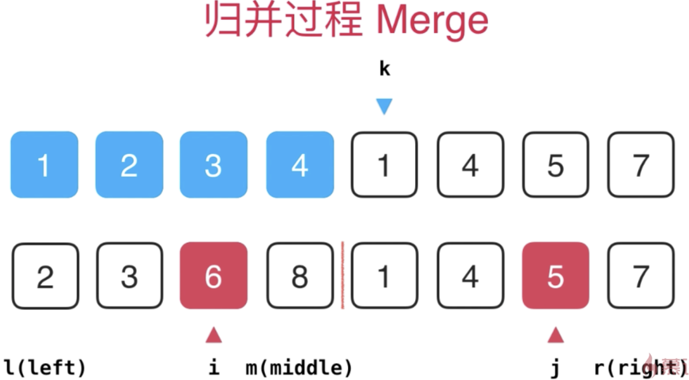
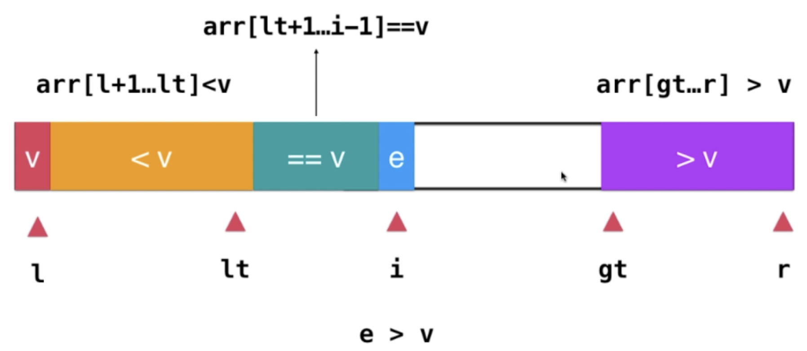

## 【B】算法 -- 01_排序


### 输出倒逼输入

- **快速排序**与优化
- 几种排序的时间复杂度和基本实现
- **数组里的元素，组合起来求最大值（排序，高位求和）**


### 经典排序算法基本实现


#### 冒泡排序

```java
/**
 * 冒泡排序
 * 思想：
 *  相邻两个元素依次比较并交换位置，这样每一轮都把最大的元素推到最后的位置（竖着看就是最上边的位置，故称为冒泡）
 */
public class BubbleSort implements ISort {

    @Override
    public int[] sort(int[] array) {
        if (array.length == 0) {
            return array;
        }
        //i代表第几轮，一轮确定一个元素的最后位置
        for (int i = 0; i < array.length; i++) {
            for (int j = 0; j < array.length - 1 - i; j++) {
                if (array[j + 1] > array[j]) {
                    int temp = array[j + 1];
                    array[j + 1] = array[j];
                    array[j] = temp;
                }
            }
        }
        return array;
    }
}
```


#### 选择排序

```java
/**
 * 选择排序
 * 思想：也是两轮循环，外循环index表示排到了哪个位置，内循环从该位置向后寻找更小的元素，并记录其下标，最后交换两元素交换位置
 */
public class SelectionSort implements ISort {
    @Override
    public int[] sort(int[] array) {
        int n = array.length;

        for (int i = 0; i < n; i++) {
            int minIndex = i;
            for (int j = i + 1; j < n; j++) {
                if (array[j] < array[minIndex]) {
                    minIndex = j;
                }
            }
            int temp = array[minIndex];
            array[minIndex] = array[i];
            array[i] = temp;
        }
        return array;
    }
}
```


#### 插入排序

插入排序适用于近乎有序的数组

插入排序类比场景：抓扑克牌。从未排好序的牌里抽一张。插入已排好序的牌合适位置，每次只关注一个元素的最终位置。


```java
public int[] sort(int[] array) {
    int n = array.length;
    for (int i = 0; i < n ;i++){
        int m = array[i];//待插入元素
        int j = i;// 从已排好序的元素中，从后向前比对
        for (; j > 0 && array[j-1] > m; j--) {
            array[j] = array[j-1];//m 较j-1处元素小，j-1元素向后移
        }
        array[j] = m;//当m较j-1处大，m应该插入在j-1位置之后，即j位置
    }
    return array;
}
```


#### 归并排序

> 思想步骤

1. 申请辅助空间，其大小为两个已经排序数组只和，该空间用来存放合并后的序列

2. 三指针法i、j、k，使用辅助数组，合并两个排序数组。另3个表示边界的局部变量 l、r 、mid

   

3. 直到某一个指针到达序列尾部，将另一个序列剩下的所有元素直接复制到合并序列尾部


> 总体流程动画：


> 代码实现

递归过程：

```java
 		public int[] sort(int[] array) {
        sort(array, 0, array.length - 1);
        return array;
    }

    /**
     * 归并排序使用递归思想
     *
     * @param arr
     * @param left
     * @param right
     */
    private void sort(int[] arr, int left, int right) {
        if (left >= right) {
            return;
        }

        int mid = left + (right - left) / 2;
        sort(arr, left, mid);
        sort(arr, mid + 1, right);
        merge(arr, left, mid, right);
    }
```


具体合并两个有序数组过程：

```java

    /**
     * 目的：为 arr[l , r] 区间排序
     * 思路：将 arr[l , mid] 和 arr[mid+1 ,r] 这两个有序数组合并
     */
    private void merge(int[] arr, int l, int mid, int r) {
        //申请辅助空间，复制arr[l,r]值
        int[] aux = Arrays.copyOfRange(arr, l, r + 1);
        //定义指针 i，j初始时指向两个数组起始位置
        int i = l;
        int j = mid + 1;
        //定义指针k ，指向原数组真实位置,区间[r,l]
        int k = l;
        for (; k <= r; k++) {
            //边界判断，i或j指针到结尾了的情况
            if (i > mid){
                arr[k] = aux[j - l];
                j++;
            }
            else if (j > r){
                arr[k] = aux[j - l];
                i++;
            }
            //比较i , j指向元素 ,这里注意aux数组下标要考虑偏移量 l
            else if (aux[ i - l] < aux[j - l]){
                arr[k] = aux[i - l];
                i++;
            }
            else{
                arr[k] = aux[j - l];
                j++;
            }
        }
    }
```


##### 归并排序的优化

```
//优化1：对于小规模数组，使用插入排序
//优化2：arr[mid]代表左边区间最大元素， arr[mid+1] 代表右侧区间最小元素，只有arr[mid]>arr[mid+1]才需要合并
```


#### 快速排序

1. 挑选一个元素，称为 “基准”（pivot）。
2. 比基准数小的放到基准数前面，比基准数大的放到其后面。该过程称为partition（分区）操作。
3. 对左右分区进行递归

```java
    public int[] sort(int[] array) {
        int length = array.length;
        quickSort(array, 0, length - 1);
        return array;
    }

    /**
     * 自顶向下地对闭区间[r,l]进行递归快速排序
     */
    private void quickSort(int[] arr, int l, int r) {
        if (l >= r) {//终止条件，细分至区间只有一个元素（l，r指针重合）
            return;
        }
        int p = partition(arr, l, r);//进行一次partition分捡，返回基准数位置
        quickSort(arr, l, p - 1);//对比基准数小的元素区间[l,p-1]递归
        quickSort(arr, p + 1, r);//对比基准数大的元素区间[p+1,r]递归
    }

    /**
     * 对arr[l...r]部分进行partition操作
     * @return 返回基准数位置p，使得arr[l,p-1] <arr[p] ;arr[p+1]>arr[p]
     */
    private int partition(int[] arr, int l, int r) {
        int pivot = arr[l]; //选为基准数
        int j = l; //游标j 维护区间[0, j] 使得区间内元素都小于基准数
        for (int i = l + 1; i < r; i++) {//i 表示下一个待考察的元素下标
            if (arr[i] < pivot) { //发现比基准数小
                swap(arr, i, j);  //交换进 [0, j] 区间
                j++;    //j 指针后移，准备放下一个小于基准数的元素
            }
        }
        swap(arr, l, j);//将pivot交换到左半部分结尾处，作为左右分界点
        return j;
    }
```


##### 快速排序的优化 -- 三路快排

1. 随机种子选取基准pivot。

2. 三路快排，指的是partition的过程中将数组分为小于v、等于v、大于v 三个部分。



算法设计

用如下几个变量维护三个区间：lt表示小于v的空间游标，从左向右移、gt表示大于v的空间游标，从右向左移动，i表示下一个待考察的元素游标。

```java
 private void quickSort(int[] arr, int l, int r) {
        if (l >= r) {
            return;
        }
        if (arr.length <= 15) {
            // TODO: 优化点：小规模(长度15以内)的数组，使用插入排序
        }
        //优化点：从arr[l,r]的范围中随机选一个作为pivot，交换到l位置去
        swap(arr, l, (int) (Math.random() * (r - l + 1) + l));

        //用如下几个变量维护三个区间：
        int v = arr[l];
        int lt = l; // 游标lt维护区间[l , lt] 使得区间内元素都不大于基准数v，从前向后移
        int gt = r + 1; // 游标gt维护区间[gt , r] 使得区间内元素都不小于基准数v，从后向前移
        int i = l + 1;// i表示下一个待考察的元素游标。
        while (i < gt) {
            if (arr[i] < v) { //交换到[0,lt]区间内
                swap(arr, i, lt + 1); // 第一个位置l 暂时放着基准数，所以从第二个位置开始
                lt++; //左半区游标后移
                i++; //左半区肯定是比基准数小的，所以 i 后移，考察下一个元素
            } else if (arr[i] > v) {
                swap(arr, i, gt - 1); //从arr[i] 元素换到后半区
                gt--; //右半区指针前移，因为从后面交换到 i 处的元素大小不确定，所以i 不变，继续比较
            } else {
                i++; //与基准数相等，i后移
            }
        }
        swap(arr, l, lt); //区间[l,lt]收尾交换位置，使得将l处pivot基准值放回等于v分区内

        quickSort(arr, l, lt - 1);
        quickSort(arr, gt, r);
    }

```


> 数组里有一个数字出现次数超过一半，让你找出来这个数是什么

方案之一就是 使用快速排序算法对数组排序，然后取中位数。算法复杂度O(NlogN)


### 总结：

1s之内排序算法解决问题的数据规模：

|          | 数据规模            |
| -------- | ------------------- |
| O(n^2)   | 10^4 级别的数据规模 |
| O(nlogn) | 10^7 级别的数据规模 |
| O(n)     | 10^8 级别的数据规模 |


**几种排序性能评测总结：**


- n 表示 数据规模
- k 表示 “桶”的个数
- In-Place、Out-Place 内排序、外排序


### 资源参考

- 七大经典排序算法总结

  https://segmentfault.com/a/1190000021638663


 

