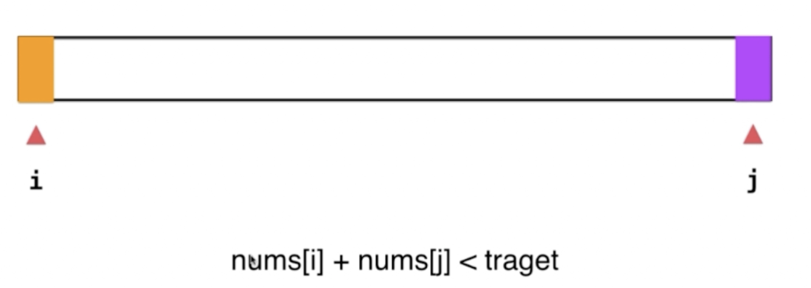

## 【B】01_数组问题


###  数组问题集合

- **三色球排序：红白蓝三色小球排列成有序的红白蓝三色的同颜色在一起的小球组**

- **实现一个函数，求一个整数的二进制表示中1的个数，比如 整数9二进制表示1001，里面有2个 1 。**

- **将所有0移动到数组右边，保持其他相对位置不变**

- **数组里有一个数字出现次数超过一半，让你找出来这个数是什么**

- **长度为n的数组中，总是存在一个断点（下标记为i），数组中断点前面的数字是有序的，断点后的数字也是有序的，且断点后边的数字总是小于前面的数字。如果直接把断点后边的数字移动到数组的前边，那么这个数组将是有序的，求这个数组中的第n/2大的数。**

- **两数之和问题**

  - **有序数组中寻找两个数和为target。**

- **矩形看重合** 

- **旋转矩阵**

- **leetcode的旋转数组**

- **删除排序数据中的重复项**

- **合并k个有序数组**

  


> 为什么程序中数组下标都是从0开始？

其实通过下标访问数组元素内存地址时，下标更确切的含义是offset，偏移量：

a[k]_address = base_address + k * type_size

所以从0开始更容易计算，表达也更准确


#### 三色球排序

给定一个包含红色、白色和蓝色，一共 *n* 个元素的数组，**原地**对它们进行排序，使得相同颜色的元素相邻，并按照红色、白色、蓝色顺序排列。我们使用整数 0、 1 和 2 分别表示红色、白色和蓝色。

> 思路

类似快速排序的partition思想，使用三个指针`left`,`right`和`current`，其中`left`使得`nums[l0...left-1]`中的元素都小于`v`，`right`使得`nums[right+1...hi]`中的元素都大于`v`，`current`使得`nums[left...current-1]`中的元素都等于`v`。

从而实现将未排序的元素，分捡到三个区间。

```java
   /**
     * 三色球排序
     * 令：整数 0、 1 和 2 分别表示红色、白色和蓝色。
     */
    public void sortColors(int[] nums) {
        sort(nums, 0, nums.length - 1);
    }

    /**
     * 对[low,high]进行排序
     *
     * @param nums
     * @param low
     * @param high
     */
    private void sort(int[] nums, int low, int high) {
        if (low >= high) {
            return;
        }
        //三指针维护三个区间
        int i = low;
        int cur = low + 1;
        int j = high;
        while (cur <= j) {
            if (nums[cur] == 0) {
                swap(nums, i, cur);
                i++;
                cur++;
            } else if (nums[cur] == 2) {
                swap(nums, cur, high);
                high--;
            } else {
                cur++;
            }
        }
    }
```


#### 重复数字问题

##### **数组里有一个数字出现次数超过一半，让你找出来这个数是什么**

除了快速排序+取中位数法，还可以

**哈希表统计法**：遍历数组 `nums` ，用 HashMap 统计各数字的数量，即可找出 众数 。此方法时间和空间复杂度均为 O(N)。

```java
   public static int majorityElement(int[] nums) {
        int length = nums.length;
        Map<Integer, Integer> map = new HashMap<>();
        for (int i = 0; i < length; i++) {
            if (map.containsKey(nums[i])) {
                int tmp = map.get(nums[i]);
                map.put(nums[i], tmp+1);
            } else {
                map.put(nums[i], 1);
            }
        }

        for (Integer i : map.keySet()) {
            if (map.get(i) > length / 2) {
                return i;
            }
        }
        return 0;
    }
```


##### 给一组数字，这些数字里面每一个都重复出现了三次，只有一个数字只出现了一次，要求在时间O（n）空间O（1）内解出来。

位运算

https://blog.csdn.net/ojshilu/article/details/14762791

```

```


#### 将所有0移动到数组右边，保持其他相对位置不变

给出数组nums = {0,1,0,3,12},要求输出 {1,3,12,0,0}

> 思路

利用辅助数组，一次遍历，将非0元素依次存入，遍历完后，剩余位置补位填0.

```java
 public void moveAllZerosToEnd(int[] nums) {
        if (nums == null || nums.length == 0) {
            return;
        }
        List<Integer> list = new ArrayList<>();

        for (int i = 0; i < nums.length; i++) {
            if (nums[i] != 0) {
                list.add(nums[i]);
            }
        }

        for (int j = 0; j < list.size(); j++) {
            nums[j] = list.get(j);
        }

        for(int k = list.size() ; k < nums.length;k++){
            nums[k] = 0;
        }
    }
```

时空复杂度都是O(n).

> 改进1

上述方案空间复杂度O(n)，优化思路是使用变量标记非0 元素，空间复杂度变为O(1)。

```

```


> 改进2

不使用辅助空间和额外一次循环补位，直接原地交换位置。

```

```


> 相似问题
>

有一个整形数组，包含正数和负数，然后要求把数组内的所有负数移至正数的左边，且保证相对位置不变，要求时间复杂度为O(n), 空间复杂度为O(1)。例如，{10, -2, 5, 8, -4, 2, -3, 7, 12, -88, -23, 35}变化后是{-2, -4，-3, -88, -23,5, 8 ,10, 2, 7, 12, 35}。


#### 长度为n的数组中，总是存在一个断点（下标记为i）... 

题目：长度为n的数组中，总是存在一个断点（下标记为i），数组中断点前面的数字是有序的，断点后的数字也是有序的，且断点后边的数字总是小于前面的数字。如果直接把断点后边的数字移动到数组的前边，那么这个数组将是有序的，具体描述如下所示。**求这个数组中的第n/2大的数。**

示例：

nums = [6,8,10,13,1,2,4] ， 断点为index = 3 处的元素13。数组长度7，中位数应该是index = 0处元素 6。

> 思路

二分查找法的变体，将有序数组折断，前部拼接到了后部，连接处称为断点。

只要找到断点位置，即实质上就又变回了有序数组，进而求有序数组中位数


#### 旋转数组

给定一个数组，将数组中的元素向右移动 k 个位置，其中 k 是非负数。

示例 1:

输入: nums = [1,2,3,4,5,6,7], k = 3
输出: [5,6,7,1,2,3,4]
解释:
向右旋转 1 步: [7,1,2,3,4,5,6]
向右旋转 2 步: [6,7,1,2,3,4,5]
向右旋转 3 步: [5,6,7,1,2,3,4]


进阶：

尽可能想出更多的解决方案，至少有三种不同的方法可以解决这个问题。
你可以使用空间复杂度为 O(1) 的 原地 算法解决这个问题吗？


1. **使用临时数组**

   最简单直接的方式 ,将nums数据放到临时数组,再把临时数组的值放回原数组，并且利用偏移量k 和取模运算，计算新下标，从而实现元素向右移动k位。

```java
   public static void rotate1(int[] nums, int k) {
        int length = nums.length;
        int[] temp = new int[length];

        //将nums数据放到临时数组
        for (int i = 0; i < length; i++) {
            temp[i] = nums[i];
        }
        //再把临时数组的值放回原数组，并且向右移动k位
        for (int i = 0; i < length; i++) {
            nums[(i + k) % length] = temp[i];
        }
    }
```

> 技巧

```
(i + k) % length 
```

计算下标


2. **多次反转**

先反转全部数组，再反转前k个，最后在反转剩余的


```java
    public static void rotate2(int[] nums, int k) {
        int length = nums.length;
        k %= length;
        reverse(nums, 0, length - 1);
        reverse(nums, 0, k - 1);//再反转前k个元素
        reverse(nums, k, length - 1);
    }

    private static void reverse(int[] nums, int start, int end) {
        while (start < end) {
            int temp = nums[start];
            nums[start++] = nums[end];
            nums[end--] = temp;
        }
    }
```


3. **环形旋转**


#### 删除排序数据中的重复项

 https://leetcode-cn.com/problems/remove-duplicates-from-sorted-array/

给定一个排序数组，你需要在**[ 原地](http://baike.baidu.com/item/原地算法)** 删除重复出现的元素，使得每个元素只出现一次，返回移除后数组的新长度。

示例：

给定 nums = [0,0,1,1,1,2,2,3,3,4],

函数应该返回新的长度 5, 并且原数组 nums 的前五个元素被修改为 0, 1, 2, 3, 4。


##### 双指针法

因为数组是排好序的，即如果有重复元素，那么一定是连续的。

根据这个特征，采用快慢双指针i、j，从初始位置起，j 指针向前探索，发现与i指针处不等的新元素则i指针后移一位，使得i指针维护区间[0,i]内都是不重复元素

```java
  public static int removeDuplicates(int[] nums) {
        if (nums.length == 0) {
            return 0;
        }
        int i = 0;//nums[0,i]区间记录不重复元素
        for (int j = 0; j < nums.length; j++) {
            if (nums[j] != nums[i]) {
                //发现新元素
                i++;
                nums[i] = nums[j];
            }
        }
        return i + 1;
    }
```


#### 合并k个有序数组

归并算法

合并两个有序数组，申请辅助数组空间，进行归并排序的merge操作

```java
   public static int[] merge(int[] arr, int[] arr2) {
        int[] temp = new int[arr.length + arr2.length];
        int i = 0, j = 0;
        for (int k = 0; k < temp.length; k++) {
            if (i >= arr.length) {
                temp[k] = arr2[j];
                j++;
            } else if (j >= arr2.length) {
                temp[k] = arr[i];
                i++;
            } else if (arr[i] < arr2[j]) {
                temp[k] = arr[i];
                i++;
            } else {
                temp[k] = arr2[j];
                j++;
            }
        }
        return temp;
    }
```


#### 求二进制数中1的个数

实现一个函数，求一个整数的二进制表示中1的个数，比如 整数9二进制表示1001，里面有2个 1 。

解法1:每次右移1位，与1做&运算，并计数，时间复杂度与二进制数位数有关

```java
   /**
     * 输出整数n的二进制表示中1的个数
     *  9（1001）>>> 1 = 4(100)
     * @param num
     */
    public static int print1(int num) {
        int n = 0;
        while (num != 0) {
            n += num & 1;
            num >>>= 1; //无符号右移1位
        }
        return n;
    }
```


##### 改进算法

用到了二进制数的一个特性规律：n&(n-1) 能消去其二进制形式中最右边（最低位）的1。比如：5&4 = 101 & 100 = 100 。4&3=100&011=000。 如此一来，只要n不为0就递归计算 n = n&(n-1) ，就可以计算出1的个数。

时间复杂度（循环次数）只与二进制中1的个数有关，而与二进制本身长度无关。

```java
   public static int print1(int num) {
        int n = 0;
        for (; num != 0; n++) {
            num &= (num - 1);
        }
        return n;
    }
```


```
n &= (n – 1)能清除最右边的1呢？因为从二进制的角度讲，n相当于在n - 1的最低位加上1。举个例子，8（1000）= 7（0111）+ 1（0001），所以8 & 7 = （1000）&（0111）= 0（0000），清除了8最右边的1（其实就是最高位的1，因为8的二进制中只有一个1）。再比如7（0111）= 6（0110）+ 1（0001），所以7 & 6 = （0111）&（0110）= 6（0110），清除了7的二进制表示中最右边的1（也就是最低位的1）。
```


#### 两数之和i -- 有序数组中寻找两个数和为target。

##### 对撞指针法



利用数组有序这个特性，如果 nums[i] + nums[j] < target 则 i 右移；如果 nums[i] + nums[j] > target 则 j 左移；

```java
    /**
     * 两数之和
     * 有序数组中寻找两个数和为target
     *
     * @return 返回数据对
     */
    public int[] twoSum(int[] nums, int target) {
        int low = 0;
        int high = nums.length - 1;
        while (low < high) {
            int sum = nums[low] + nums[high];
            if (sum == target) {
                return new int[]{low, high};
            } else if (nums[low] + nums[high] > target) {
                --high;
            } else {
                ++low;
            }
        }
        return new int[]{-1, -1};
    }
```


> 两数之和ii ：两个有序数组，寻找和为target的元素序列

https://leetcode-cn.com/problems/two-sum-ii-input-array-is-sorted/


#### 矩形看重合 

给出两个矩形，判断它们是否重叠并返回结果。

思路分析：这道题我们正面考虑可能情况比较多，可以逆向思维，只要找到他们两不相交的条件即可。

```c++
class Solution {
public:
    bool isRectangleOverlap(vector<int>& rec1, vector<int>& rec2) {
        //rec2[0] >= rec1[2]代表的是rec1在rec2的左方（相邻）
        //rec1[0] >= rec2[2]代表的是rec1在rec2的右方（相邻）
        //rec2[1] >= rec1[3]代表的是rec1在rec2的下方（相邻）
        //rec1[1] >= rec2[3]代表的是rec1在rec2的上方（相邻）
        if (rec2[0] >= rec1[2] || rec1[0] >= rec2[2] || rec2[1] >= rec1[3] || rec1[1] >= rec2[3]){
            return false; 
        }
        return true;
    }
};

```


#### 旋转矩阵

给定一幅由N × N矩阵表示的图像，其中每个像素的大小为4字节，编写一种方法，将图像旋转90度。不占用额外内存空间能否做到？

**示例输入：**
给定 matrix =
[
[1,2,3],
[4,5,6],
[7,8,9]
]
**示例输出：**
原地旋转输入矩阵，使其变为:
[
[7,4,1],
[8,5,2],
[9,6,3]
]

```java
    /**
     * 旋转矩阵
     * 使用辅助数组
     * 对于矩阵内每一个元素matrix[i,j]
     * 交换后行下标 = 交换前列下标 j
     * 交换后列下标 = n - 交换前行下标i - 1
     */
    void rotate(int[][] matrix){
        int n = matrix.length;
        int[][] newMatrix = new int[n][n];
        for (int i = 0; i < n; i++) {
            for (int j = 0; j < n; j++) {
                newMatrix[j][n - i -1] = matrix[i][j];
            }
        }
        //复制回原数组
        for (int i = 0; i < n; i++) {
            for (int j = 0; j < n; j++) {
                matrix[i][j] = newMatrix[i][j];
            }
        }
    }
```


### 参考资源

- 03 玩转算法面试 leetcode -- 3 数组中的问题其实最常见
- 