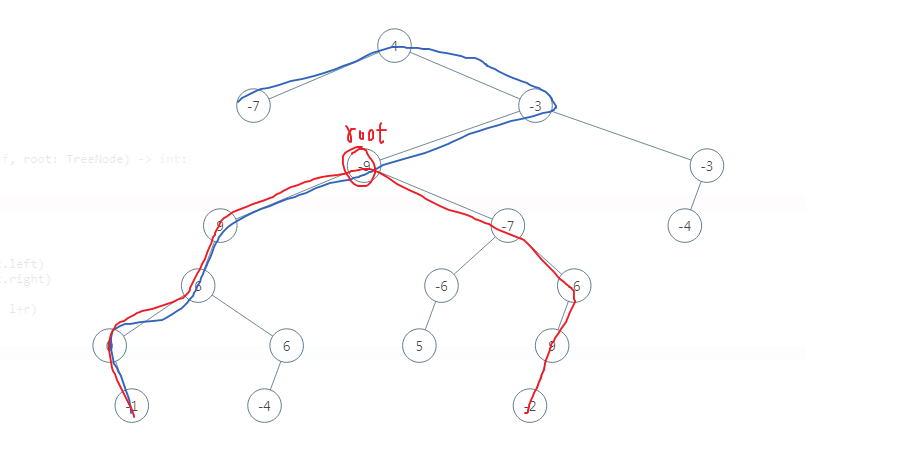

## 【B】算法 -- 二叉树


### SelfCheck

- **前、中、后序遍历二叉树，使用非递归方式**

- **从上到下从左到右输出二叉树**

- **二叉树输出第 k 层节点元素**

- **二叉树层序遍历，奇数层逆序遍历节点，偶数层正序遍历**（之字形输出二叉树）。

- **反转一棵二叉树(二叉树的镜像)**

- **二叉树最大深度**

- **二叉树的直径-- 任意一棵二叉树，求最大节点距离**

- 给定一棵二叉树和两个节点，求这两个节点最近公共祖先

- 验证二叉搜索树

- 二叉搜索树的后序遍历序列

- 给定一棵二叉搜索树和两个节点，求这两个节点最近公共祖先

- 验证平衡二叉树

- 二叉树的右视图

  

  


### 二叉树

```
/**
 * 定义二叉树数据结构
 */
static class TreeNode {
    int val;
    TreeNode left;
    TreeNode right;

    public TreeNode(int value) {
        val = value;
    }
}
```


#### 二叉树的遍历

##### DFS - 深度优先遍历

###### 递归方式

每个节点最多被访问两次，时间复杂度与节点数n有关，O(n)

```
/**
 * 中序遍历
 */
public static List<Integer> inorderTraversal(TreeNode root) {
    List<Integer> list = new ArrayList<>();
    inorderRecurse(root, list);
    return list;
}

private static void inorderRecurse(TreeNode tree, List<Integer> orderList) {
    if (tree == null) {
        return;
    }
    inorderRecurse(tree.left,orderList);
    orderList.add(tree.val);
    inorderRecurse(tree.right,orderList);

}
/**
 * 前序遍历
 */
public static List<Integer> preorderTraversal(TreeNode root){
    List<Integer> list = new ArrayList<>();
    preorderRecurse(root, list);
    return list;
}

private static void preorderRecurse(TreeNode tree, List<Integer> orderList){
    if (tree == null){
        return;
    }
    orderList.add(tree.val);//根结点先打印，再左右
    preorderRecurse(tree.left,orderList);
    preorderRecurse(tree.right,orderList);
}

/**
 * 后序遍历
 */
public static List<Integer> postorderTraversal(TreeNode root){
    List<Integer> list = new ArrayList<>();
    postorderRecurese(root,list);
    return list;
}

private static void postorderRecurese(TreeNode root , List<Integer> orderList){
    if (root == null){
        return;
    }
    postorderRecurese(root.left,orderList);
    postorderRecurese(root.right,orderList);
    orderList.add(root.val);
}
```


###### 非递归方式

深度遍历是一根筋，走到底

> 前序遍历

```
    /**
     * 规则：根 -> 左 -> 右
     * 思想：
     * 利用辅助数据结构 -- 栈
     * 对于每棵子树，打印根节点后，入栈作为回溯点，深度遍历其左子树，左子树为空，则弹出回溯点，深度遍历其右子树
     */
    public List<Integer> preOrderTraversal(TreeNode root) {
        List<Integer> result = new ArrayList<>();
        Stack<TreeNode> stack = new Stack<>();
        TreeNode node = root;
        while(node != null || !stack.isEmpty()){
            //深度优先遍历左子树
            while(node != null){
                result.add(node.val); //打印经过的子树根节点值
                stack.push(node);// 保存回溯点
                node = node.left;//深度优先遍历左子树
            }
            //到底了，弹出最近回溯点，尝试遍历右子树
            if (!stack.isEmpty()){
                node = stack.pop();
                node = node.right;
            }
        }
        return result;
    }
```


> 中序遍历

```
      public List<Integer> inOrderTraversal(TreeNode root) {
        List<Integer> result = new ArrayList<>();
        Stack<TreeNode> stack = new Stack<>();
        TreeNode node = root;
        while(node != null || !stack.isEmpty()){
            while(node != null){
                stack.push(node);
                node = node.left;//深度遍历左子树
            }
            node = stack.pop();//每个弹出的节点可以看作一棵子树的根结点。
            result.add(node.val);//因为是中序遍历左->根➡>右，根节点弹出了，意味着没有下一层左子树了，所以打印子树根结点。
            node = node.right;
        }
        return result;
    }
```


> 后序遍历

后序遍历相比较前序遍历太难理解了，索性玩个逻辑游戏

后序： 左 - 右 - 中

前序：中 - 左 - 右，将前序遍历法 左 - 右分支处理逻辑交换一下，就变成按中 - 右 - 左顺序遍历，再将结果集合逆置就行了。

```
   public List<Integer> postorderNonRecurse(TreeNode root) {
        List<Integer> result = new ArrayList<>();
        Stack<TreeNode> stack = new Stack<>();
        TreeNode treeNode = root;
        while (treeNode != null || !stack.isEmpty()){
            while (treeNode != null){
                result.add(treeNode.val);
                stack.push(treeNode);
                treeNode = treeNode.right;
            }
            if (!stack.isEmpty()){
                treeNode = stack.pop();
                treeNode = treeNode.left;
            }
        }
        Collections.reverse(result);
        return result;
    }
```


力扣官方原版解法：

```
    public List<Integer> postorderNonRecurse(TreeNode root) {
        List<Integer> result = new ArrayList<>();
        if (root == null) {
            return result;
        }
        Deque<TreeNode> stack = new LinkedList<>();
        TreeNode prev = null;
        while (root != null || !stack.isEmpty()) {
            while (root != null) {
                stack.push(root);
                root = root.left;
            }
            root = stack.pop();
            if (root.right == null || root.right == prev) {
                result.add(root.val);
                prev = root;
                root = null;
            } else {
                stack.push(root);
                root = root.right;
            }
        }
        return result;
    }
```


##### 

##### BFS - 广度（宽度）优先遍历 / 层序遍历

基于队列

```

/**
 *  从上到下，从左到右打印二叉树（不需分层）
 *  场景是从左到右依次遍历，队列特性是先进先出，所以就从根结点开始，放入队列，出队、打印后，再将其左右孩子入队
 */
public static void traversalBinaryTreeByLevel(TreeNode root){
    if (root == null){
        return;
    }
    LinkedList<TreeNode> queue = new LinkedList<>();
    queue.add(root);
    while(!queue.isEmpty()){
        TreeNode lastNode = queue.pop();
        //print node
        System.out.print(lastNode.val+" ");

        if (lastNode.left != null){
            queue.add(lastNode.left);
        }
        if (lastNode.right != null){
            queue.add(lastNode.right);
        }
    }
}
```


##### “之”字型锯齿状打印二叉树

使用Collections.reverse() 将单层遍历结果集合反转一下

```
   public List<List<Integer>> bfsBaseOnQueueWithZhi(TreeNode root) {
        //我们用可变长的二维数组保存最终层序遍历结果
        List<List<Integer>> res = new ArrayList<>();
        if (root == null) {
            return res;
        }
        //链表实现了Dequeue接口
        LinkedList<TreeNode> queue = new LinkedList<>();
        queue.push(root);
        //保存每层遍历结果
        List<Integer> level;
        while(!queue.isEmpty()){
            int count = queue.size();
            level = new ArrayList<>();

            for (int i = 0; i < count; i++) {
                TreeNode node  = queue.poll();
                if (node == null){
                    continue;
                }
                if (node.left != null){
                    queue.add(node.left);
                }
                if (node.right != null){
                    queue.add(node.right);
                }
                level.add(node.val);
            }

            //一层遍历完，判断是奇层还是偶层
            if (res.size() % 2 == 1){
                Collections.reverse(level);
            }
            res.add(level);
        }
        return res;
    }
```


##### 反转二叉树（二叉树的镜像）

###### 递归法

由底向上，由小到大，递归反转子树

```
    public static TreeNode inverseTree(TreeNode root){
        if (root == null){
            return null;
        }
        TreeNode inverseLeft = inverseTree(root.right);
        TreeNode inverseRight = inverseTree(root.left);
        root.left =  inverseLeft;
        root.right = inverseRight;
        return root;
    }
```

###### 非递归

采用辅助栈,迭代每个节点，交换其左右孩子

```
   public static TreeNode mirrorTreeNonRecurse(TreeNode root){
        if (root == null){
            return null;
        }
        Stack<TreeNode> stack = new Stack<>();
        stack.push(root);
        while(!stack.isEmpty()){
            TreeNode node = stack.pop();
            if (node.left != null){
                stack.push(node.left);
            }
            if (node.right != null){
                stack.push(node.right);
            }
            TreeNode tmp = node.left;
            node.left = node.right;
            node.right = tmp;
        }
        return root;
    }
```


##### 重建二叉树

输入某二叉树的前序遍历和中序遍历的结果，请重建该二叉树。假设输入的前序遍历和中序遍历的结果中都不含重复的数字。

例如，给出

前序遍历 preorder = [3,9,20,15,7]
中序遍历 inorder = [9,3,15,20,7]
返回如下的二叉树：

​	3

   / \
 9  20
    / 	 \
  15   	7

```

```


##### 任意一棵二叉树，寻找两个节点最近公共祖先

给定一个二叉树, 找到该树中两个指定节点的最近公共祖先。

百度百科中最近公共祖先的定义为：“对于有根树 T 的两个节点 p、q，最近公共祖先表示为一个节点 x，满足 x 是 p、q 的祖先且 x 的深度尽可能大（一个节点也可以是它自己的祖先）。”

 

示例 1：


输入：root = [3,5,1,6,2,0,8,null,null,7,4], p = 5, q = 1
输出：3
解释：节点 5 和节点 1 的最近公共祖先是节点 3 。

来源：力扣（LeetCode）
链接：https://leetcode-cn.com/problems/lowest-common-ancestor-of-a-binary-tree
著作权归领扣网络所有。商业转载请联系官方授权，非商业转载请注明出处。


方法1:递归

```java
class Solution {

    private TreeNode ans;

    public Solution() {
        this.ans = null;
    }

    private boolean dfs(TreeNode root, TreeNode p, TreeNode q) {
        if (root == null) return false;
        boolean lson = dfs(root.left, p, q);
        boolean rson = dfs(root.right, p, q);
        if ((lson && rson) || ((root.val == p.val || root.val == q.val) && (lson || rson))) {
            ans = root;
        } 
        return lson || rson || (root.val == p.val || root.val == q.val);
    }

    public TreeNode lowestCommonAncestor(TreeNode root, TreeNode p, TreeNode q) {
        this.dfs(root, p, q);
        return this.ans;
    }
}
```


方法2:


#### 二叉树深度相关问题

##### 二叉树最大深度

二叉树最大深度 -- 二叉树的深度为根节点到最远叶子节点的最长路径上的节点数。

示例：
给定二叉树 [3,9,20,null,null,15,7]，

​	3

   / \
 9   20
    /  	\
  15      7
返回它的最大深度 3 。


方法1: 深度优先搜索DFS

```java
    private int maxDepth(TreeNode root) {
        if (root == null) {
            return 0;
        }
        int left = maxDepth(root.left);
        int right = maxDepth(root.right);
        return Math.max(left, right) + 1;
    }
```


方法2: 广度优先遍历BFS

使用queue结构，存节点。一层一层搜索，计算层数

```java

    public int maxDepthByBFS(TreeNode root) {
        if (root == null) {
            return 0;
        }
        Queue<TreeNode> queue = new LinkedList<>();
        queue.add(root);
        int depth = 0;
        while (!queue.isEmpty()) {
            int count = queue.size();//队列中始终存放一层的节点
            for (int i = 0; i < count; i++) {
                TreeNode node = queue.poll();
                if (node == null) {
                    continue;
                }
                if (node.left != null) {
                    queue.add(node.left);
                }
                if (node.right != null) {
                    queue.add(node.right);
                }
            }
            depth++;
        }
        return depth;
    }
```


##### 二叉树的直径- 任意一棵二叉树，求最大节点距离

二叉树的深度，代表着层数，所以最大深度一定是从root节点开始算起，但是直径却不一定，直径关注的是左右子树深度之和。

一棵二叉树的直径长度是任意两个结点路径长度中的最大值。这条路径可能穿过根结点也可能不穿过。




```java
class Solution {
    private int res = 0;
    public int diameterOfBinaryTree(TreeNode root) {
        if (root == null || (root.left == null && root.right == null)) {
            return 0;
        }
        maxDepth(root);
        return res;
    }

    private int maxDepth(TreeNode root) {
        if (root == null) {
            return 0;
        }
        int leftDepth = maxDepth(root.left);
        int rightDepth = maxDepth(root.right);
				//更新最大直径
        res = Math.max(res, leftDepth + rightDepth);
        return Math.max(leftDepth, rightDepth) + 1;
    }
}
```


#### 二叉树路径相关问题

##### 路径总和

给出一个二叉树以及一个数字sum，判断在这个二叉树上是否存在一条从根结点到叶子的路径，其路径上的所有节点和为sum。

```
	 public boolean hasPathSum(TreeNode root, int sum) {
        if (root == null) {
            return false;
        }
        if (root.left == null && root.right == null) {
            //没有左右子树了，说明是叶子结点，递归终止
            return root.val == sum;
        }
        return hasPathSum(root.left, sum - root.val)
                || hasPathSum(root.right, sum - root.val);
    }
```


### BST - 二叉查找树

#### 二分查找法

##### 给定排序数组，搜索插入位置

如果不存在，则返回它将要被按顺序插入的位置。

非递归方式：

```
   public int searchInsert(int[] arr, int target) {
        if (arr == null || arr.length == 0) {
            return -1;
        }
        int left = 0;
        int right = arr.length - 1;
        while (left <= right) {
            int mid = left + (right - left) / 2;
            if (target == arr[mid]) {
                return mid;
            } else if (target < arr[mid]) {
                right = mid - 1;
            } else {
                left = mid + 1;
            }
        }
        //	题设要求返回该按顺序插入的位置，也就是如果没找到，循环终止时left指针指向的位置
        return left;
    }
```

递归方式

```
   	 public int searchInsert(int[] arr, int target) {
          if (arr == null || arr.length == 0) {
            return -1;
        }
        return find(arr, 0, arr.length - 1, target);
    }
     private int find(int[] arr, int l, int r, int target) {
        if (l > r) {
            return l;
        }
        int mid = l + (r - l) / 2;
        if (target < arr[mid]) {
            return find(arr, l, mid - 1, target);
        } else if (target > arr[mid]) {
            return find(arr, mid + 1, r, target);
        } else {
            return mid;
        }
    }
```

资源参考

 https://leetcode-cn.com/problems/search-insert-position/


#### 二叉查找树

对于二叉树的任意一个节点，左子树中每个节点的值都比它小，右子树中每个节点的值都比它大。

##### 构建二叉搜索树

```
public class BinarySearchTree {

    private Node root;

    /**
     * 查找
     * 与当前节点值比较，小则向左，大则向右
     */
    public Node find(int data) {
        Node p = root;
        while (p != null) {
            if (data < p.val) {
                p = p.left;
            } else if (data > p.val) {
                p = p.right;
            } else {
                return p;
            }
        }
        return null;
    }

    /**
     * 查找最大结点
     * 一直向右
     */
    public Node findMax() {
        if (root == null){
            return null;
        }
        Node p = root;
        while (p.right != null){
            p = p.right;
        }
        return p;
    }

    /**
     * 查找最小结点
     * 一直向左
     */
    public Node findMin(){
        if (root == null){
            return null;
        }
        Node p = root;
        while(p.left != null){
            p = p.left;
        }
        return p;
    }

    /**
     * 插入
     * 类似查找，与当前节点比，小于则向左，大于则向右，没有则生成
     * 找到空位（子节点为空），接上去成为叶子。
     */
    public void insert(int data) {
        if (root == null) {
            root = new Node(data);
            return;
        }
        Node p = root;
        while (p != null) {
            if (data > p.val) {
                if (p.right == null) {
                    p.right = new Node(data);
                    return;
                }
                //继续
                p = p.right;
            } else {
                if (p.left == null) {
                    p.left = new Node(data);
                    return;
                }
                p = p.left;
            }
        }
    }

    //删除
    public void delete(int data) {

    }


    static class Node {
        int val;
        Node left;
        Node right;

        public Node(int value) {
            this.val = value;
        }
    }
}
```


##### 二分搜索树，寻找两个节点最近公共祖先

```

```


### 平衡二叉树、红黑树、B树与B+树

#### 平衡二叉树

AVL树是**严格的平衡二叉树**，平衡条件必须满足（**所有节点的左右子树高度差的绝对值不超过****1**）。不管我们是执行插入还是删除操作，只要不满足上面的条件，就要通过旋转来保持平衡，而旋转是非常**耗时**的，由此我们可以知道**AVL树适合用于插入与删除次数比较少，但查找多的情况（AVL树是基于二分法的策略，提高数据的查找速度）；


##### 给定一个二叉树，判断它是否是平衡二叉树

```

```


#### 红黑树

一种二叉查找树，但在每个节点增加一个存储位表示节点的颜色，可以是红或黑（非红即黑）。

红黑树是一种弱平衡二叉树（由于是弱平衡，可以看到，在相同的节点情况下，AVL树的高度低于红黑树），相对于要求严格的AVL树来说，它的旋转次数少，所以对于搜索，插入，删除操作较多的情况下，我们就用红黑树。

****


##### 应用场景

1. JDK 中 TreeMap、HashMap 
2. IO多路复用的epoll的的的实现采用红黑树组织管理的的的sockfd，以支持快速的增删改查;
3. 广泛用于C ++的STL中，地图和集都是用红黑树实现的;
4. Linux的的进程调度完全公平调度程序，用红黑树管理进程控制块，进程的虚拟内存区域都存储在一颗红黑树上，每个虚拟地址区域都对应红黑树的一个节点，左指针指向相邻的地址虚拟存储区域，右指针指向相邻的高地址虚拟地址空间;


#### B树和B+树

##### 二叉查找树的局限性

https://cloud.tencent.com/developer/article/1583422

B树也称B-树,它是一颗多路平衡查找树。B树和后面讲到的B+树都是从最简单的二叉树变换而来的。描述一颗B树时需要指定它的阶数，阶数表示了一个节点最多有多少个孩子节点，一般用字母m表示阶数。

B+树是从B树衍生而来的，比B树更具有优越性。B+树相对于B树主要做了两点改进： 

（1）非叶结点仅具有索引作用，跟记录有关的信息均存放在叶结点中。

（2）树的所有叶节点构成一个有序链表，可以按照关键字排序的次序遍历全部记录。

##### 应用场景

1. MySQL数据库索引。

   


### 学习资源

* 平衡二叉树、B树、B+树、B*树 理解其中一种你就都明白了 -- 知乎

  https://zhuanlan.zhihu.com/p/27700617

### 


