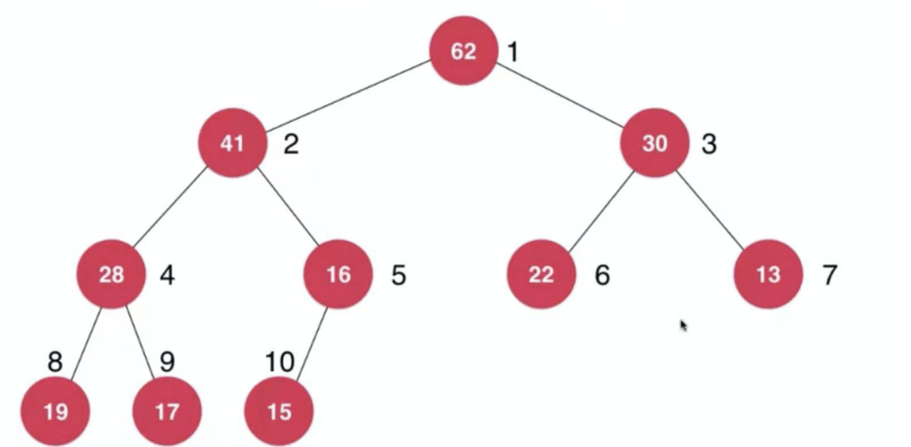

## 【B】算法 -- 优先队列（堆）


### 面试题
- 什么是最小堆？什么是最大堆？在堆中怎么插入一个元素？

- 一个数组建堆，时间复杂度是多少呢？在堆中找指定的一个元素复杂度是多少？

- 海量数据 Top - K 问题

  - 给定一个非空数组，返回前k个出现频率最高的元素
  - 100万个数找最大的100个？如何从一百万个数里面找到最小的一百个数？

- 合并k个有序数组

  


### 数据结构 -- 堆

堆 逻辑上是一棵完全二叉树，性质是 节点值总是不大于父节点（最大堆）或节点值总是不小于父节点（最小堆）。


二叉堆实现 -- 用数组存储。




为方便计算，用数组实现堆时，通常从下标1位置开始存储元素

| -    | 62   | 41   | 30   | 28   | 16   | 22   | 13   | 19   | 17   | 15   |
| ---- | ---- | ---- | ---- | ---- | ---- | ---- | ---- | ---- | ---- | ---- |
| 0    | 1    | 2    | 3    | 4    | 5    | 6    | 7    | 8    | 9    | 10   |

观察得出规律：

1. 最大堆的堆顶总是最大元素，最小堆堆顶总是最小元素
2. 数组容量 = 元素个数+1 
3. 左右孩子下标 处以 2 可以得到其父节点下标
4. 同理，父亲节点下标乘以2 得到其左孩子下标


##### **shift up** -- 向堆中插入元素 

根据完全二叉树性质，叶子节点总要放到最后一层靠左的位置，之后根据最大堆的性质，还要判断新添加的叶子节点与其父节点大小，比父节点大，则交换位置，继续向上比较并交换，这一过程被称为shift up。


##### shift down -- 取出堆顶元素 

堆数据结构只允许每次弹出堆顶元素，即当前堆中最大或最小元素。

堆顶元素弹出后，将数组中最后一个元素补位到堆顶补位。

以最大堆为例，

根据堆的性质，根结点左右孩子比较，较大者与补位到根结点的元素互换，此时如果补位节点仍比孩子节点小，继续逐层向下与左右孩子中较大者交换，该过程即为shift down。


> 基于数组实现一个支持shift up和shift down的最大堆

```
public class MaxHeap {

    private int[] data;

    //容量大小
    private int capacity;

    //元素个数
    private int size;

    public MaxHeap(int capacity) {
        this.capacity = capacity;
        data = new int[capacity];
        size = 0;
    }

    public int size() {
        return size;
    }

    public boolean isEmpty() {
        return this.size == 0;
    }

    public void insert(int value) {
        assert size + 1 <= capacity;
        //添加到数组末尾，表示完全二叉树最后一个叶子节点
        data[size++] = value;
        shiftUp(size); //对最后添加进数组的元素进行shift up操作
    }

    private void shiftUp(int k) {
        int index = k;
        //递归与父节点比较，找到父节点
        while (k > 1 && data[index] > data[index / 2]) {
            swap(data, index, index / 2);
            index /= 2;
        }
    }

    public int extractMax() {
        assert size > 0;
        //取出数组第一个元素（堆中最大值）
        int ret = data[1];
        //shift down
        swap(data, 1, size);
        size--;
        shiftDown(1);
        return ret;
    }

    private void shiftDown(int k) {
        while (2 * k <= size) {
            int j = 2 * k; //左孩子，完全二叉树一定存在左孩子

            //如果右孩子比较大
            if (j + 1 <= size && data[j + 1] > data[j]) {
                j += 1; //更新 j为右孩子下标，使变量j表示左右孩子中较大者的位置
            }

            //父节点比最大的孩子节点还大，直接break
            if (data[k] > data[j]) {
                return;
            }

            //父节点与较大的孩子节点交换位置
            swap(data, data[k], data[j]);
            k = j; //下一层
        }
    }

    /**
     * 交换数组中两位置的元素
     */
    private void swap(int[] arr, int left, int right) {
        int temp = arr[left];
        arr[left] = arr[right];
        arr[right] = temp;
    }
}
```


### 堆常见算法

#### 海量数据 Top - K 问题

##### 给定一个非空数组，返回前k个出现频率最高的元素

```

```


##### 100万个数找最大的100个？

```

```


#### 合并k个有序数组


### 重复问题

海量数据还有一种常见问题，即查找重复出现的元素问题。例如，已知某个文件内包含一些电话号码，每个号码为8位数字，统计不同号码的个数。

针对此类问题一般可以通过**位图法**解决。


