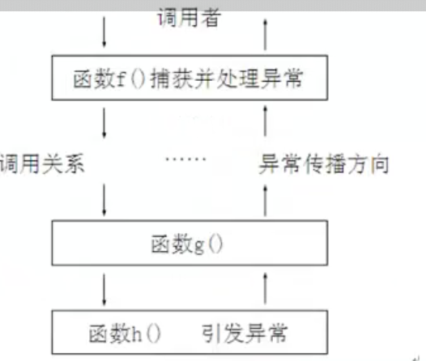

## 【C】NDK_04_C++基础

> 天地交，泰；后以财成天地之道，辅相天地之宜，以左右民。--《易经·泰》
>


### SelfCheck

2. 讲一下内联函数 ，内联函数和#define区别。inline 内联什么时候失效？为什么循环、分支不能设为内联？如果设为内联会怎样？
3. 静态链接和动态链接的区别？哪种更快？哪种生成的可执行文件更大？
4. main函数之前和之后都会做什么工作，怎么在main函数之前和之后执行代码；
5. 内存空间分为哪几个部分？全局变量存在哪个部分？
6. 指针和引用的区别
7. c++ 中全局static变量和局部static变量


### 目录

- 基础语言特性
  - 函数
    - 函数基础
      - 函数的定义、声明与调用
      - 值传递
    - 函数高级
      - 函数的默认参数
      - 函数的占位参数
      - 函数重载
  - 指针
  - 结构体
  - 内存四区 -- 栈区、堆区、全局区、代码区
  - **C++中的引用**
  - **面向对象--类和对象**
    - **封装**
    - **继承和组合**
    - **多态性和虚函数**
    - **对象特性-构造函数和析构函数**
    - **友元**
    - **运算符重载**
  - **C++文件操作**
  - 类型转换
  - 异常机制
  - ***项目实战：职工管理系统***
- **模版**
  - **函数模版**
  - **类模版**
- **STL**
  - **vector**
  - **string**


### 函数

#### 函数基础

##### 值传递

函数内修改形参的值，不会影响外部实参本身。

函数体内，会将参数的值复制一份。从内存四区角度来看，每个函数调用时在栈上给函数内临时变量分配内存，然后把调用者实际参数值复制过来一份。这也是为什么常常用指针作函数参数的原因（避免大量数据拷贝）。


#### 内联函数

如果函数被定义为内联函数，那么在函数调用的地方，编译器将直接替换成函数体，从而替代一次函数调用。内联函数作用是省去了普通函数调用的额外开销（压栈，跳转，返回）。

但是两种情况内联会失效：

1）函数体太复杂比如含有任何形式的循环、复杂的条件判断。

2）当要显式或者隐式的取函数地址。（编译器必须为函数代码分配内存从而产生函数地址）


内联函数是C++中用来替代带参数的宏片段的。因为宏只能机械做替换并展开。


#### 默认参数

不传就用默认值

```
void myPrint(int z ,int x = 3 , int y = 4){
    cout << "x = "<<x<<endl;
    cout << "y = "<<y<<endl;
    cout << "z = "<<z<<endl;
}
```

规则：默认参数放在参数列表最后


#### 占位参数

占位参数必须传

```
void placeHolder(int a, int b, int) {
    cout << "a = " << a << endl;
    cout << "b = " << b << endl;
}
```


> 默认参数与占位参数结合

为以后程序拓展，达到占位参数可以不传的效果

```
void placeHolder(int a, int b, int=0) {
    cout << "a = " << a << endl;
    cout << "b = " << b << endl;
}
```


#### 函数重载

**函数名相同，参数列表(类型、个数)不同。**（函数返回值不是重载的判定条件）

##### 默认参数 vs 函数重载

出现二义性

```
void myPrint(int a ,int b , int c = 0){
}

void myPrint(int a, int b){
}
int main(){
    myPrint(1,2,3);
    myPrint(1,2); //报错 ： call to "myPrint" is ambiguous
    return 0;
}
```


##### 函数重载 与 函数指针

###### 函数指针三种语法

```
//1.声明一个函数类型
typedef void (myTypeFunc)(int a , int b);
//    myTypeFunc *myTypeFuncp = NULL;//定义一个函数指针，这个指针指向函数的入口地址
//2.声明一个函数指针类型
typedef void (*myPTypeFunc)(int a ,int b);
// myPTypeFunc fp = NULL;//通过 函数指针类型 定义一个函数指针
//3.定义一个函数指针变量
void (*myVarFunc)(int a ,int b);
```


###### 函数重载结合函数指针

根据传参严格匹配具体函数


### 指针

作用：间接访问内存


##### 指针占的内存空间

指针也是一种数据类型，存的是内存地址16进制数，

32位操作系统(x86)下，占4个字节。64位系统(x64)占8字节内存。

sizeof(int *) 


##### 野指针

指针变量指向没有权利操作的内存地址。


##### const修饰指针

1. const 修饰指针 -- 常量指针

   在指针变量前加const修饰 , 指向常量的指针。

   ```
   const int * p = &a;
   ```

   指针指向可以改，指针指向的内存不可以改

   

2. const修饰常量 -- 指针常量

   指针本身是一个常量，不可修改其指向。

   ```
   int * const p = &a;
   ```

   

3. const既修饰指针又修饰指向的值 

   ```
   const int * const p = &a;
   ```


##### 利用指针访问数组元素

数组名即为数组首元素地址。

int * p = arr;


##### 指针和函数

地址传递：把变量地址作为参数传递函数。

在函数体内通过 * p 可以间接修改外部实参的值。


### 结构体

```
struct Student{
    string name;
    int age;
    int score;
};
```


##### 初始化结构变量

struct关键字可以省略

```
struct Student s1;
s1.name = "张三";
s1.age = 20;
s1.score = 60;

Student s2 = {"李四", 22, 59};
```


##### 结构体指针

指针->访问结构体成员变量

```
Student s2 = {"赵四", 22, 59};
Student * s3 = &s2;
s3->name = "尼古拉斯·赵四";
```


##### 结构体数组

```
struct Student students[10] = {{"王武",21,100},{},{}};

```


##### 结构体嵌套

```
struct Teacher{
    string name;
    struct Student std;
};
```


##### 结构体中const使用场景

结构体既作地址传递，又不希望函数内部改变其内部成员值

```
void printStudent(const Student * s){
    s->name = ""; //报错
}
```


### 内存模型- 内存四区

- 代码区

  操作系统管理的，存放CPU执行的指令。特点：共享、只读

- 全局区

  全局变量和静态变量以及常量。

  全局区包含了常量区 -- 字符串常量、（const修饰的）全局常量。

  

- 栈区

  由编译器自动分配和释放，存放函数的参数值**（形参）***、**局部变量**等。

  Tip：不要返回局部变量地址：因为函数结束，局部变量栈内存被回收，返回其内存地址是不安全的。

  

- 堆区

  由程序员分配和释放。

  new 关键字在堆上开辟内存。

  

### 引用

#### 引用的概念

变量的别名

语法：数据类型 &别名 = 原名		

```
int a = 10;
int &b = a;
cout<<"b = "<<b;
b = 100;
cout<<"a = "<<b;
```


#### 引用的性质

1. 引用必须初始化（依附于某个变量）
2. 引用初始化后，不可以再改变指向


#### 引用的本质

普通引用内部实现是常量指针，有自己的内存空间，也跟原变量操作同一块内存。指针常量


#### 引用的使用场景

##### 引用当函数返回值 

1）若函数返回的是栈上变量的引用，则不能用引用作左值（函数执行完后，栈内存会被回收）

```
int &getAA2() {
    int a;
    a = 10;
    return a; 
}

int main() {
    int a2 = getAA2();			// 因为返回的是基本类型，返回值会复制一份赋给int 变量a2，所以没问题
    int &a3 = getAA2(); // 引用作左值，函数getAA2()栈内存被回收，打印变量引用，出现乱码

    printf("a2:%d\n",a2);
    printf("a3:%d\n",a3);
    return 0;
}
```

2）若返回静态变量或全局变量，没问题

```
int &getAA2() {
    static int a;
    a = 10;
    return a; //ok
}
```


##### 函数返回值是引用，并且当左值

```
int& setAA() {
    static int a;
    a = 10;
    return a;//返回变量本身（变量标识的内存空间）
}

int main() {
    setAA() = 100; //相当于给静态变量a 赋值 100

    printf("a:%d\n",a);
    return 0;
}
```


##### 指针的引用

之前讲过的指针作函数参数，间接修改实参的场景。

```
struct Teacher{
    char name[64];
    int age;
};
```

使用二级指针方式:

```

int getTeacher(Teacher **p){
    Teacher *tmp = NULL;
    if(p == NULL){
        return -1;
    }
    tmp = (Teacher*)malloc(sizeof(Teacher));
    if (tmp == NULL){
        return -2;
    }
    tmp->age = 33;
    //p是实参地址，*在左边，像一把钥匙寻址并打开间接地修改实参的值
    *p = tmp;
}

int main() {
    Teacher *pT1 = NULL;
    getTeacher(&pT1);
    cout<<"pT1 ="<<pT1->age;
    return 0;
}
```


换成**指针引用**的方式

```
int getTeacher2(Teacher* &pt){
    //给指针引用pt赋值，相当于给main函数中Teacher指针pT1赋值
    pt = (Teacher *)malloc(sizeof(Teacher));
    if (pt == nullptr){
        return -1;
    }
    pt->age = 36;
}

void freeTeacher(Teacher * pT){
    if (pT == nullptr){
        return;
    }
    free(pT);
}

int main() {
    Teacher * pT1 = NULL;
    getTeacher2(pT1);
    printf("age :%d\n",pT1->age);
    freeTeacher(pT1);
    return 0;
}
```


##### 引用数组与数组引用

没有所谓的引用数组，即元素是引用的数组

```
int& b[3]; //不允许创建 元素是引用的数组
```


但是允许用下面**数组引用**的语法，为数组创建别名（引用）

```
int a[] = {1,2,3};
int (&b1)[3] = a; // 为一个有3个元素的数组a ，创建引用
for (int i = 0; i < 3; ++i) {
    cout<<b1[i]<<endl;
}
```


##### 常引用

const int & e 相当于 const int * const e;


常引用的初始化

1） 用变量初始化常引用

```
int x = 20;
const int &y = x; //让变量引用变成只读属性 ， 不能通过y去修改x了。
```

2）用字面量去初始化常引用

```
const int a = 10; //c++编译器把a放在符号表中
int &m = 41; // 编译不通过，字面量没有内存地址，引用也就没办法给内存地址取别名
const int &m = 43; // c++编译器会分配内存空间
```


> c与c++中的const

C语言中的const变量是只读变量，有自己的内存空间。

C++中的const常量可能分配空间也可能不分配空间

* 当const常量为全局，并且需要在其他文件中使用，会分配空间
* 当使用&操作符，取const常量地址时，会分配存储空间
* 当const int &a = 10;修饰引用时，也会分配存储空间。

​	


### 类和对象

#### 类的封装

struct和class区别：默认访问权限不同，struct默认public，class默认private


##### 类的声明和实现分开

类和函数的声明 写在头文件 .h

```
#pragma once //只包含一次
#ifndef HELLO_C___DAY03_H
#define HELLO_C___DAY03_H

#endif //HELLO_C___DAY03_H
class Test
{
public:
    //拷贝构造函数，用一个对象来构造另一个对象
    Test(const Test & obj);

    Test(int a);

    Test();
    ~Test();
private:
    int m_a;
};

Test getTest();
```

实现写在同名.cpp文件

```
#include "day03.h"
#include <iostream>
using namespace std;

Test getTest() {
    Test A(1); //调用有参构造函数生成 A 对象
    return A; //调用拷贝构造函数，生成匿名对象？
}


Test::Test(const Test &obj) {
    cout<<"copy Test "<<endl;
}

Test::Test(int a) {
    cout<<"Test(int a) "<<a<<endl;
}

Test::Test() {
    cout<<"Test "<<endl;
}

Test::~Test() {
    cout<<"~Test "<<endl;
}
```


#### 构造函数和析构函数

构造函数是用来完成属性的初始化的

析构函数是系统自动调用以释放内存的。

```
class Test{
public:
    Test(){
        cout<<"Test() ..."<<endl;
    }
    ~Test(){
        cout<<"~Test() ..."<<endl;
    }
};
void play(){
    Test t1;
    Test t2;
}
int main()
{
    play();
    return 0;
}
```

构造函数调用规则：先声明的对象先调用。

析构函数调用规则：先声明的对象后调用。

> 为什么需要构造函数和析构函数？


##### 构造函数

1. 无参构造函数

   ```
   Test t ;  // 不要带括号
   ```

   

2. 带参构造函数

   ```
   Test t(1) ;  // 带括号,传参数，调用带参构造函数
   ```

   ```
   Test t1 = (1,2,3); //等号法，调用带参构造函数； 如果不完全匹配，则参数列表后面的参数生效
   ```

   ```
    Test t1 = Test(1);//直接调用构造函数，将构造出匿名对象
   ```

   

3. 拷贝构造函数

   拷贝构造函数，用一个对象来初始化另一个对象

   ```
       //拷贝构造函数，用一个对象来初始化另一个对象
       Test(const Test& obj){
           cout<<"copy Test()"<<endl;
       }
   
       Test(int a){
           m_a = a;
           cout<<"copy Test(int a)"<<endl;
       }
   
       Test(){
           cout<<"Test()"<<endl;
       }
   ```

   

**构造函数调用规则**

1. 编译器默认提供：默认构造函数（空实现）、析构函数、拷贝构造函数（简单值拷贝）

2. 若自己定义了一个有参构造函数，则编译器不再提供无参构造函数，只提供拷贝构造函数。

3. 若自己写了拷贝构造函数，C++编译器不会提供任何自动提供任何构造函数。


**拷贝构造函数调用时机**

1. 使用已经初始化的对象创建新对象

```
Test t2 =  t1; //用t1来初始化t2 ；与赋值操作t0 = t1; 是不一样的含义
```

```
 Test t3(t1); //直接传入对象
```

 C++默认的拷贝构造函数，会自动拷贝成员属性的值给新对象。


2.值传递方式给函数传参 -- 用实参初始化函数内形参

```
void play(Test t0){
    t0.printA(); //相当于使用Test t0 = t1; 做了一次拷贝函数调用
}
void play(){
    Test t1(1);
    t1.printA();
    play(t1);
}
析构的顺序仍然是“先创建，后析构” ： t0 -> t1
```


3.值方式返回局部对象 -- 函数返回匿名对象

```
Test getTest() {
    Test t(1024);
    return t;//调用有参构造函数创建t对象、又调拷贝构造函数构造生成匿名对象并返回。t对象是局部变量不能直接返回。
}

void play() {
 		Test t5;
    t5 = getTest(); //普通赋值操作，赋值完后匿名对象被析构
    
    Test t4 = getTest(); //匿名对象直接转成 t4对象，从匿名变有名，不会析构掉。
}
```

要注意的是这是语法层面的知识，实际的**C++编译器可能对匿名变量做优化，编译器发现有变量来接收匿名变量，则直接将匿名变量的初始化过程放到接收该匿名变量的对象身上去，免去了后面的拷贝构造的过程。** 比如我Mac 上用的Clion。 


##### 深拷贝与浅拷贝

浅拷贝：简单的赋值拷贝操作。

深拷贝：在堆区重新申请内存，进行拷贝操作。

示例：

```
class Person{
public:
    Person(){
        cout<<"Person() "<<endl;
    }

    Person(int a, int b){
        this->age = a;
        height = new int (b);
        cout<<"Person(int,int) "<<endl;
    }

    //编译器默认的拷贝构造函数是浅拷贝，
    //如果属性有在堆区分配内存，那么堆区地址也会简单拷贝到另一个对象
    //会出现析构时两个对象都释放同一块堆区内存的错误
    Person(const Person & p){
        cout<<"copy Person() "<<endl;
        this->age = p.age;
        this->height = p.height;
    }

    ~Person(){
        if(height != nullptr){
            delete height;
            height = NULL;
        }
        cout<<"~Person() "<<endl;
    }

    int age;
    int * height;
};
```

编译器默认的拷贝构造函数是浅拷贝,解决方案就是自己写拷贝构造函数，用深拷贝给新对象用到堆内存的属性分配自己的内存。

自定义拷贝构造函数

```
  	Person(const Person & p){
        cout<<"copy Person() "<<endl;
        this->age = p.age;
        this->height = new int(*p.height);//用深拷贝重新创建堆内存
    }
```


##### 初始化列表

除了在构造函数中手动初始化成员属性，C++还提供初始化列表语法对成员属性初始化

```
//定义A类
class A {
public:
    A(int a) {

    }
};
//定义B类
class B {
public:
    B(int b) {

    }
};

```

//对于 class Person 有成员属性m_A和m_B ， 构造函数声明成员属性初始化列表，语法：

    class Person {
    public:
        A m_A;
        B m_B;
    
        Person(int a, int b) : m_B(a), m_A(b) {
            cout << "Person() m_A = " << m_A.m_a << " m_B = " << m_B.m_b << endl;
        }
    };
    
    int main() {
        Person p(100, 200);
        return 0;
    }


组合对象初始化顺序 决定于**类中成员属性定义的顺序**，与初始化列表的顺序无关。


#### 对象创建 

##### new语法

在堆区开辟内存 ， 返回相应数据类型的指针

```
int *p = new int(10);
```

创建数组

```
int *a = new int[10];
for (int i = 0; i < 10; ++i) {
    a[i] = i;
}
```


##### delete语法

​	释放new 申请的内存

```
delete p;
```

释放数组 

```
delete[] a;
```

**总结：**

对于基本类型和基本类型数组是可以混搭的，对于派生类型，不可以混搭。

 malloc 与 free 是 c语言中的函数，只会分配内存和释放内存

 new和delete   是C++中的操作符，会分配内存同时会调用构造函数、析构函数


#### 静态成员变量和静态成员函数

static关键字修饰的属性和函数属于整个类，与对象无关

##### 静态变量声明与定义

```
class A {
public:
    void addC() {
        sIntC++;
    }

    static int sIntC;

    void printC() {
        cout << "sIntC = " << sIntC << endl;
    }
};

int A::sIntC = 10; //定义静态成员变量

//可见不同的成员，共享静态变量
int main() {
    A a1;
    a1.addC();
    a1.printC();

    A a2;
    a2.addC();
    a2.printC();

    A::sIntC++;   //类名直接访问静态变量
    A a3;
    a3.printC();
    return 0;
}
```


> 全局static变量和局部static变量辨析

存储：static 的作用是全局区分配内存，包括静态全局变量和静态局部变量。且静态变量属于类，类的所有对象共享。只初始化一次且生命周期直到程序结束。

作用域：普通全局变量默认是有外链性的，在另一个文件中通过extern声明，就可以使用，作用域是整个工程。静态全局变量作用域是当前文件，而静态局部变量作用域与普通局部变量无异。只不过是生命周期延长到程序结束了。


##### 静态成员函数

static修饰

```
static void printC() {
    cout << "sIntC = " << sIntC << endl;
}
```

双冒号调用

```
 A::printC();
```

与Java相同 ， 静态成员函数不能访问普通成员变量


#### C++面向对象模型

C++编译器是如何支持面向对象的 -- 如何管理类、对象，类与对象之间的关系。

C++面向对象，是基于c语言面向过程进行的封装，下图可见C++编译器对类中普通成员函数和成员变量的处理方式：


可以看到:

1. C++编译器把类的成员变量和成员函数分开存储的。class类通过struct 结构体 + 普通成员变量实现，成员函数单独抽出来存到代码区。

那么函数内部如何区分是具体哪个对象调用的呢 ？

2. **普通成员函数，传参多了一个 this指针。**

```
Test a; // 分配内存
Test_initalize(&a,10); // 初始化--构造方法调用，传入this指针： &a;
Test_getI(&a);				 //普通成员函数调用同样默认会传入this指针
```

这也是为什么我们使用同名参数的原因：

```
class B {
public:
    B(int b) {				//相当于 B(B *this,int b)
        this->b = b; //终于知道this是哪来的
    }
private:
    int b;
};
```


##### this指针强化-- const修饰类的成员函数

成员函数后面写const关键字,

实质上修饰的是this指针，表示this指向的内存空间不允许修改，即当前对象的普通成员属性不允许修改。

```
class B {
public:
    B(int b) {
        this->m_b = b;
        cout << "B()" << m_b << endl;
    }
    /**
     * const 修饰this指针
     * 相当于 setValue(const B *this ,int a)
     * 表示this指向的内存空间不允许修改
     * @param a
     */
    void setValue(int a) const
    {
        this->m_a = a; //modify m_a not allowed
        this->m_b++; //modify m_b not allowed
    }
    int m_a;
    int m_b;
};
```


> C++中一个类占用多少字节？

*非静态成员变量总合。
*加上编译器为了CPU计算，作出的数据对齐处理。
*加上为了支持虚函数，产生的额外负担。

详见：

https://blog.csdn.net/x356982611/article/details/79709855


##### this指针强化 -- 全局函数与成员函数 互转的场景

想说的是这样一种场景：写函数，实现两对象（成员变量）相加 , 返回一个新的对象

用全局函数实现则需要传入两个对象；

```
B addAnother(B &b1 , B &b2){
    B tmp(b1.m_a + b2.m_a,b1.m_b + b2.m_b);
    return tmp;
}
```

调用全局函数： B bGlobal = addAnother(b1,b2);


而成员函数默认因为有传入this指针，所以少一个传参

```
class B {
public:
    B(int a , int b) {
        this->m_a = a;
        this->m_b = b;
    }

    B addAnother(B& b2){
        B tmp(this->m_a + b2.m_a,this->m_b + b2.m_b);
        return tmp; // 通过tmp，生成匿名对象
    }

    int m_a;
    int m_b;
};
```

调用 b1.addAnother(b2);

```

int main() {
    B b1(10,100);
    B b2(20,200);
    B bNew = b1.addAnother(b2);//addAnother返回匿名对象直接转成bNew对象
    cout<<"bNew->a = "<<bNew.m_a<<" bNew->b = "<<bNew.m_b<<endl;
    return 0;
}
```


##### this指针强化 -- 成员函数返回当前对象自身

函数内对成员变量进行了修改，通过 *this 语法将自身作为函数返回值返回

```
class B {
public:
    B(int a , int b) {
        this->m_a = a;
        this->m_b = b;
    }
    
    //传入另一个B对象，使当前对象与之 m_a相乘,m_b相加,把计算完后的当前对象再return
    B& addB(B b2){
        this->m_a = this->m_a * b2.m_a;  
        this->m_b = this->m_b + b2.m_b;
        return *this; //把对象自身（对象内存所在地址）返回
    }
    int m_a;
    int m_b;
};
```


```
int main() {
    B b1(2,100);
    cout<<"b1->a = "<<b1.m_a<<" b1->b"<<b1.m_b<<endl;
    B b2(3,200);
    b1 = b1.addB(b2);
    cout<<"b1->a = "<<b1.m_a<<" b1->b"<<b1.m_b<<endl;
    return 0;
}
```

结果

b1->a = 2 b1->b100
b1->a = 6 b1->b300


#### 类的封装练习 -- 数组类的封装

1.编写头文件--类的框架

```
//
// 类似Java中的ArrayList 封装一个数组，可以插入数据、根据index查找
// Created by author on 2021/1/29.
//

#pragma once

#include <iostream>
using namespace std;

class Array {
public:
    Array();
    Array(const Array &array);
    ~Array();
public:
    void setData(int index , int value);
    int get(int index);
    int length();
private:
};
```

2.cpp文件中写类实现

```
#include "MyArray.h"
#include <iostream>

using namespace std;

MyArray::MyArray(int length) {
    this->size = length;
    if (this->size < 0){
        this->size = 0;
    }
    this->space = new int[this->size];
}

MyArray::MyArray(const MyArray &array) {
    this->size = array.size;
    this->space = new int[this->size];
    for (int i = 0; i < this->size; ++i) {
        this->space[i] = array.space[i];
    }
}


MyArray::~MyArray() {
    if (space != nullptr){
        delete[] space;
        space = nullptr;
        size = 0;
    }
}

void MyArray::setData(int index, int value) {
    space[index] = value;
}

int MyArray::get(int index) {
    return space[index];
}

int MyArray::length() {
    return size;
}

```

3.编写测试用例

```
//测试用例
int main() {
    MyArray a(10);

    for (int i = 0; i < a.length(); ++i) {
        a.setData(i, i);
    }

    for (int j = 0; j < a.length(); ++j) {
        cout << " i = " << a.get(j);
    }

    MyArray b = a;
    cout << " b = " << endl;
    for (int i = 0; i < b.length(); ++i) {
        b.setData(i, i*10);
    }

    for (int j = 0; j < b.length(); ++j) {
        cout << " " << b.get(j);
    }

    std::cout << "Hello, MyArray! b length = " << b.length() << std::endl;
    return 0;
}
```


#### 友元

类似Java中反射机制，在类的外部修改类中私有成员变量，破坏其封装性。


##### 友元函数

类中使用 **friend**关键字声明一个外部的函数，表明其是这个类的“好朋友”，允许其修改类内部私有变量。

```
class A{
private:
    int i;
    friend void modifyA(A *a , int value);//友元函数声明位置没关系

public:
    A(int a){
        this->i = a;
    }
    int getI(){
        return this->i;
    }
//    friend void modifyA(A *a , int value);//友元函数声明位置没关系
};

//修改A类内部成员
void modifyA(A *pA, int value){
    pA->i = value;
}
int main(){
    A a1(1);
    modifyA(&a1,1000);
    cout<<"a="<<a1.getI()<<endl;
    return 0;
}
```


### 操作符重载

类是一种自定义数据类型，不同于基础类型，可以使用加减乘除等各种进行运算符操作。C++通过操作符重载机制来让程序员自定义实现自定义数据类型的运算操作。


#### 运算符重载两种方法

##### 全局函数（友元函数）

operator + 表示重载"+"运算符，程序中使用加号运算符（c1 + c2）时，C++编译器自动匹配操作符重载函数，相当于手动调 operator+(c1,c2)

```
Complex operator +(Complex &c1, Complex &c2){
    Complex tmp(c1.a + c2.a, c1.b + c2.b);
    return tmp;
}
```

一般情况下类中属性是private的，所以全局操作符重载函数要在类中声明为友元函数。

> Complex类：

```
private:
    int a;
    int b;
    friend Complex operator +(Complex &c1, Complex &c2) ;
```


##### 成员函数

 类中定义的操作符重载函数，参数声明省略隐藏this指针，c1- c2 相当于 c1.operator-(c2)

```
Complex operator- (Complex &c2){

}
```


##### 运算符重载的本质

1. 运算符重载的本质是函数调用

```
Complex addComplex(Complex &c1, Complex &c2) {
    Complex tmp(c1.a + c2.a, c1.b + c2.b);
    return tmp;
}

//operator + 表示重载"+"运算符，程序中使用加号运算符（c1 + c2）时，C++编译器自动匹配操作符重载函数
Complex operator +(Complex &c1, Complex &c2){
    Complex tmp(c1.a + c2.a, c1.b + c2.b);
    return tmp;
}

int main() {
    Complex c1(5, 10), c2(15, 20);
//    Complex c3 = addComplex(c1, c2); //等同于加号操作符重载函数
    Complex c3 = c1 + c2;
    c3.printObj();
}
```


不能重载的运算符：

. 	::	 .* 	 ?: 	sizeof


### C++文件操作

#### API

ofstream //写文件

ifstream //读文件

fstream //可读写


文件打开方式：

ios::out //默认以文本方式打开文件

ios::binary // 指定以二进制方式打开文件

ios::app //追加方式写文件

ios::trunk //如果文件存在，先删除、再创建


#### 文本方式读写文件

##### 写文件：

ASCII码形式储存

```
   	ofstream ofs;
    ofs.open("PersonWithText.txt",ios::out);
    Person p2 = {"张三2",28};
    ofs<<p2.m_Name<<" "<< p2.m_Age<<endl;
    ofs.close();
```


##### iftrean 4种方法读文件

​		  包含头文件<fstream>

​		  创建流对象 & 打开文件

​		  判断文件是否打开成功

​          关闭文件

```
	  ifstream ifs("person.txt",ios::in | ios::binary);
    if (!ifs.is_open())
    {
        cout<< "open file failed."<<endl;
        return -1;
    }
```


1. 运算符 >> 读，读入字符缓冲数组 Char buf[1024]

   ```
   
       char buf[1024] = {0};
       while(ifs >> buf){
           cout << buf << endl;
       }
   ```

   

2. ifstream::getline方法读，字符缓冲数组接收

   ```
   		while (ifs.getline(buf, sizeof(buf))) {
           cout << buf << endl;
       }
   ```

   

3. fstream::getline方法读，string接收

   ```
       string s;
       while(getline(ifs,s)){
           cout << s << endl;
       }
   ```

   

4. If stream::get() 按字符读，char接收

   ```
   		char c;
       while ((c = ifs.get()) != EOF) {
           cout << c << endl;
       }
   ```

   


#### 二进制方式文件读写

```
#include<iostream>
#include<fstream>

using namespace std;

class Person
{
public:
    char m_Name[64];
    int m_Age;
};
```

##### 写文件：持久化 Person对象

1. 包含头文件
2. 创建流对象
3. 打开文件
4. 写文件
5. 关闭文件

```
    //1. inlcude head file
    //2. create out stream object
    ofstream ofs("person.txt",ios::out | ios::binary);
    //3. open file
//    ofs.open("person.txt",ios::out|ios::binary);
    //4. write file
    Person p = {"张三",18};
    ofs.write((const char *)&p, sizeof(Person));
    //5. close file
    ofs.close();
```

##### 读文件：读取person.txt为Person对象

1. 包含头文件
2. 创建流对象
3. 打开文件
4. 打开文件（判断文件是否打开成功）
5. 关闭文件

```
    ifstream ifs("person.txt",ios::in | ios::binary);
    if (!ifs.is_open())
    {
        cout<< "open file failed."<<endl;
        return -1;
    }
    Person p{};
    ifs.read((char *)&p, sizeof(Person));

    cout<<"name : "<<p.m_Name<<" age : "<<p.m_Age<<endl;
```


### 类型转换

4种 C++ 风格的**类型**转换，各司其职，应用于不同场景

| static_cast            | 静态类型转换，如int转成char;             |
| ---------------------- | ---------------------------------------- |
| **reinterpreter_cast** | **重新解释类型,不同类型之间强制转换**；  |
| dynamic_cast           | 动态类型转换，如子类和父类的多态类型转换 |
| const_cast             | 去const属性，常量变成可修改              |


##### static_cast

编译器会进行类型检查，不通过会编译报错

```
    double dPi = 3.1415926;
    int iPi = (int)dPi; //c风格类型转换
    iPi = static_cast<int>(dPi);// static_cast与c风格类型转换效果基本一样
```


##### reinterpreter_cast

重新解释，类似强制类型转换


reinterpreter_cast 是可以通过编译，被重新解释成了Animal类型；运行时会产生未知错误。


##### dynamic_cast

一个简单的多态例子

```
class Animal{
public:
    virtual void cry() = 0;
};

class Dog : public Animal{
public:
    virtual void cry(){
        cout<<"旺旺"<<endl;
    }
    void action(){
        cout<<"看家"<<endl;
    }
};
class Cat : public Animal{
public:
    virtual void cry(){
        cout<<"喵喵"<<endl;
    }
    void action(){
        cout<<"抓老鼠"<<endl;
    }
};
void playWithObj(Animal *base){

    base->cry(); //1.有继承 2.虚函数重写 3.父类指针指向子类对象 ==》 多态

    //dynamic_cast 运行时识别 RIIT
    Dog *dog = dynamic_cast<Dog*>(base);//父类向下转型
    if (dog != nullptr){
        dog->action();//做特有的工作
    }
    Cat *cat = dynamic_cast<Cat*>(base);
    if(cat != nullptr)
    {
        cat->action();//做特有的工作
    }
}
int main(){
     Dog d;
     Cat c;
     playWithObj(&d);
     playWithObj(&c);
}
```

运行结果：

```
旺旺
看家
喵喵
抓老鼠
```


##### const_cast

```
void printBuf(const char *p){
    p[0] = '2'; //const 修饰不允许修改值
}
```

```
void printBuf(const char *p){
    char *p1 = NULL;
    p1 = const_cast<char*>(p);//const_cast去掉指针p的const属性
    p1[4] = '2'; 
    cout<<"buf : "<<p1<<endl;
}
```

要确保p指向的内存空间确实能修改。


### C++异常处理机制

```
void divide(int x, int y ){
    if (y == 0)
    {
        throw y;
    }
    cout<<"result = "<<x/y<<endl;
}
```

```
    try{
        divide(10,0); //制造一个除数为0的异常
    }catch (int e){
        cout<<"exception "<<e<<endl;
        throw;
    }catch(...){
        cout<<"unknown exception "<<endl;
    }
```

与Java异常机制类似 -- 

try...catch语法，异常捕捉严格按照类型匹配，可以是基本类型(不会隐式类型转换)。

  “...” 表示未成功捕获的异常，用来兜底。

程序 throw 后面的语句将被阻断，不执行。

抛异常是函数的。一层一层往上抛


C++异常统一处理机制设计思想：




### STL（标准模版库）

string

Vector

Stack

Queue

List容器

Set和MultSet

Map和Multmap


### 学习资源

- 《C++编程思想（两卷合订本）》

- 《C++ primer Plus》

- B站 - 黑马程序员C++教程

  https://www.bilibili.com/video/BV1et411b73Z

-  传智播客-扫地僧 C++就业班视频课

  链接: https://pan.baidu.com/s/1hPvxGub1HCkROBM2yXQn8Q  密码: 2ju4