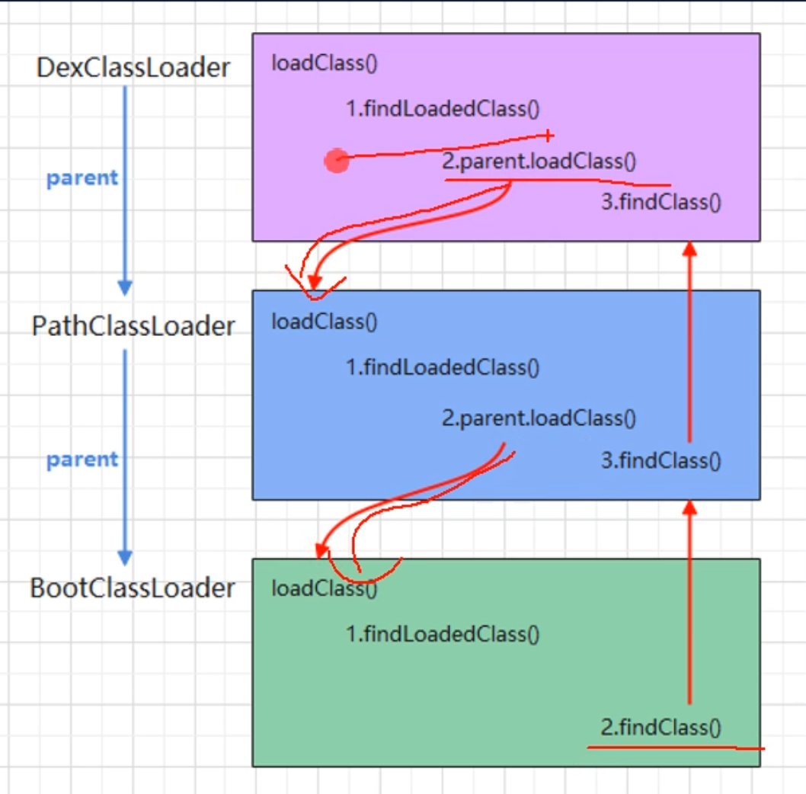
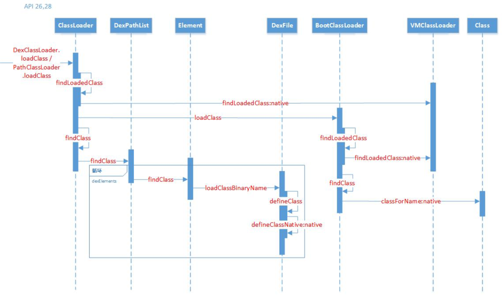
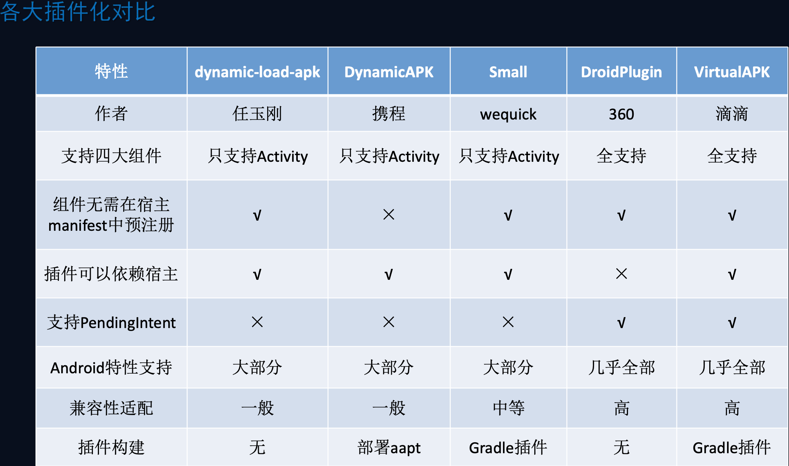

## 【P】项目设计实践 -- 插件化


### 面试问题

- Hook源码实现换肤
- 启动activity的hook方式


宿主apk和插件apk分开上线。按需加载。实现插件化要考虑的核心问题：

1. **如何加载插件的类？**
2. **如何启动插件的四大组件？**
3. **如何加载插件的资源？**


### 插件化基础知识

##### Android类加载机制



首先检测这个类是否已经被加载了，如果已经被加载了，直接获取并返回。否则，如果parent不为null 则调用parent的loadClass进行加载，依次递归，如果找到了或者加载了就返回，如果没找到才自己去加载。


###### findClass()原理




BaseClassLoader：：findClass 委托给成员DexPathList进行加载


DexPathList：：findClass 方法中循环遍历Element[]数组 dexElements


Element：：findClass 其中每个DexFile对应一个dex文件

DexFile：：loadClassBinaryName


dex文件生成命令

使用dx工具：sdk/Sdk/build-tools

```
dx --dex --output=output.dex input.class
```


### 插件化核心技术

#### 1.如何加载插件中的类

插件化与热修复的区别，elements数组，**补丁dex插到宿主dex之前还是放到宿主dex之后**。

```java
public static void loadClass(Context context) {
    /**
     * 1. 获取宿主dexElements
     * 2. 获取插件dexElements
     * 3. 合并两个dexElements
     * 4. 将新的dexElements赋给宿主dexElements
     */
    try {
        Class<?> clazz = Class.forName("dalvik.system.BaseDexClassLoader");
        Field pathListFiled = clazz.getDeclaredField("pathList");
        pathListFiled.setAccessible(true);

        Class<?> dexPathListClass = Class.forName("dalvik.system.DexPathList");
        Field dexElementsField = dexPathListClass.getDeclaredField("dexElements");
        dexElementsField.setAccessible(true);

        //宿主的类加载器
        ClassLoader pathClassLoader = context.getClassLoader();
        //DexPathList 类的对象
        Object hostPathList = pathListFiled.get(pathClassLoader);
        //宿主的dexElements
        Object[] hostDexElements = (Object[]) dexElementsField.get(hostPathList);

        //插件的类加载器，自定义DexClassLoader
        ClassLoader dexClassLoader = new DexClassLoader(pluginApkPath,context.getCacheDir().getAbsolutePath(),null,pathClassLoader);
        //DexPathList对象
        Object pluginPathList = pathListFiled.get(dexClassLoader);
        Object[] pluginDexElements = (Object[]) dexElementsField.get(pluginPathList);

        //新的宿主dexElements = 宿主dexElements + 插件dexElements
        Object[] newDexElements = (Object[]) Array.newInstance(hostDexElements.getClass().getComponentType(),
                hostDexElements.length+pluginDexElements.length);
        //合并数组
        System.arraycopy(hostDexElements, 0, newDexElements,
                0, hostDexElements.length);
        System.arraycopy(pluginDexElements, 0, newDexElements,
                hostDexElements.length, pluginDexElements.length);
        //赋值回给宿主dexElements
        dexElementsField.set(hostPathList,newDexElements);
    } catch (Exception e) {
        e.printStackTrace();
    }
}
```


Application中加载，程序中反射调用插件中的类

```java
            try {
                Class<?> clazz = Class.forName("com.enjoy.plugin.Test");
                Method print = clazz.getMethod("print");
                print.invoke(null);
            } catch (Exception e) {
                e.printStackTrace();
            }
```


#### 2. 插件化加载Activity

**Hook点选取原则**

1. public
2. static


##### 思路

启动插件中组件，通过动态代理+反射 hook组件启动流程，实质是修改intent对象，启动宿主中代理组件，欺骗AMS 检查机制。


##### Activity -- 对startActivity过程的hook

瓶颈：插件中Activity 没在AndroidManifest中注册

```
Intent intent = new Intent();
intent.setComponent(new ComponentName("com.zhx.host","com.zhx.plugin.MainActivity"));
startActivity(intent);
```


hook住IAvtivityManager startActivity方法

获取IActivityManagerSingleton对象，动态代理IActivityManager对象


替换成启动宿主代理组件intent


再换回插件中组件

hook ActivityThread 中 H

系统的Handler 构造方法 Callback为null


#### 3. 资源加载的解决方案

布局资源加载

setContentView()

 installDecor()


##### Hook源码实现换肤

AssetManager addAssetPath(String) ;

​						 getResourceIdentifier()

```

```


#### 4. so的插件化解决方案


### 插件化框架

#### 简易动态加载框架


#### 基于静态代理的插件化解决方案-- that框架


#### 基于Fragment的插件化框架


#### 当前主流插件化框架




### SDK版本兼容挑战


Google 在 Android P 新增了AppComponentFactory API，并且在 Android Q 增加了替换 Classloader 的接口 instantiateClassloader。在 Android Q 以后，我们可以实现在运行时替换已经存在 ClassLoader 和四大组件。我们使用 Google 官方 API 就可以实现热修复了。


### 学习资源

- 《插件化开发指南》-- 包建强

- Android 开发高手课 -- 张绍文

  https://time.geekbang.org/column/article/89555