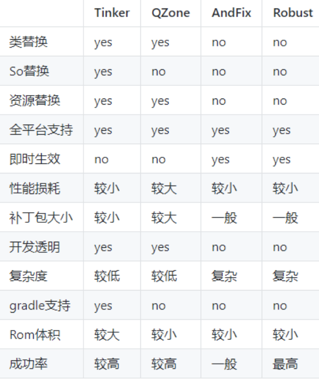

## 【P】项目设计实践 -- 热修复


### 问题

- 热修复流程，原理是什么，业界有哪些方案，对比如何 
- 热修复原理，类冷启动修复原理，类热修复原理
- 热修复资源id冲突怎么解决
- 动态修复替换加载 so ，那你知道怎么修复 class 吗？怎么修复资源呢


### 热修复基础知识

#### ClassLoader 类加载机制


### 业界热修复框架




#### 即时生效 -- 热修复原理

* AndroidFix / SoFix

  Native 层动态替换java层方法

  ArtMethond 属性替换

* Robust

  gradle插件，字节码插桩技术，编译时对每个类每个方法插入一段代码。一个用于热修复重定向的静态属性flag -- changeQuickRedirect。PatchProxy补丁包类加载，实现方法调用重定向。修复方法bug。

  

  补丁包 是完整的dex文件

  

#### Tinker 冷修复原理

增量更新

bsdiff 工具 生成差分文件 patch

不同于前者。Tiner的补丁包是真正的差分文件


PathClassLoader 的parent 是BootClassLoader

ClassLoader#loadClass

```java
pathList.findClass(name);
```

pathList#findClass

```
for(Element element : dexElements){
	DexFile dex = element.dexFile;
	dex.find();
}
```


> 想办法把补丁包.dex 放到 dexElements 最前面。

1. patch.dex 转化为Element[]

2. 反射修改pathList

3. 合并


修复时机，越早越好，必须在bug类被加载之前，加载补丁。


