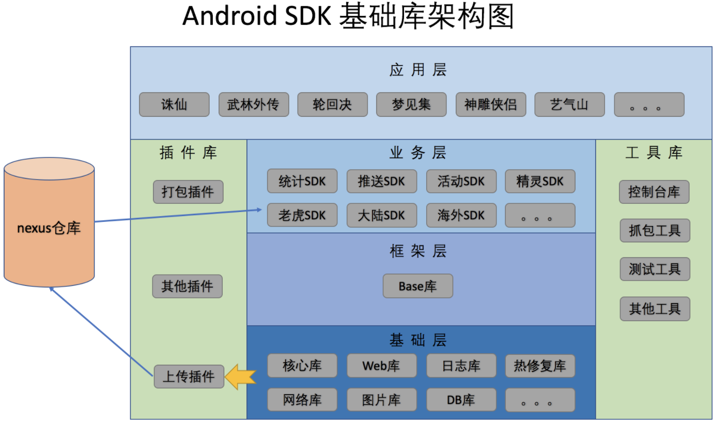

## 【P】项目设计实践 - 框架设计实践

> 游戏聚合SDK与各种基础功能库设计学习与整理

### SelfCheck

- 【设计思想】设计一个网络框架（下载器）

    怎么做上传下载的断点续传	

- 【设计思想】设计一个图片框架

  考虑如何加载，如何编解码，如何缓存，api的易用性

  - 图片加载三级缓存

  - LRUCache实现

- 【设计思想】Hook源码实现换肤框架

- 【设计思想】IMSDK 

   假设现在要开发一款IM应用程序，功能包括分组、好友和消息传输(文字、图片、文件)，请以接口的形式给上层应用程序开发人员提供SDK文档，通过该文档上层开发人员可以屏蔽掉具体的网络实现细节；

- 【设计思想】用户行为监控方案设计，上传日志的功能，应该怎么去实现

- 【设计思想】做一个能放大缩小的图片查看器，加载一张巨大的图片，怎么做

https://www.cnblogs.com/punkisnotdead/p/4807795.html?utm_source=tuicool&utm_medium=referral

https://blog.csdn.net/lmj623565791/article/details/49300989

- 【设计思想】如何设计一个安卓的画图库，做到对扩展开放，对修改封闭，同时又保持独立性

  

### 手写框架思路

#### 设计网络框架（下载器）

#### Hook源码实现换肤框架

#### 手写图片加载框架

##### 设计思路

1. 封装参数：从指定来源，到输出结果，中间可能经历很多流程，所以第一件事就是封装参数，这些参数会贯穿整个过程；
2. 解析路径：图片的来源有多种，格式也不尽相同，需要规范化；
3. 读取缓存：为了减少计算，通常都会做缓存；同样的请求，从缓存中取图片（Bitmap）即可；
4. 查找文件/下载文件：如果是本地的文件，直接解码即可；如果是网络图片，需要先下载；
5. 解码：这一步是整个过程中最复杂的步骤之一，有不少细节，下个博客会说；
6. 变换：解码出Bitmap之后，可能还需要做一些变换处理（圆角，滤镜等）；
7. 缓存：得到最终bitmap之后，可以缓存起来，以便下次请求时直接取结果；
8. 显示：显示结果，可能需要做些动画（淡入动画，crossFade等）。

### 工作项目整理-基础库建设

#### 游戏Unity 与 Android SDK对接

https://blog.csdn.net/SGamble/article/details/101376652

#### 游戏聚合SDK

#### PushSDK

##### 一、方案选型

**方案1、使用GCM服务（Google Cloud Messaging）**

简介：Google推出的云消息服务，即第二代的C2DM。Android Cloud to Device Messaging (C2DM)是一个用来帮助开发者从服务器向Android应用程序发送数据的服务。该服务提供了一个简单的、轻量级的机制，允许服务器可以通知移动应用程序直接与服务器进行通信，以便于从服务器获取应用程序更新和用户数据。C2DM服务负责处理诸如消息排队等事务并向运行于目标设备上的应用程序分发这些消息。

优点：Google提供的服务、原生、简单，无需实现和部署服务端。

缺点：Android版本限制（必须大于2.2版本，无法兼容老的1.6到2.1系统;），该服务在国内不够稳定、需要用户绑定Google帐号，受限于Google。C2DM需要依赖于Google官方提供的C2DM服务器，由于国内的网络环境，这个服务经常不可用，如果想要很好的使用，我们的App Server必须也在国外,限制太大。

**方案2、使用XMPP协议（Openfire + Spark + Smack）**

简介：基于XML协议的通讯协议，前身是Jabber，目前已由IETF国际标准化组织完成了标准化工作。

优点：协议成熟、强大、可扩展性强、目前主要应用于许多聊天系统中，且已有开源的Java版的开发实例androidpn。

缺点：协议较复杂、冗余（基于XML）、费流量、费电，部署硬件成本高。

**方案3、使用MQTT协议**

简介：轻量级的、基于代理的“发布/订阅”模式的消息传输协议。

优点：协议简洁、小巧、可扩展性强、省流量、省电，目前已经应用到企业领域（参考：http://mqtt.org/software），且已有C++版的服务端组件rsmb。

缺点：发展时间不长不够成熟、实时性与稳定性不如XMPP（延时，丢包）。

#### 

#### HybridSDK

#### 验证码SDK

